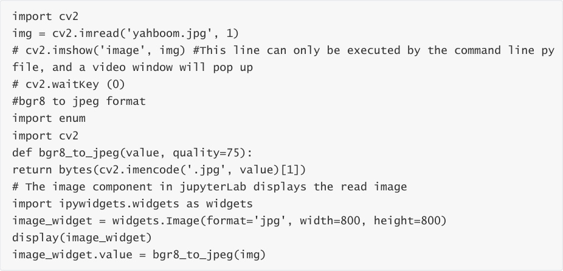

# Image reading and display
## 1. Image reading:
img = cv2.imread('yahboom.jpg', 0) The first parameter is the path to the image, and the second

parameter is how to read the image.

cv2.IMREAD_UNCHANGED: keep the original format unchanged, -1;

cv2.IMREAD_GRAYSCALE: reads the image in grayscale mode, which can be represented by 0;

cv2.IMREAD_COLOR: Read in a color image, which can be represented by 1; the default value

cv2.IMREAD_UNCHANGED: Reads an image and includes its alpha channel, which can be

represented by 2.

## 2. Image display
cv.imshow('frame', frame): Opens a window named frame and displays frame data (image/video

data)

Parameter meaning:

The first parameter indicates the name of the window to be opened.

The second parameter indicates the image to be displayed

### 2.1、Code and actual effect display
Source code path:

Main code:

After running the code block, you can see the following interface, the image has been read out

