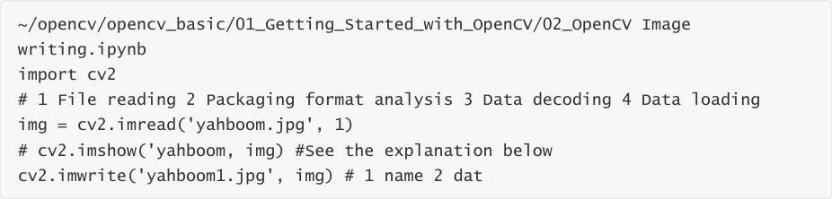
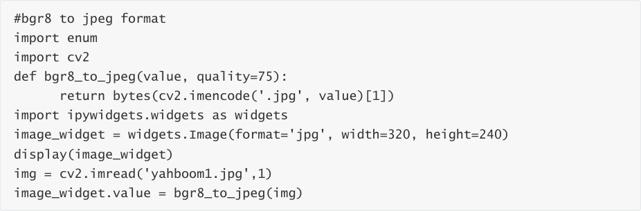
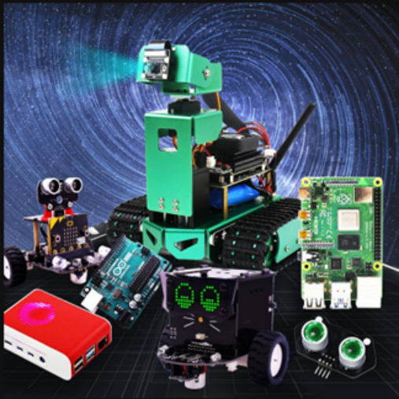

# Image writing
Function method: cv2.imwrite('yahboom1.jpg', img).

The first parameter is the file name to save, and the second parameter is the saved image.

Next, we demonstrate how to write an image. First, we read an image yahboom.jpg and then

write it to yahboom1.jpg.

Code path:

The cv2.imshow('yahboom, img) function in jupyLab cannot be executed. If you need to use this

sentence to display the read image, you need to execute the python file through the command:

python3 XX.py

When the code block finishes running, you can see that the yahboom.jpg image is written to

yahboom1.jpg.

