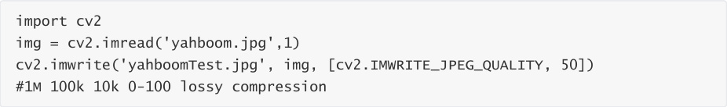
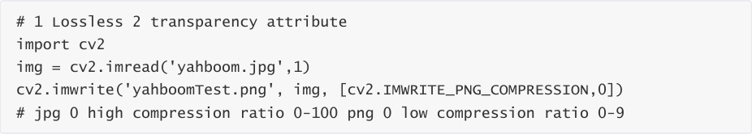
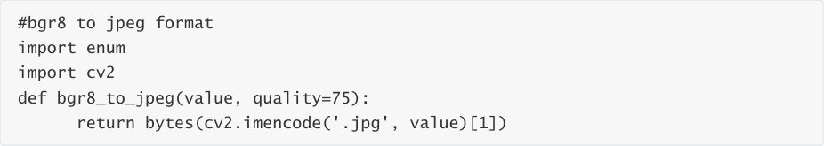
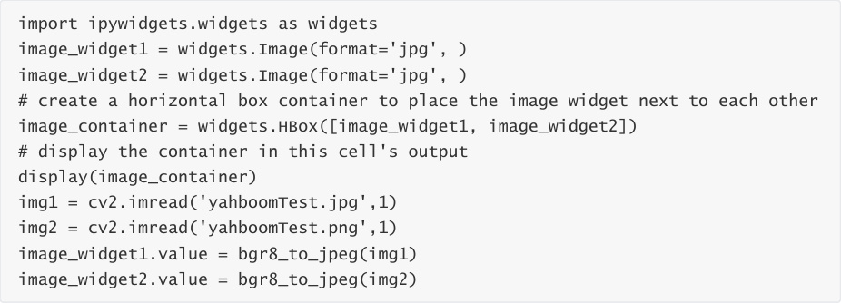

# Image quality
Code path:

1. Compression method.

cv2.imwrite('yahboomTest.jpg', img, [cv2.IMWRITE_JPEG_QUALITY, 50])

cv2.CV_IMWRITE_JPEG_QUALITY: Sets the image quality of the image format .jpeg or .jpg. The

value is 0-100 (the larger the value, the higher the quality). The default is 95

cv2.CV_IMWRITE_WEBP_QUALITY: Sets the image quality to .webp format, with a value of 0--100

cv2.CV_IMWRITE_PNG_COMPRESSION: Sets the compression ratio of the .png format. The value is

0--9 (the larger the value, the greater the compression ratio). The default is 3

The main code is as follows:

When the code block runs to the end, you can see a comparison chart of the two photos.

