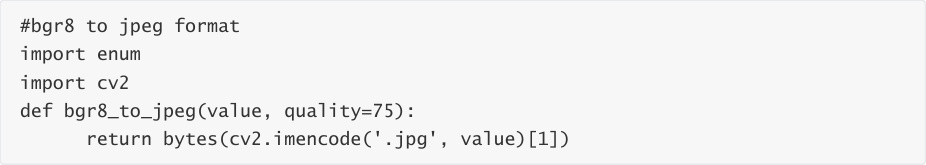
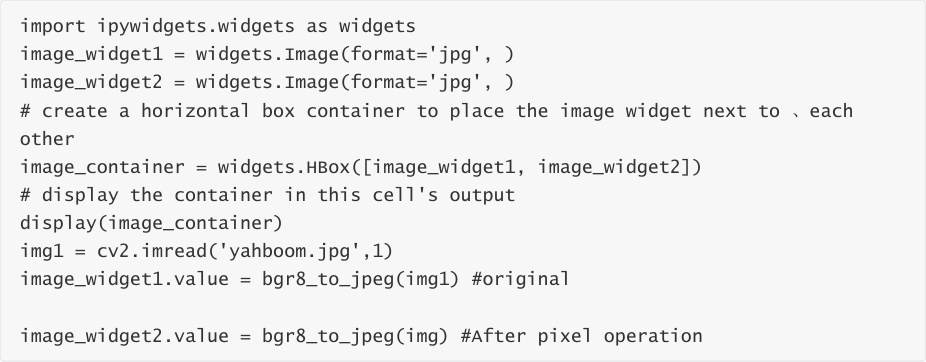
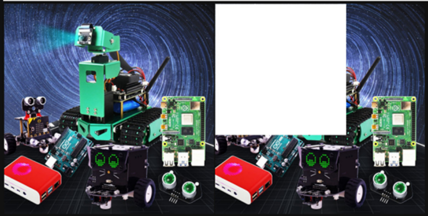

# 5.OpenCV pixel operations
Pixel operations allow us to change the color of any pixel at any position. Here we first read the

image and then assign an area to white.

Code path:

The main code is as follows:

JupyterLab displays the before and after image comparison:

After the code block is run, you can see that some of the pixels in the second image have turned

into white pixels.

