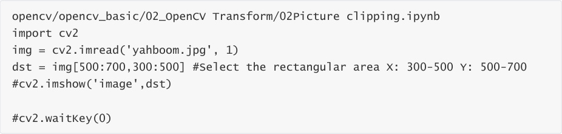
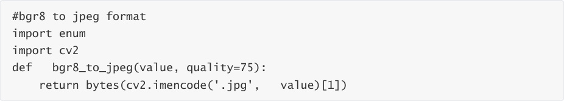
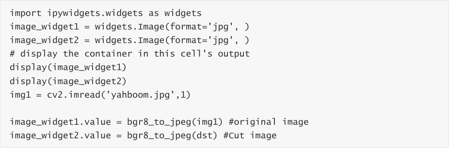
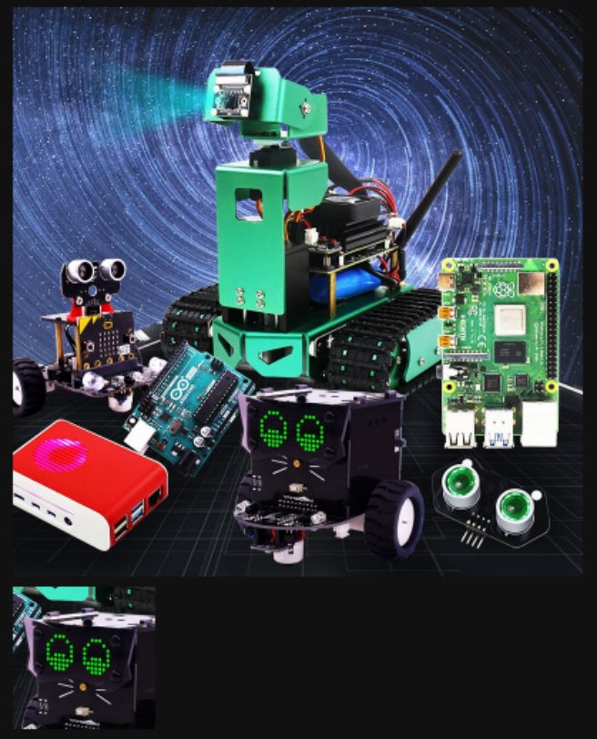

# 7. Image cutting
Image cropping first reads the image and then retrieves the pixel region from the array. The

following code selects a region with an X:300-500 and a Y:500-700 pixel resolution. Note that the

image size is 800*800, so the selected region should not exceed this resolution.

Code path:

The following will show the comparison of two compressed images in the jupyterLab control:

Here are the before and after images:

After the program is run, you can see that some parts have been cut out.

