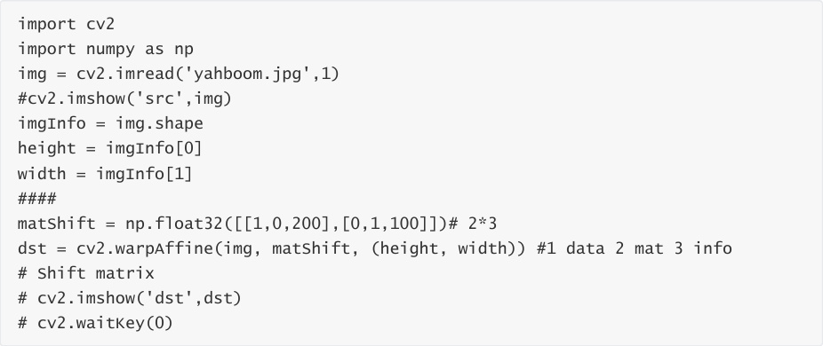
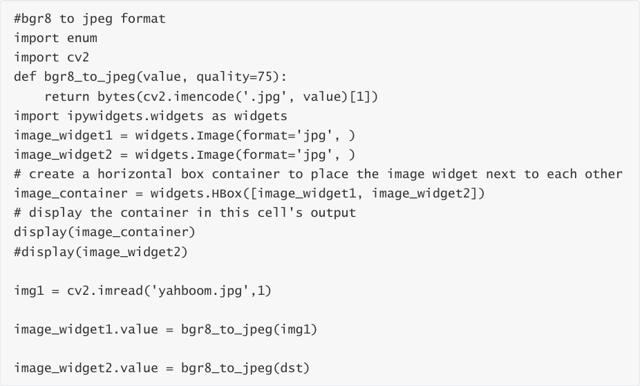
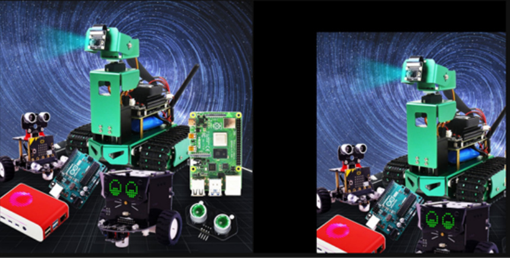

# Image panning
The original image src is converted to the target image dst through the transformation matrix M:

dst(x, y) = src(M11x + M12y+M13, M21x+M22y+M23)

If the original image src is moved 200 pixels to the right and 100 pixels downward, the

corresponding relationship is:

Complete the above expression:

dst(x, y) = src(1·x + 0·y + 200, 0·x + 1·y + 100)

According to the above expression, the values of each element in the corresponding

transformation matrix M can be determined as:

M11=1

M12=0

M13=200

M21=0

M22=1

M23=100

Substituting the above values into the transformation matrix M, we get:

Next, we directly use the transformation matrix M to call the function cv2.warpAffine() to

complete the image translation.

Code path:

The following will show the original image and the translated image in the JupyterLab control:

As can be seen from the image, the picture has moved to the lower right corner by (200, 100).
