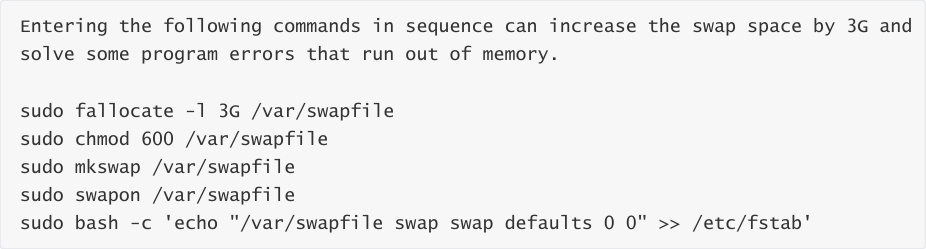
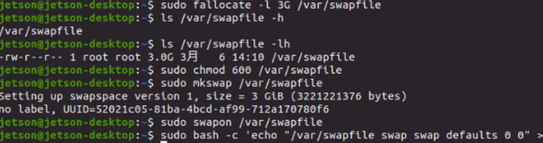
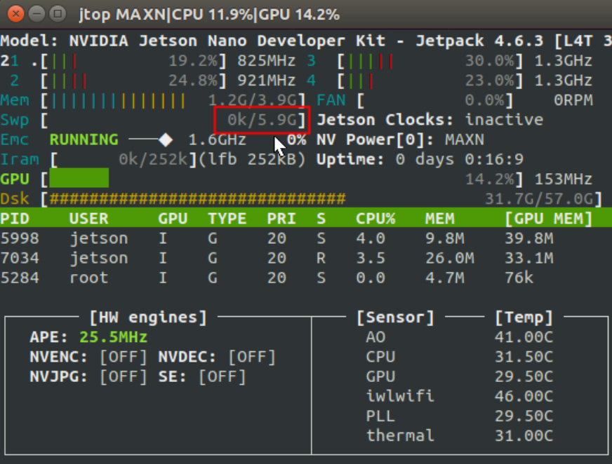

# Jetson Nano B01 Swap space increases

Add swapfile file size customization

sudo fallocate -l 3G /var/swapfile

Configure permissions for this file

sudo chmod 600 /var/swapfile

Establish Exchange Partition

sudo mkswap /var/swapfile

Enable swap partitioning

sudo swapon /var/swapfile

Set to automatically enable swapfile

sudo bash -c 'echo "/var/swapfile swap swap defaults 0 0" >> /etc/fstab'

View the effect and open the terminal input

Swap has become 6g.
