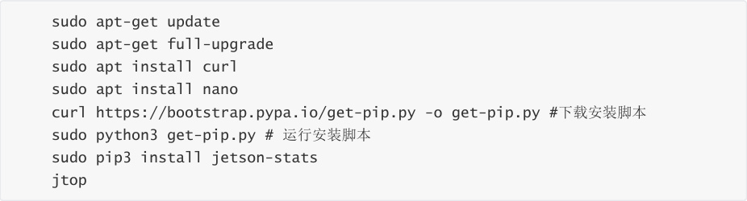
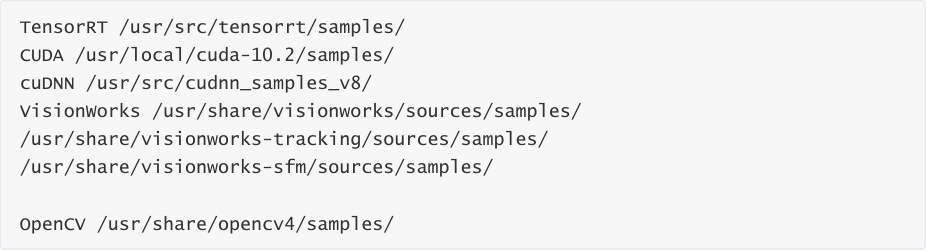
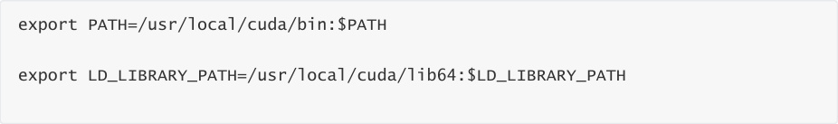
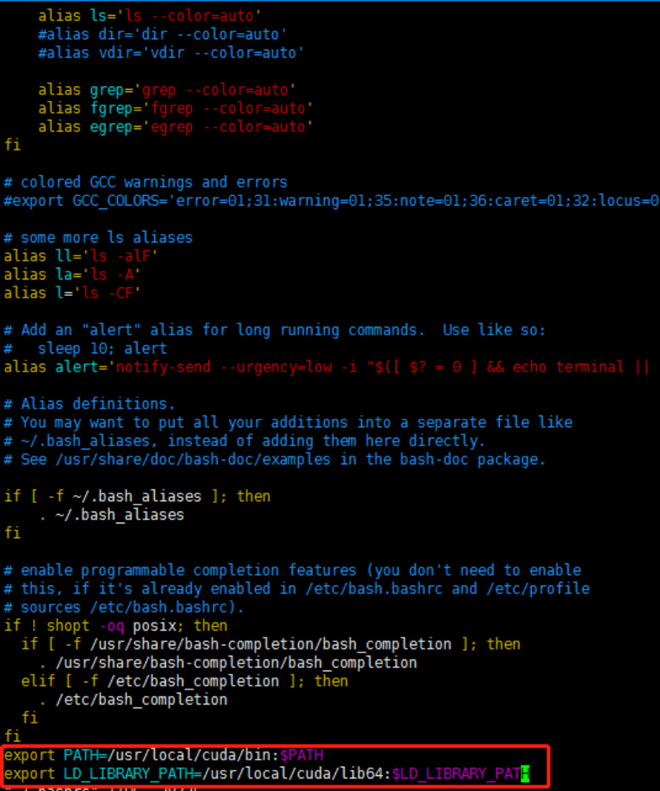
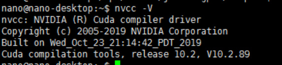
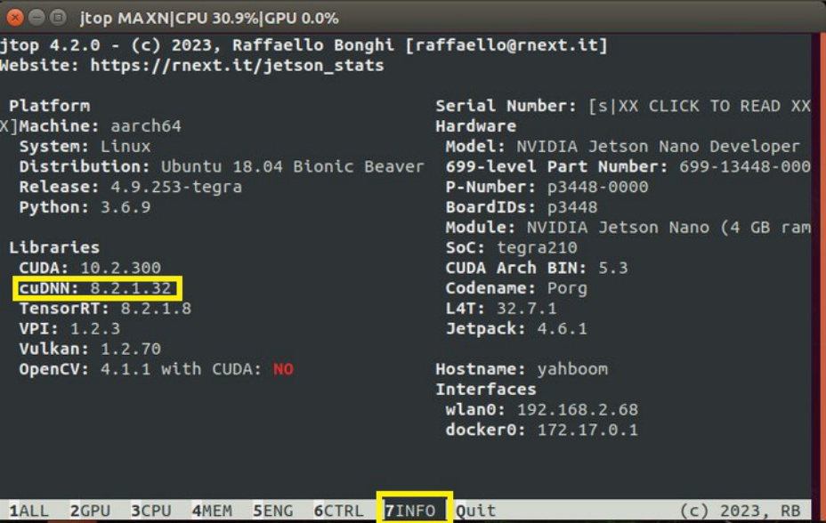

# Installation and Use of Jtop
**Installation of Jtop**

(1) Installing JTOP to check CPU usage

**Check the installed system components**

(1) The OS image of Jetson Nano B01 already comes with JetPack, cuda, cudnn, opencv, and other

installed examples. The installation path for these examples is as follows

(2) Check CUDA

The CUDA10.2 version has already been installed in Jetson Nano B01, but at this time, if you run

nvcc - V, it will not succeed. You need to write the path of CUDA to the environment variable. The

Vim tool comes with the OS, so run the following command to edit the environment variables

Firstly, check if there is nvcc in the bin directory of cuda:

If present,

Note: In vim, use Esc to return to command mode, and switch to the input module through I to

enter text in input mode

Note: After exiting the command mode through Esc, press: to start inputting commands, wq to

save and exit, q to exit, q! For forced exitSave to exit.

Then it needs to take effect under the source.

After the source, execute nvcc - V again at this time, and the result is as follows

beckhans@Jetson:~$ nvcc -V

(3) Check OpenCV

OpenCV4.1.1 version is already installed in Jetson Nano B01. You can use the command to check if

OpenCV is installed properlypkg-config opencv4 --modversionIf OpenCv is installed properly, the

version number will be displayed, and my version is 4.4.1

(4) Check cuDNN

CuDNN has been installed in Jetson nano and there are examples available for operation. Let's

run the examples to verify the CUDA above

Enter jtop at the terminal, press the right arrow key on the keyboard to select 7info, and you can

see the version of cuDNN, as shown in the following figure:

