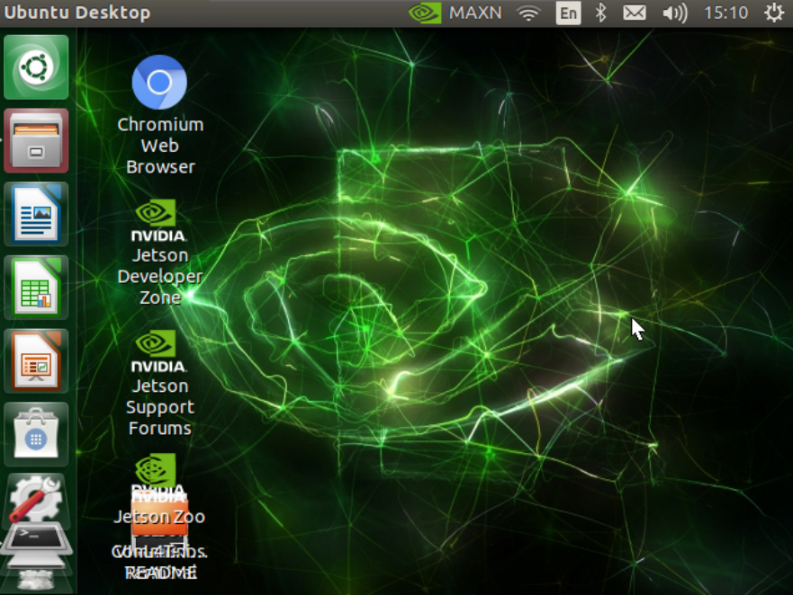
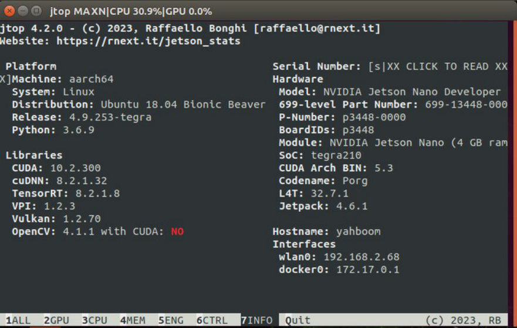

# Jetson Nano B01 System and Desktop Introduction
1. Insert the SD card/USB drive into Jetson Nano B01 and turn it on to see the graphical

interface, as shown below.

2. Version information of this system

You can see

Ubuntu 18.04 (64-bit system)

CUDA: 10.2

CUDNN:8.2.1.32

TensorRT:8.2.1.8

OPENCV:4.1.1

jetpack:4.6.1

**If you want to build the environment from scratch, you must keep the same jetpack**

**version as us, otherwise you will get an error according to the case we provide.**
