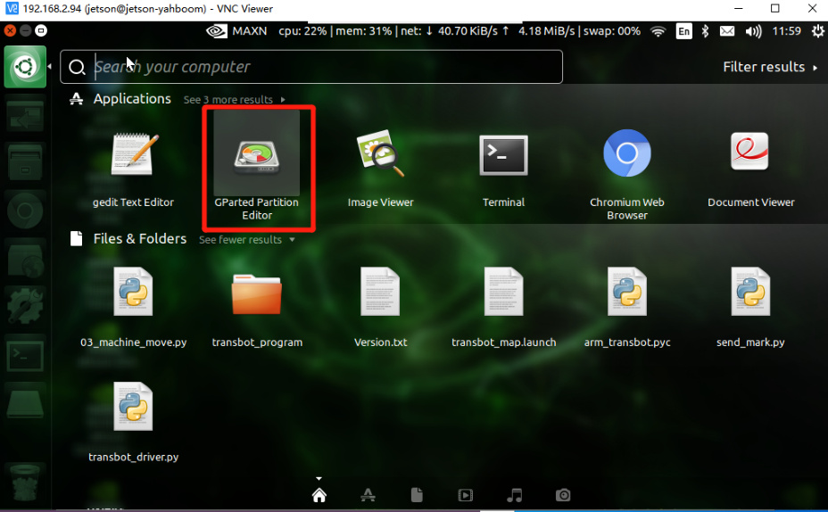
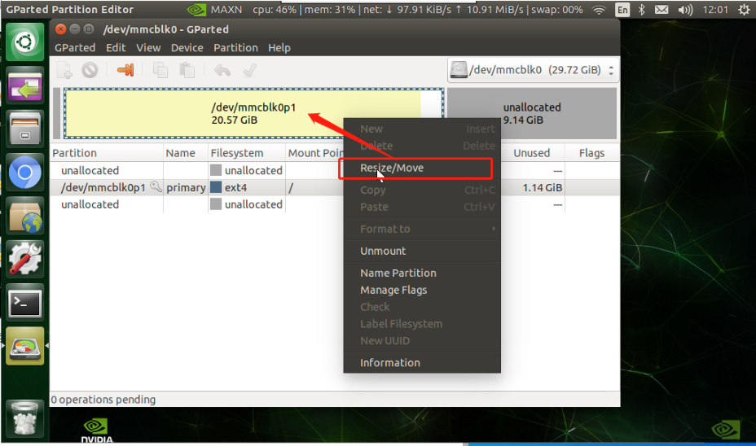
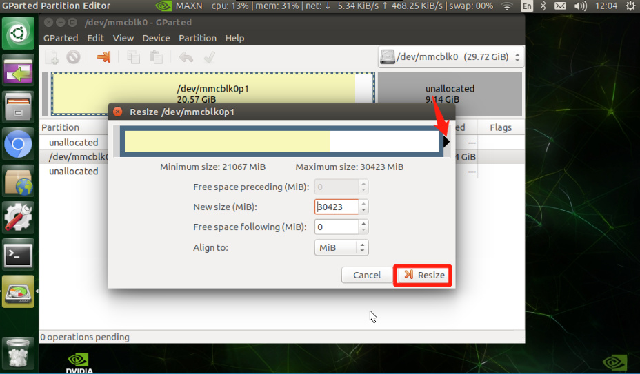
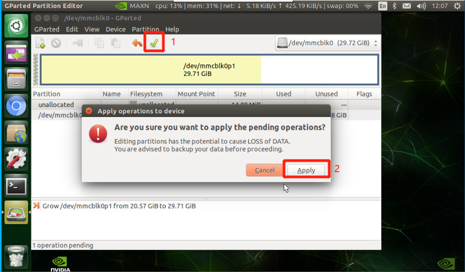
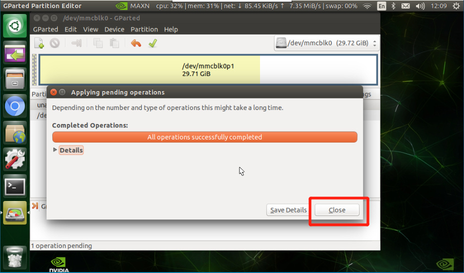
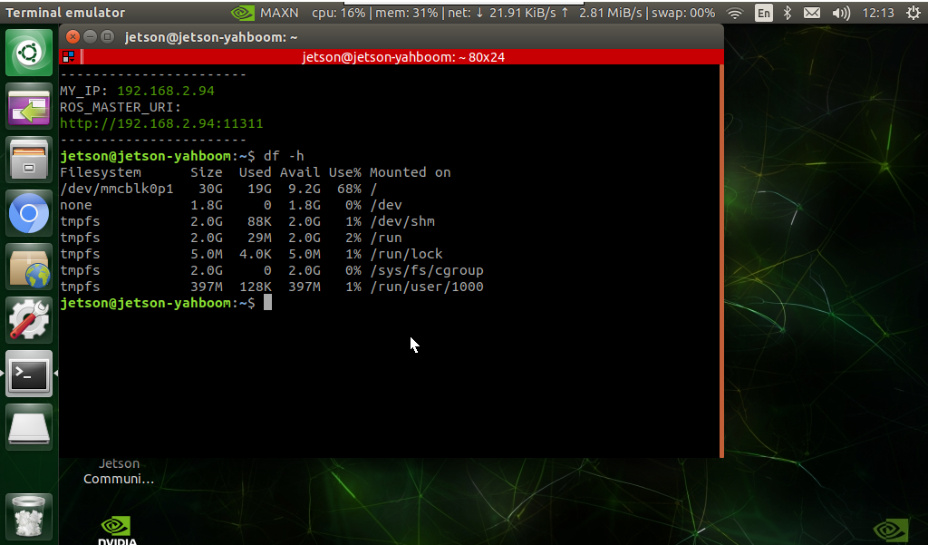

# TF card/U disk expansion Capacity Expansion Tutorial
## 1. Problem
After burning an image using a TF card or USB flash drive that is larger than the image memory,

some of the free memory will be unusable, resulting in an error message indicating insufficient

space or failure to run large projects.

Note: This tutorial is only for users who burn the image by themselves. If there is a factory image

in the TF card/U disk, you can skip this tutorial.
## 2. Solution
Install the capacity expansion software and use it to expand capacity.

Open the software

Right click [/dev/mmcblk0p1] -> Resize/Move

Drag the right box to the top until the gray area turns completely white -> Resize

Click √ at the bottom of the function bar -> Apply

Expansion completed!

Use the command to query and verify in the terminal

Verify that the expansion is successful. The 32G card expansion information is as follows

