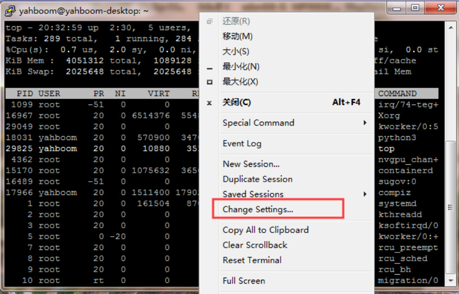
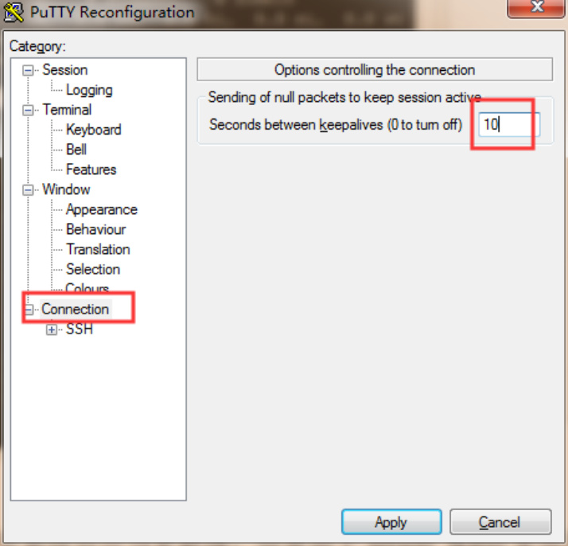
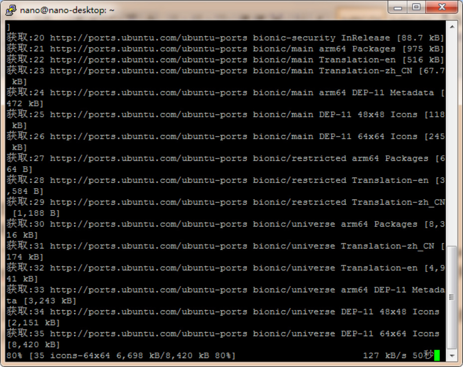
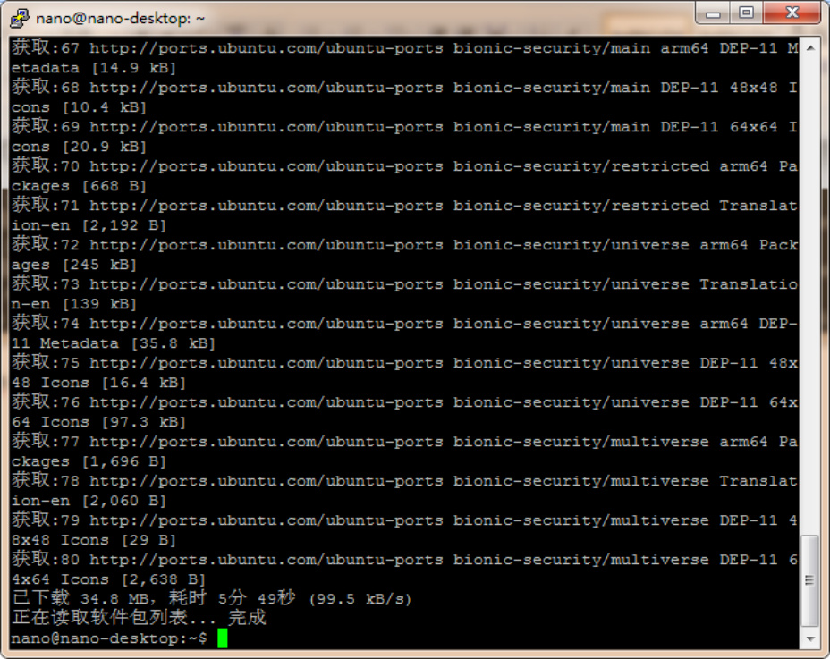
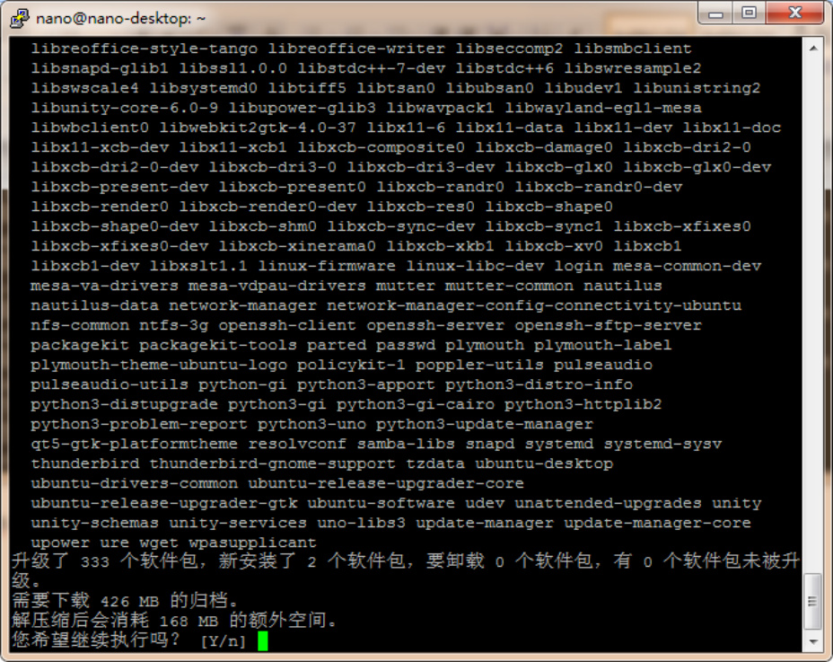
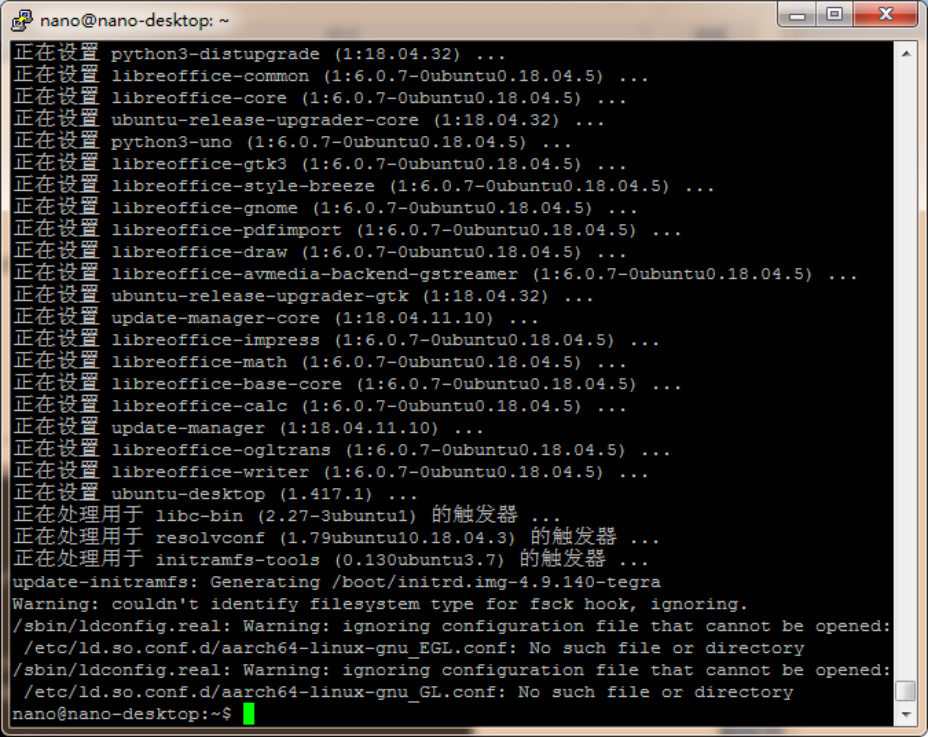
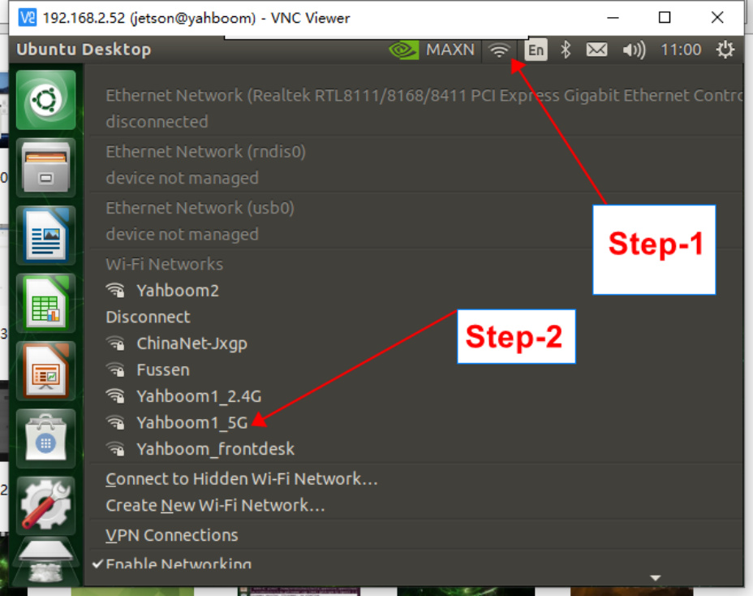
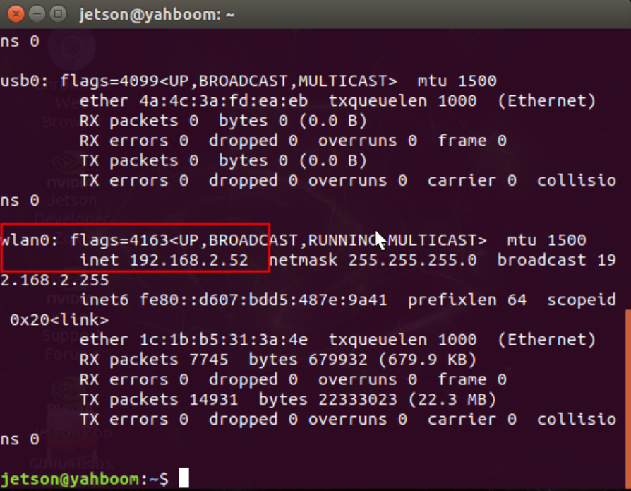
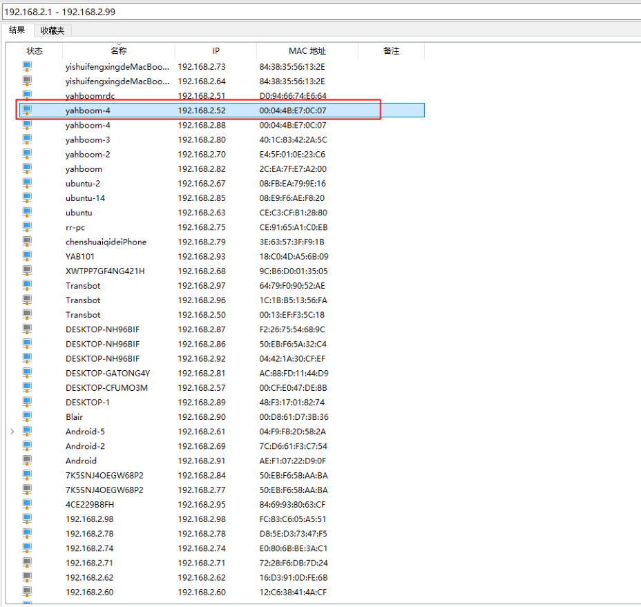

# Network Configuration
## 1.Remote login.
Choose tools such as PuTTY, SSH, and Xshell to remotely log in according to your preferences. The

following is an example of the PuTTY tool. Note: If you find that the computer cannot be remotely

accessed, you can try ping each other and view the IP address command on nano: ifconfig.

View local IP address cmd command under Windows: ipconfig. After knowing the IP address of

the other party, ping 192.168.1.xx will modify the IP address based on the actual command

If you find that putty often drops automatically, you can try the following methods:

A. Enter putty and select Connection on the left side

B. Sending of null packets to keep session active on the right sideSet it to 10

(meaning to send an empty packet every ten seconds to maintain connectivity)
## 2.About updating sources.
Generally speaking, after installing the system, the source should be updated. However, since

Jetson Nano B01 uses the aarch64 architecture Ubuntu 18.04.2 LTS system, which is different

from the AMD architecture Ubuntu system, and I have not found a perfect domestic source, I do

not recommend that you switch sources

There is no source change here, so it is still updated using the default source of Jetson Nano B01.

The update process is very long, everyone can execute the command and do other things. The

following two actions are recommended to be carried out before starting an AI project, otherwise

installing some libraries may result in missing installation addresses and frequent errors in the

future.

**sudo apt-get update**

**sudo apt-get full-upgrade**

Enter Y during the process to confirm the update. The second process may take about 2 hours

depending on the network situation. Please be patient and wait. After completion, as shown in the

following figure

The network configuration is now complete
## 3.Jetson Nano B01 connects to WiFi
The first step is to click on the network symbol above. The second step is to select the network we

need to connect to, and enter the password. I have already connected to the network of

yahboom2Obtain the IP address of the motherboard (when connected to the network)

Because I am using WiFi, looking at the IP address in the wlan0 line, I can see that my IP address

here is 192.168.2.52.
## 4.Jetson Nano B01 connecting network cable
If we want to know the IP address without a display screen, we can use the method of directly

plugging in the network cable, and then the computer and a router will also be connected to the

network. Download an IP scanning software to perform IP scanning, which is Advanced IP

Scanner.

Scanned IP

