# VNC remote login
**Jetson Nano B01 remote desktop control through**
**vnc**

Tip: The configured image has a username of Jetson and the original password is yahboom. If you

are using a configured image and VNC is already configured, you can directly skip to step 6 and

log in to VNC based on the current IP address

1. Install Vino

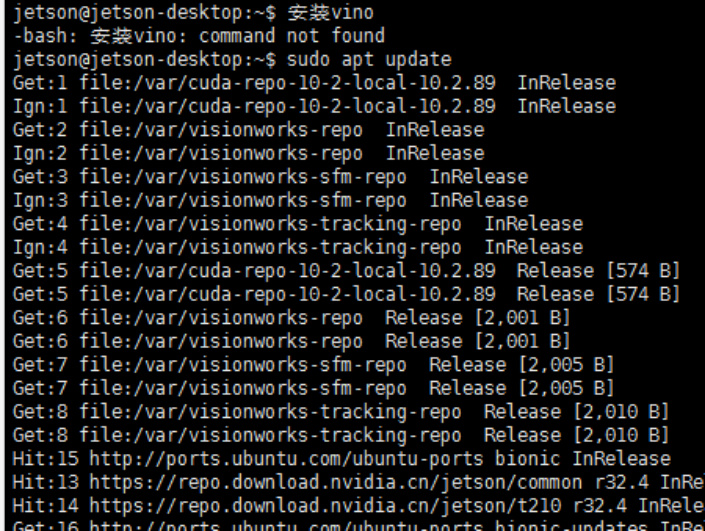

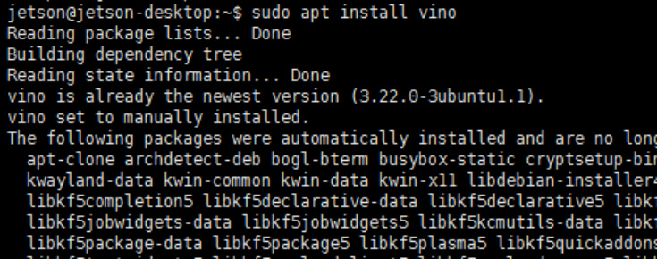

2. Set Enable VNC service (at this time, the VNC server can be manually opened)

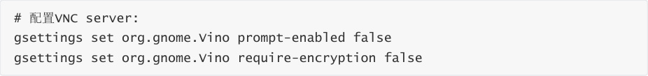

Edit org.gnome, restore the missing 'enabled' parameter, enter the command to enter the file,

and add the key content below to the end of the file. Save and exit.

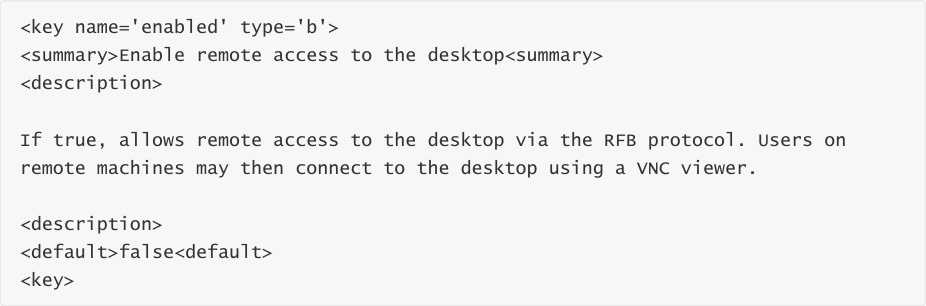

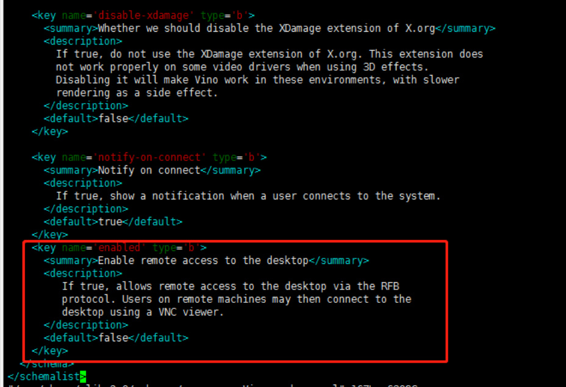

Set to Gnome compilation mode

Now the screen sharing panel is working in the unit control center But this is not enough to make

Vino run! So you need to add the program Vino server when the session starts, using the

following command line:

4. Restart the machine and verify if vnc settings were successful

5. Set the VNC Server to start automatically after startup

The VNC server is only available after you log in locally to Jetson. If you want VNC to be

automatically available, please use the system settings application to enable automatic login.

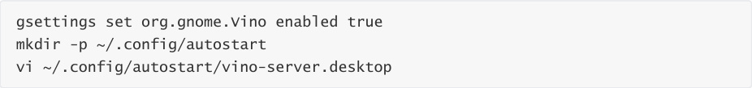

Add the following content to the file, save and exit.

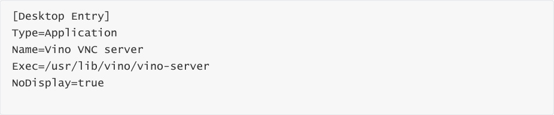

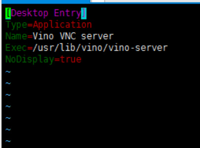

If the system is set to require a user password to enter before entering the desktop, the above

modification script will not start until entering the desktop. It is recommended to set the system

to automatically log in to the desktop by the user.

6. Connecting to VNC Server

Using vncTo connect to VNC using the viewer software, the first step is to query the IP address. I

found 192.168.1.195 here. After entering the IP address, click OK, double-click the corresponding

VNC user to enter the password, and finally enter the VNC interface

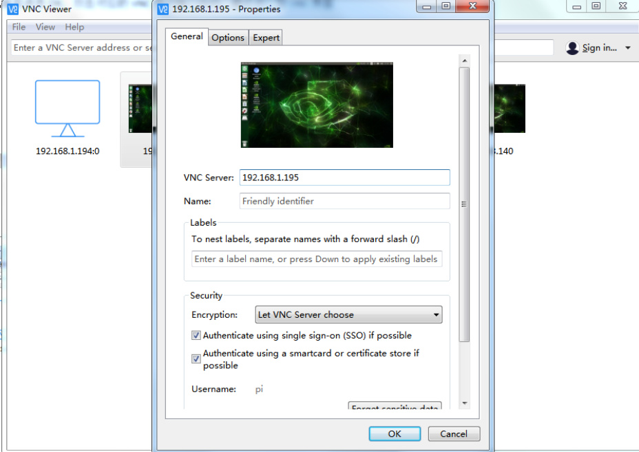

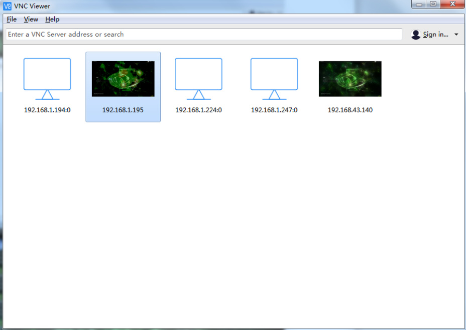
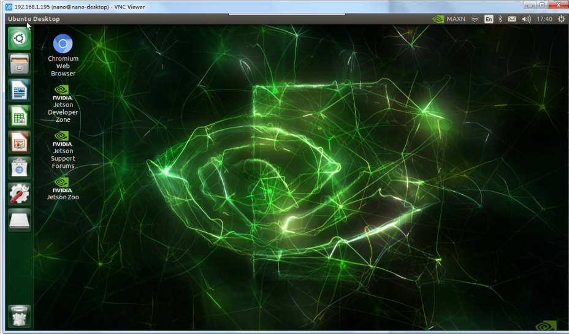
