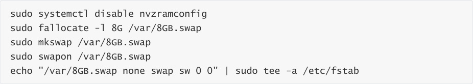
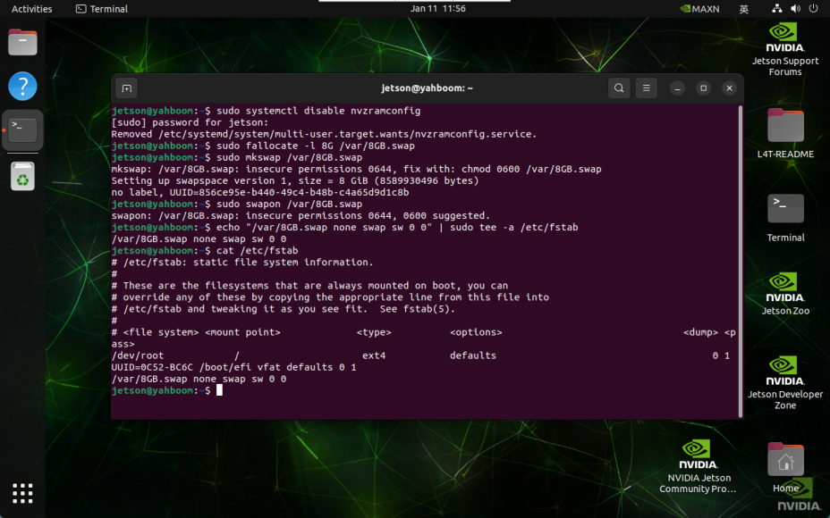
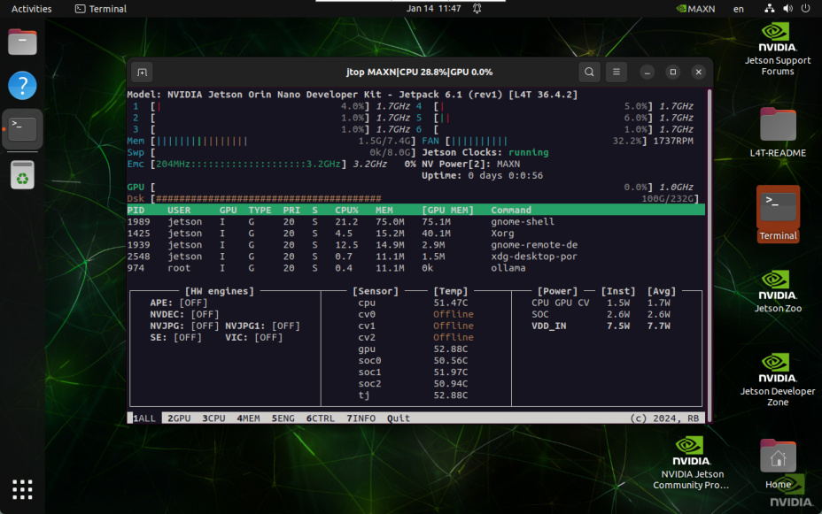

# Exchange space expansion
**Exchange space expansion**

1. Exchange space

2. Swap space expansion

### 2.1. Disable ZRAM swap configuration

### 2.2, Create 8GB file

### 2.3. Set the swap space format

### 2.4. Enable swap space

### 2.5. Permanently start swap space

3. Verify the expansion

## 1. Exchange space
Swap space is a mechanism used by the operating system to expand available memory. It can

continue to run when there is insufficient memory, avoiding program crashes or system freezes!

Note: The access speed of swap space is much lower than that of physical memory
## 2. Swap space expansion

### 2.1. Disable ZRAM swap configuration
Disable ZRAM swap configuration on Jetson devices: ZRAM compresses and stores memory pages

in memory to reduce reliance on disk.

### 2.2, Create 8GB file
### 2.3. Set the swap space format
### 2.4. Enable swap space
### 2.5. Permanently start swap space
## 3. Verify the expansion
After restarting the system, the system swap space increases to 8GB:

