# Backup SSD system
**Backup SSD system**

1. Hardware connection

2. Compress the SSD

### 2.1. Install Gparted

### 2.2. Use GParted

#### 2.2.1. Select the SSD

#### 2.2.2. Unmount the partition

#### 2.2.3. Perform disk compression

3. Back up the SSD

### 3.1. Check disk information

### 3.2. Start disk backup

During the development process, users may need to back up the system to prevent subsequent

development from affecting the current system environment.

## 1. Hardware connection
Users need to prepare the SSD box in advance, install the SSD into the SSD box and connect it to

the computer or virtual machine: the computer and virtual machine systems need to be Ubuntu

systems.

## 2. Compress the SSD
Since the SSD capacity of the Jetson Orin series motherboard is relatively large, we need to

compress it to an appropriate space for system backup to save time for backup and burning the

system.

### 2.1. Install Gparted
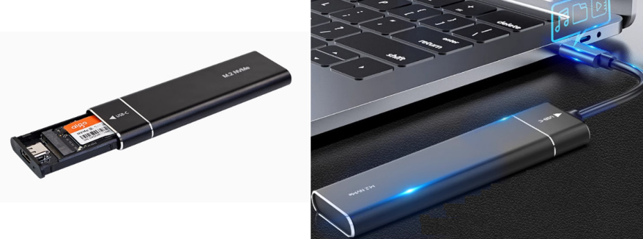

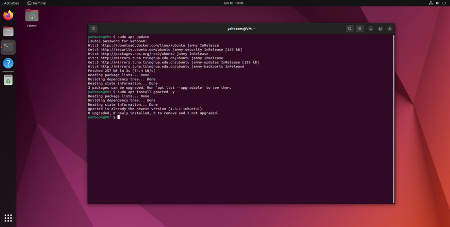
### 2.2. Use GParted
Find the `GParted` application icon in the system application menu bar to open it or enter the

following command in the terminal to start it:

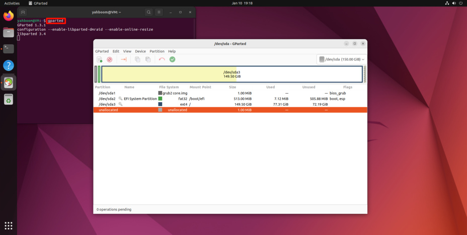
#### 2.2.1. Select the SSD
Select the newly added disk symbol: You can confirm again whether it is the SSD you mounted

based on the disk capacity

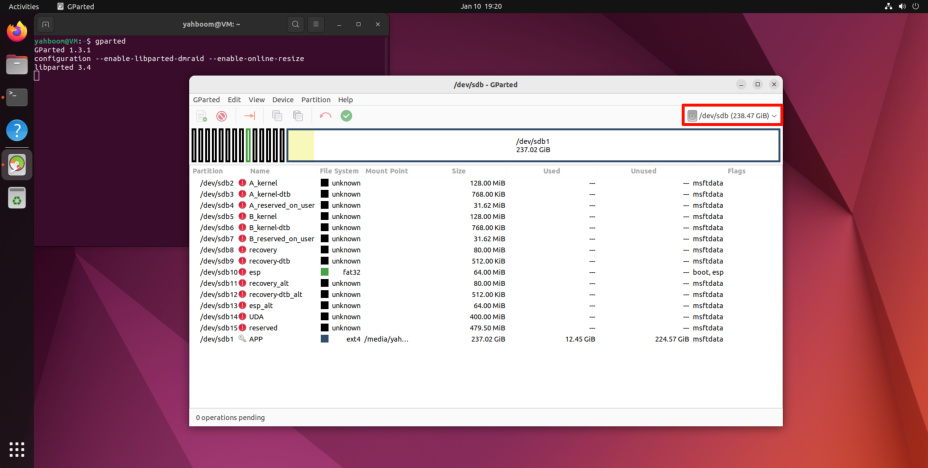
#### 2.2.2. Unmount the partition
Before operating the disk, you need to unmount the disk: select the `APP` partition (largest

partition) in the disk, and click `Unmount` to unmount the partition

#### 2.2.3. Perform disk compression
Right-click the uninstalled disk partition and resize the previously uninstalled partition space:

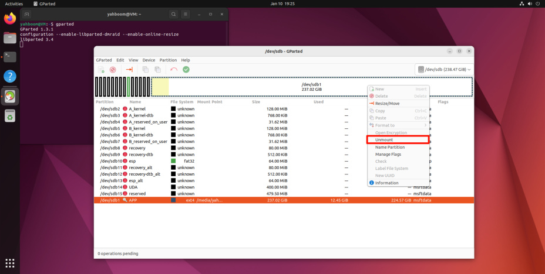
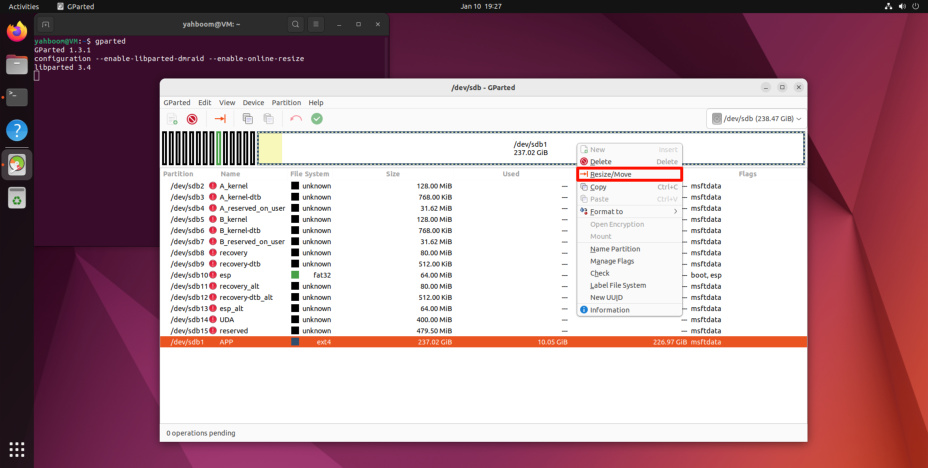

You can adjust the partition size using the slider: yellow is the space used by the partition, white is

the unused space, it is recommended to leave about 5-10G of unused space in the partition to

avoid the system from failing to start

Confirm the disk operation:

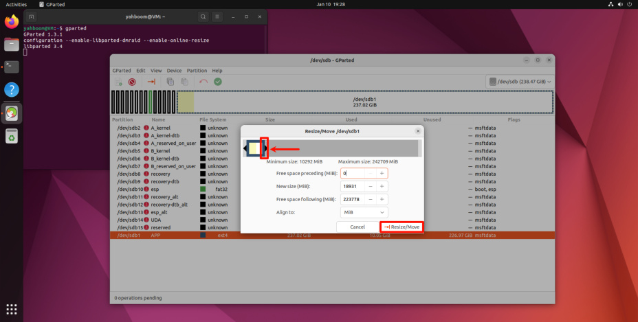

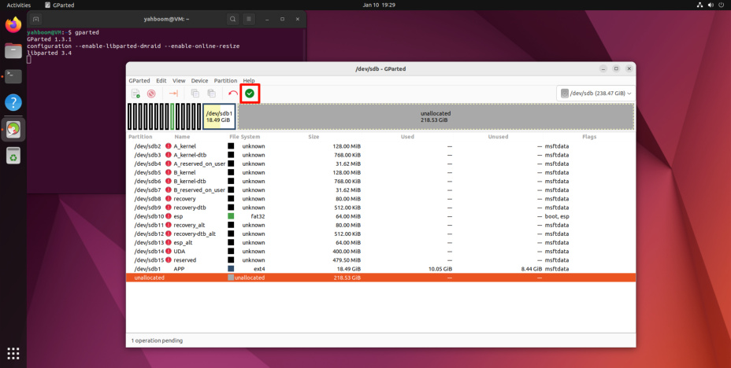
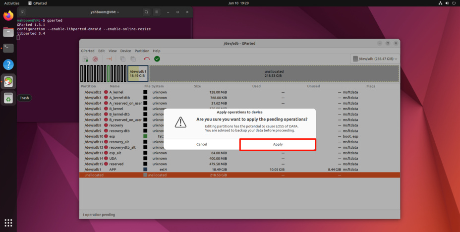

Wait for the operation to complete:

After completing the above operations, close GParted!
## 3. Back up the SSD
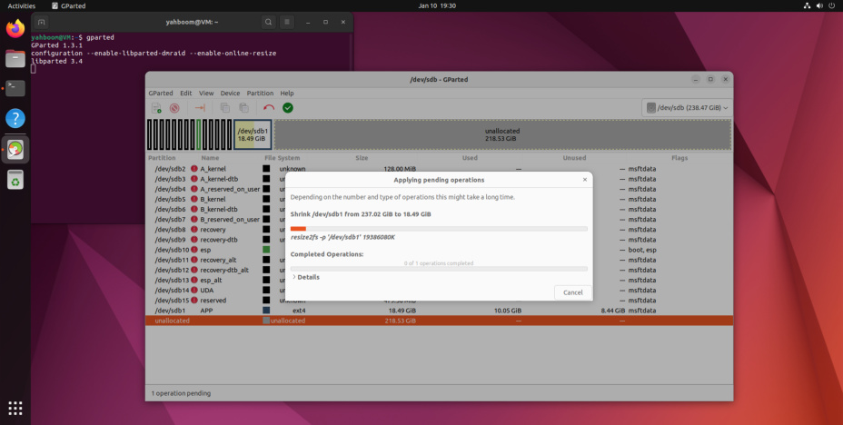

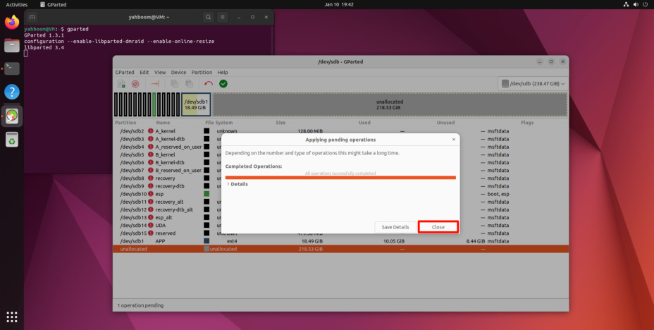
### 3.1. Check disk information
Open the terminal and use the script to view the current disk information: the drive letter needs

to correspond to the drive letter of the SSD you backed up

**parted_info.sh script content**

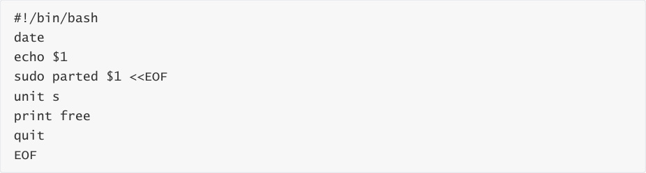

Record the data in the figure: 41822208s

### 3.2. Start disk backup
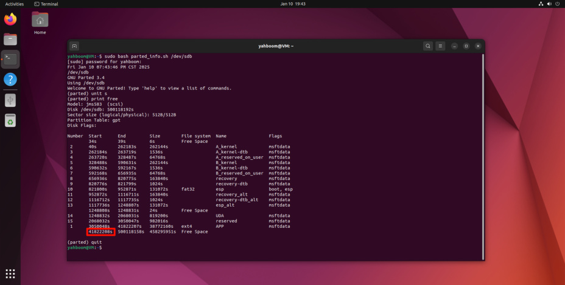

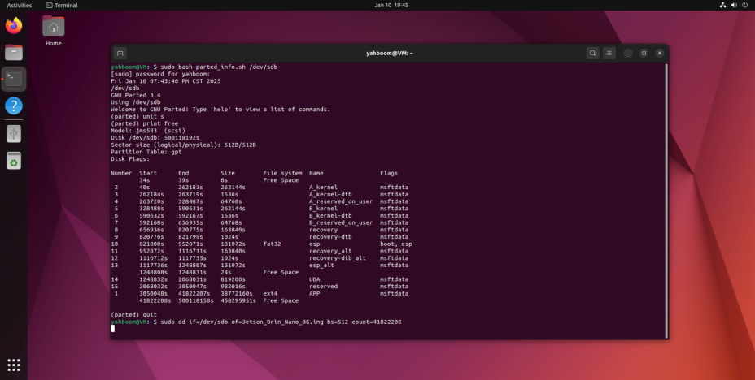

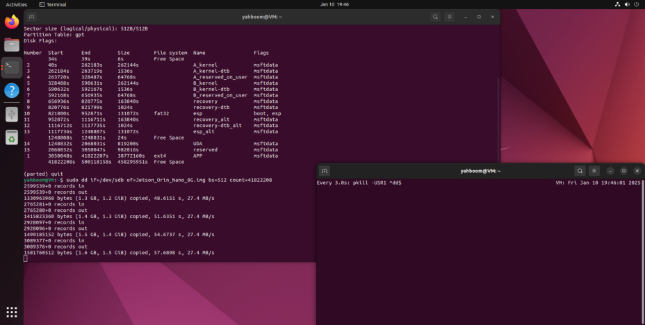

Wait for the backup to complete:

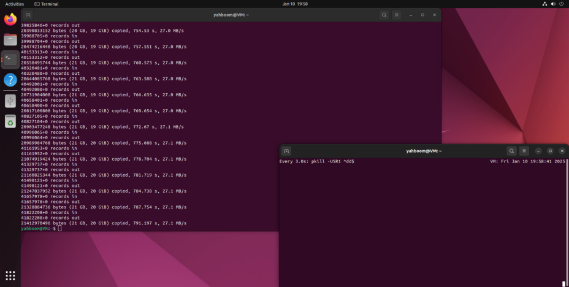
After the system backup is complete, move the backup file (Jetson_Orin_Nano_8G.img) to the

Windows system for use.

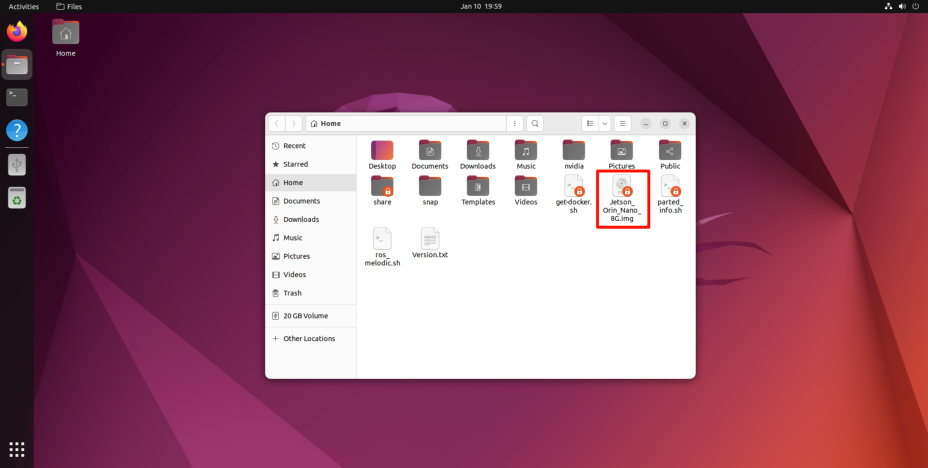
