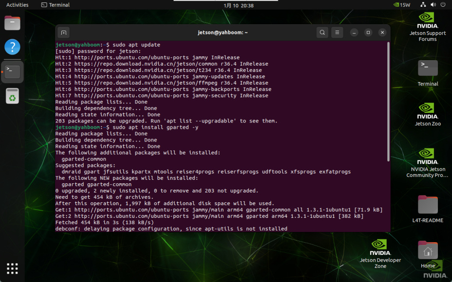
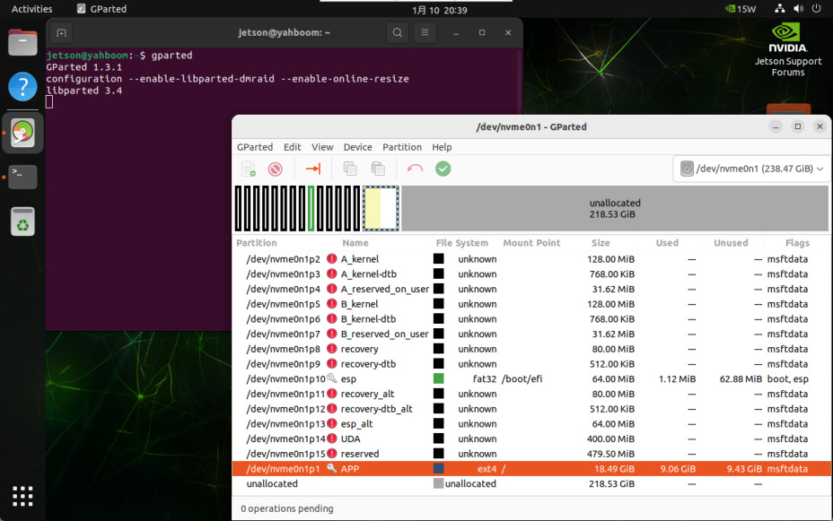
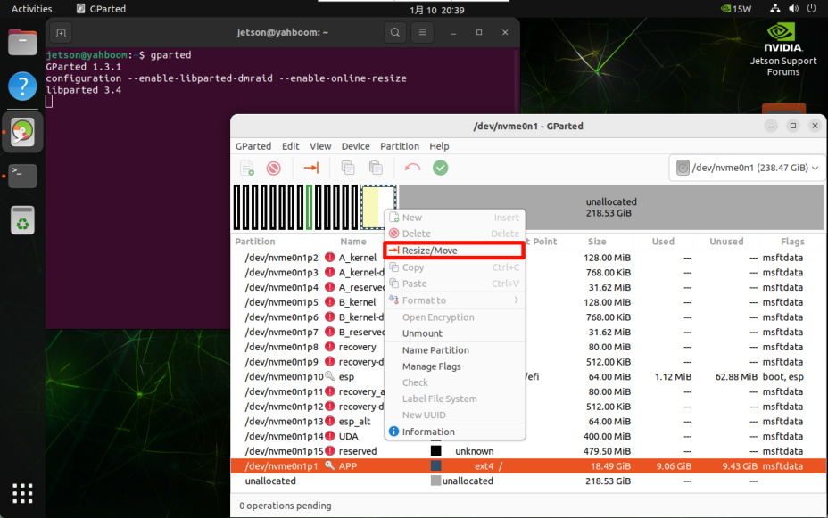
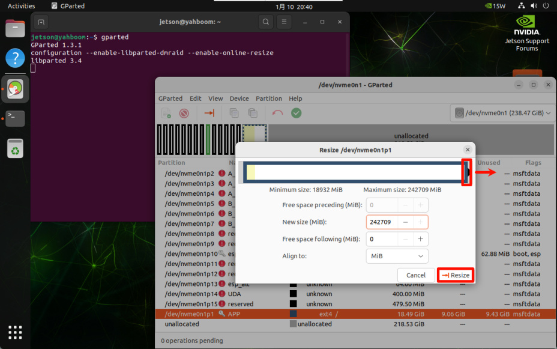
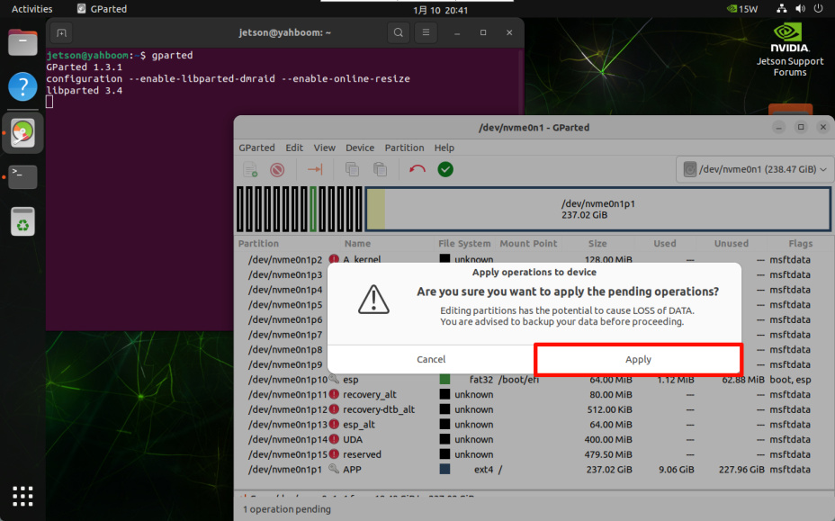
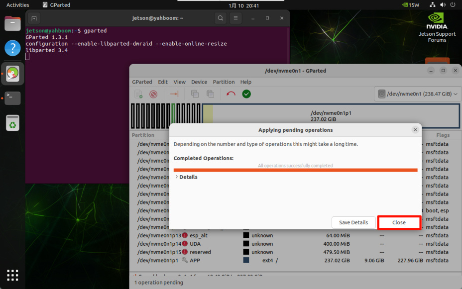
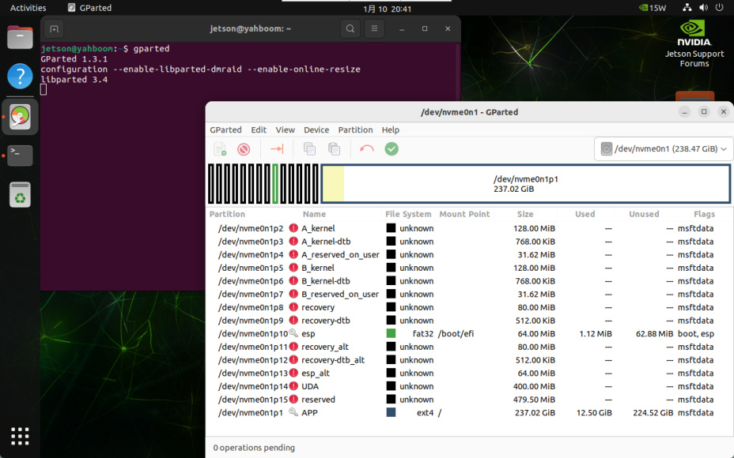

# SSD expansion
**SSD expansion**

1. Install GParted

2. Use GParted

3. Adjust partitions

The factory image system will perform disk compression, so the capacity displayed in the system

will be inconsistent with the actual capacity. Users can follow the tutorial to expand the SSD.

## 1. Install GParted
## 2. Use GParted
Find the `GParted` application icon in the system application menu bar to open it or enter the

following command in the terminal to start it:

## 3. Adjust partitions
Right-click the disk partition that needs to be expanded: generally select the largest partition in

the disk

You can adjust the partition size through the slider: you can maximize the space and slide to the

far right

Confirm the partition adjustment operation:

image-20250110204116310

