# Network configuration
**Network configuration**

1. WIFI mode

### 1.1. Connect to WiFi

### 1.3. Set static IP

2. Hotspot mode

### 2.1. Create a hotspot

### 2.2, Hotspot information

WiFi and hotspot modes require the use of a wireless network card. Before making the following

settings, check whether the wireless network card and antenna are installed!

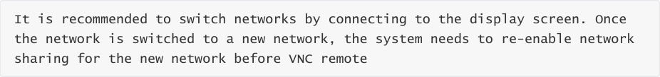
## 1. WIFI mode
### 1.1. Connect to WiFi
Select the menu option in the upper right corner of the system desktop → WiFi options → Wi-Fi

Settings:

Select the WiFi you want to connect to: If the WiFi signal is very weak, check whether the antenna

is not installed or the signal in the environment is poor

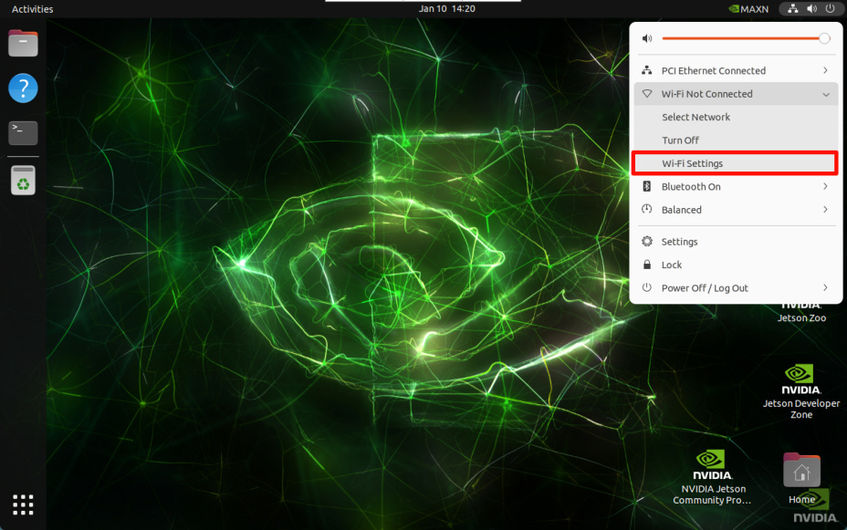
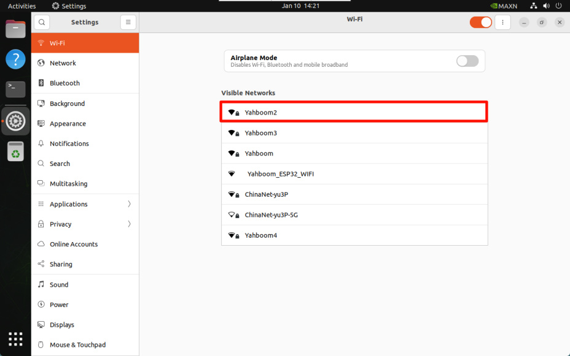
After entering the password, click Connect :

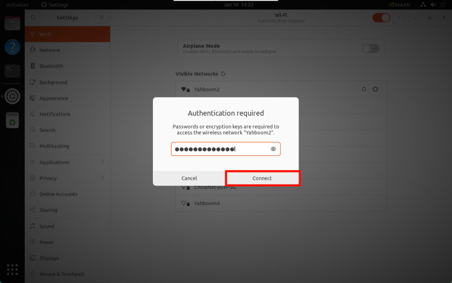

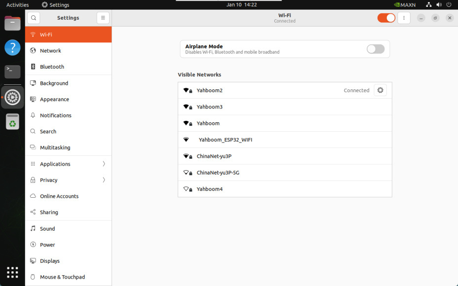

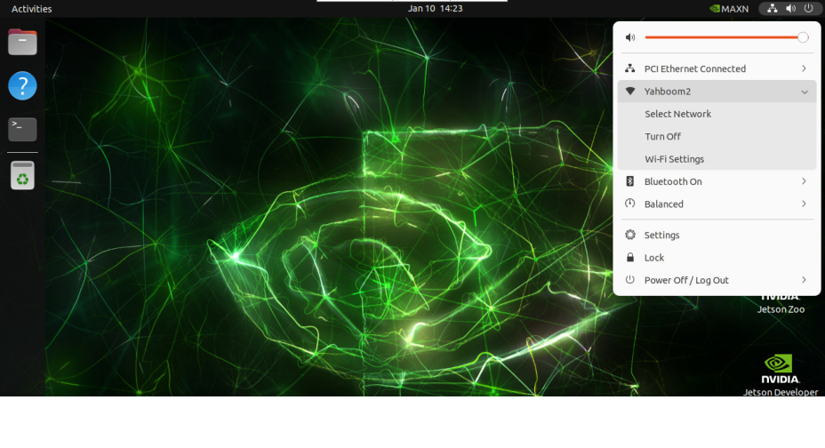

### 1.2. Check WiFi information

Click the settings icon of the connected WiFi:

is the IP connected by the network cable, and `wlP1p1s0` is the IP connected by WiFi

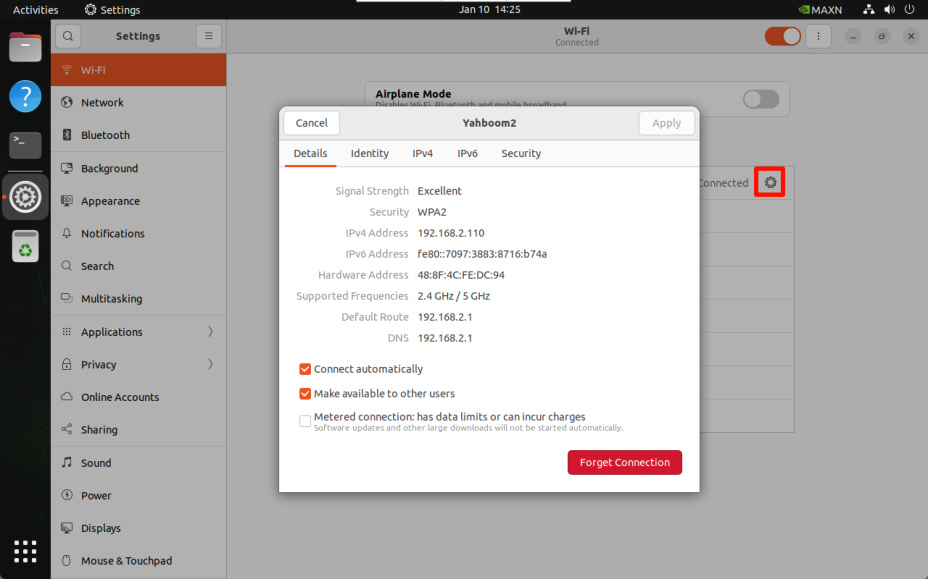

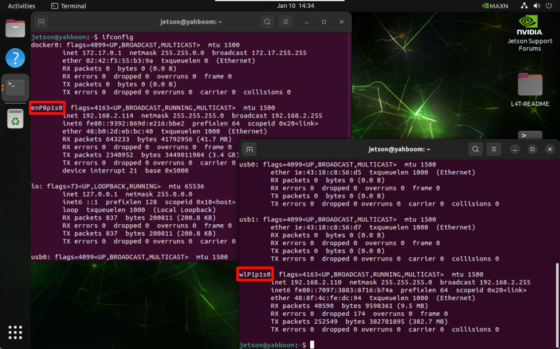
### 1.3. Set static IP
Click the setting icon of the connected WiFi to modify the IPv4 option:

Address: Fill in the required fixed IP address, which needs to be in the assignable IP address range

Netmask: Fill in 255.255.255.0

Gateway: Fill in the WiFi default gateway address

After completion, reconnect WiFi to take effect:

## 2. Hotspot mode
The wireless network card needs to support hotspot to enable hotspot mode.

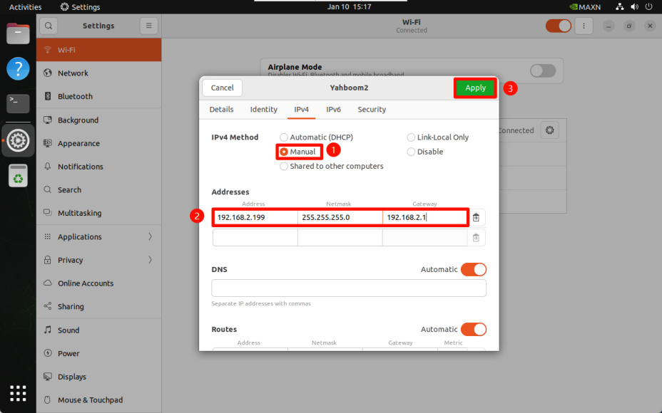

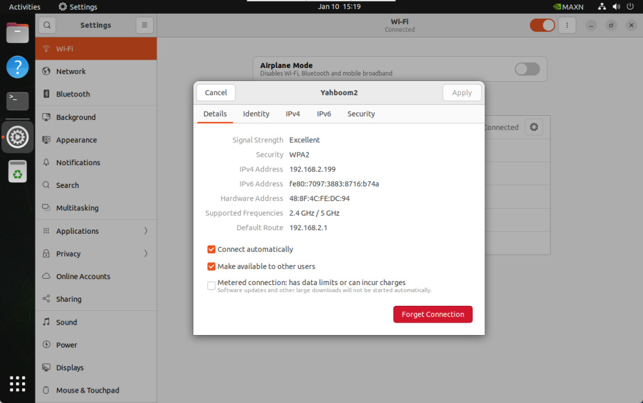
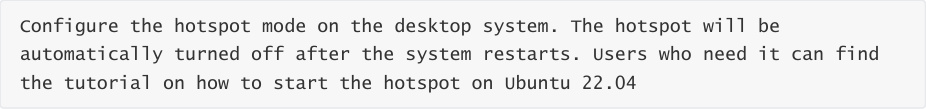

### 2.1. Create a hotspot
### 2.2, Hotspot information
Hotspot name: Jetson_Orin_Hot (customizable)

Hotspot password: 12345678 (customizable)

Hotspot mode default IP: 10.42.0.1

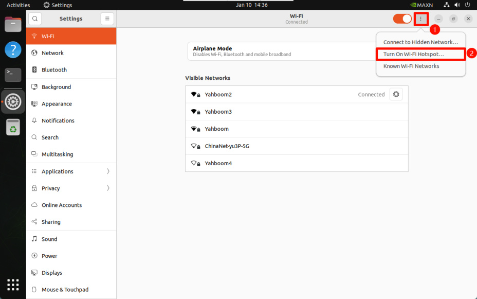

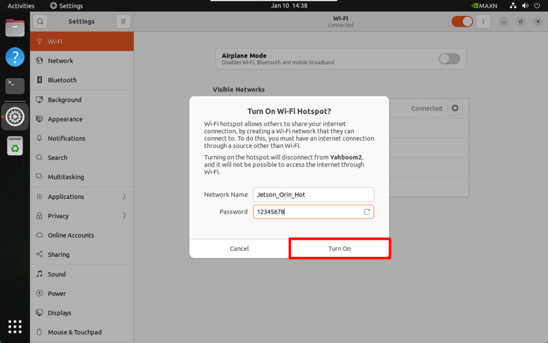
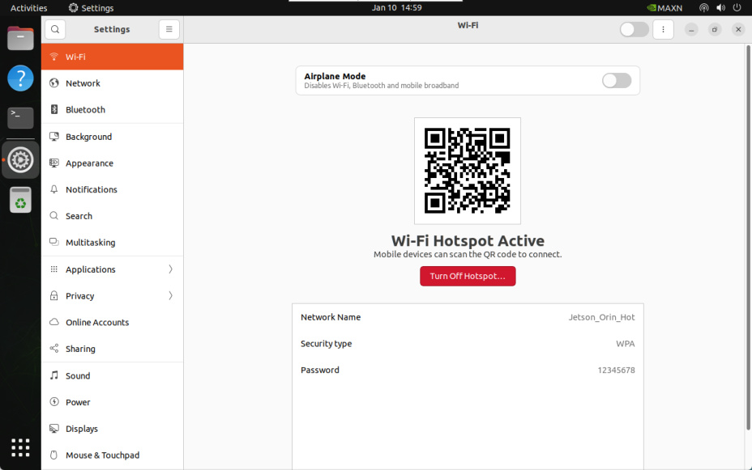
