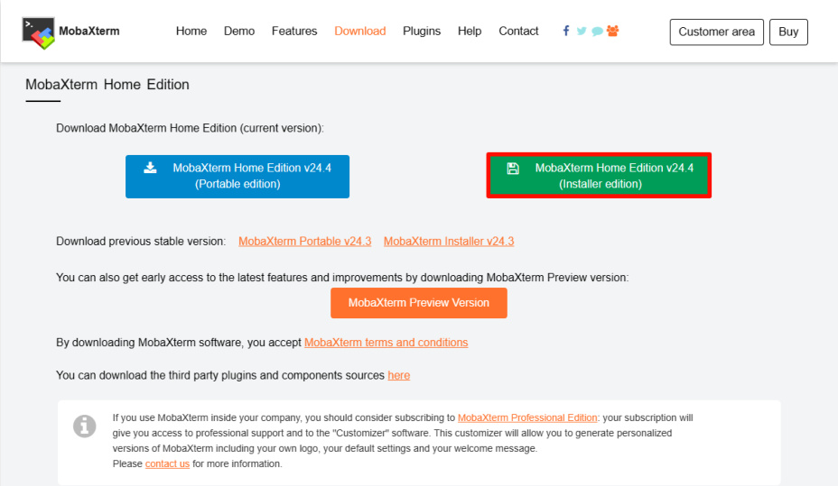
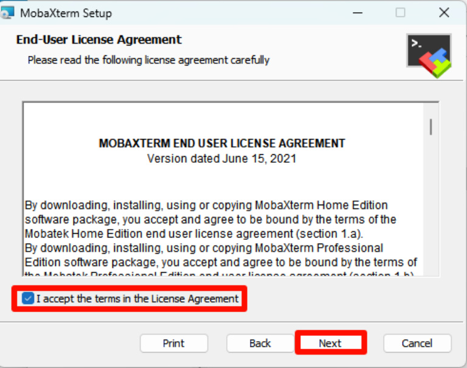
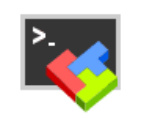
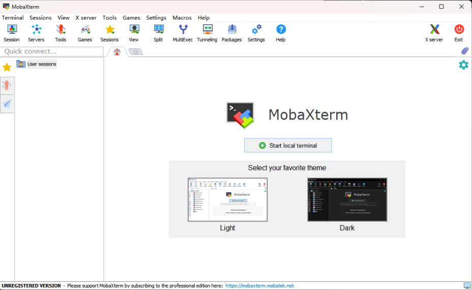
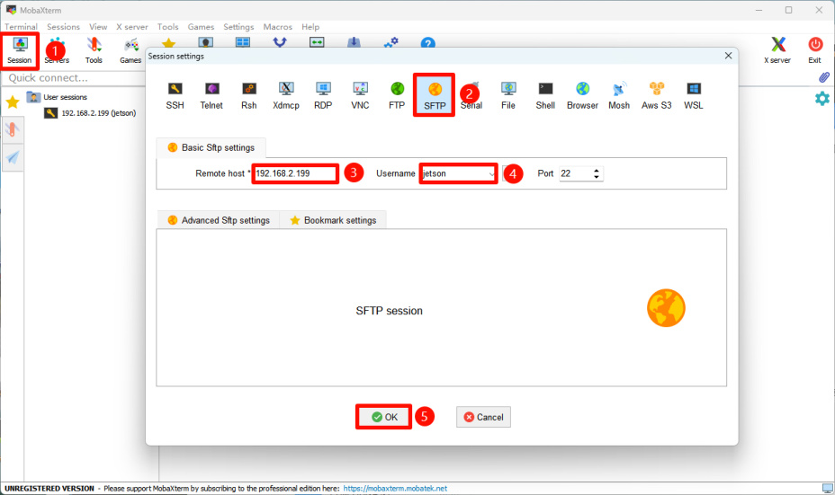
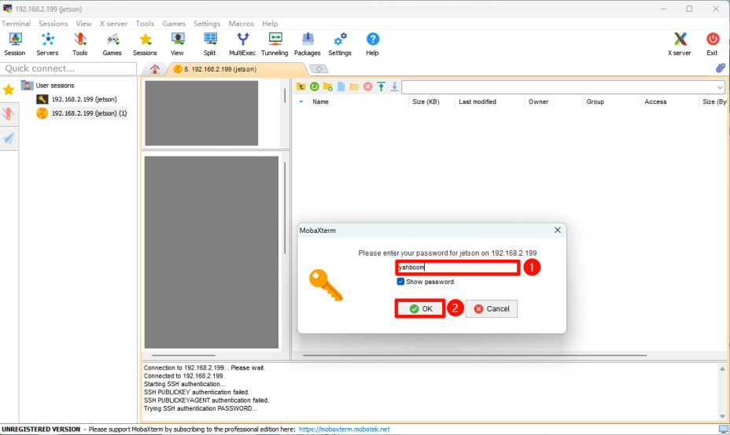
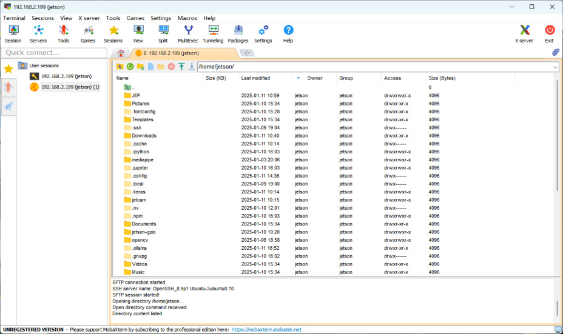

# Remote file transfer
**Remote file transfer**

1. MobaXterm

2. MobaXterm installation

### 2.1. Download MobaXterm

### 2.2. Install MobaXterm

3. Use MobaXterm

4. MobaXterm: SFTP remote

## 1. MobaXterm
MobaXterm is a powerful remote tool that integrates SHH, VNC, FTP and other remote tools.
## 2. MobaXterm installation
Official website: [https://mobaxterm.mobatek.net/](https://mobaxterm.mobatek.net/)

### 2.1. Download MobaXterm
Select the free version to download:

Select the installation version to download:

### 2.2. Install MobaXterm
Unzip the compressed package downloaded from the official website, open the

`MobaXterm_installer_24.4.msi` file to install:

Agree to the agreement:

Select the software installation location: the default location is recommended

Official installation:

Complete installation:

## 3. Use MobaXterm
## 4. MobaXterm: SFTP remote

Note: If MobaXterm uses SSH remotely, it will automatically use SFTP remote login in the sidebar

