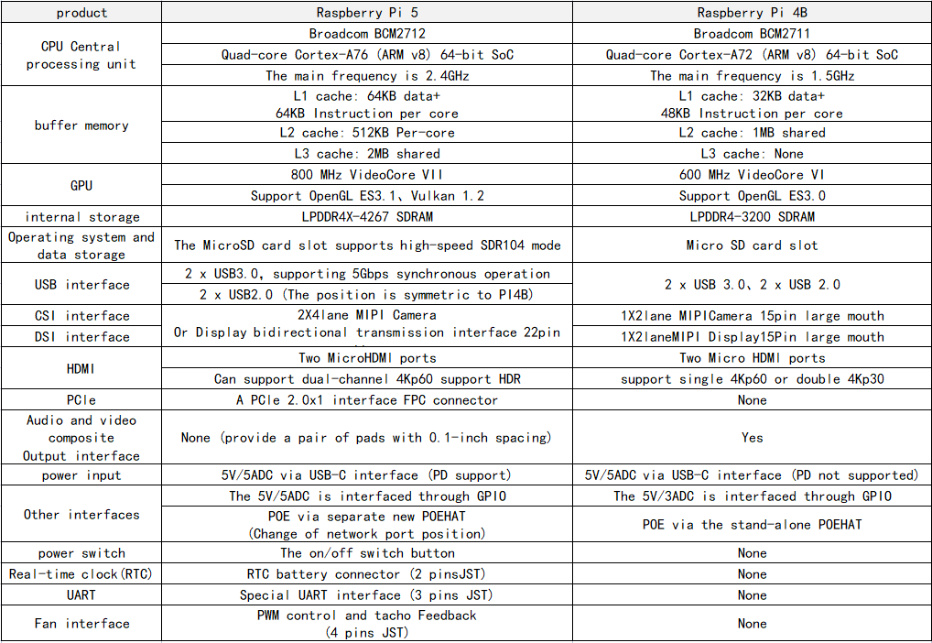
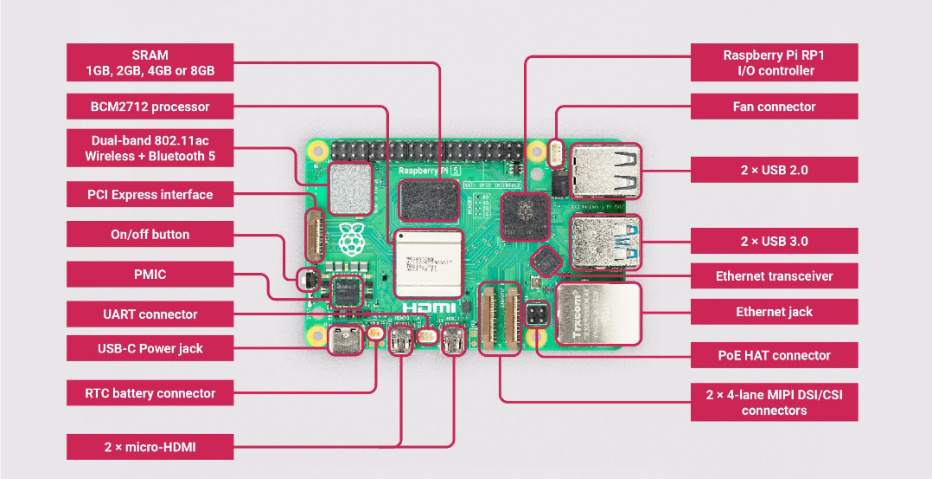
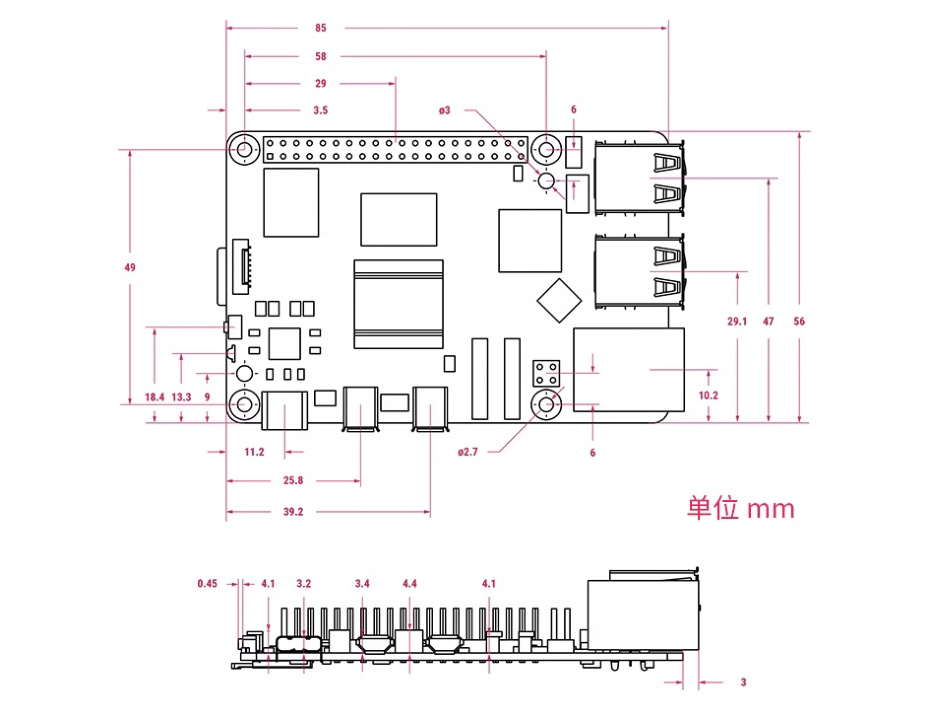

# 1. Introduction to Raspberry PI 5
**This chapter introduces information about Raspberry Pi 5.**
## 1. Introduction to Raspberry Pi 5
### 1.1. Preparation before use
To use the Raspberry Pi, you will need the following:

A Raspberry Pi motherboard;

apower;

An SD card and a card reader;

You can set up a Raspberry Pi as an interactive computer with a desktop, or as a headless

computer that can only be accessed over the network. To set up a Raspberry Pi as a headless

computer, there is no need to prepare any additional peripherals. You can pre-configure the

hostname, user account, network connection and SSH when installing the operating system .

If you want to use the Raspberry Pi directly with a desktop interactable, you will need the following

additional accessories:

A monitor and HDMI cable;

A set of keyboard and mouse.

### 1.2. Introduction
Raspberry Pi 5 uses a 64-bit quad-core Arm Cortex-A76 processor running at 2.4GHz, which

improves CPU performance by 2 to 3 times compared to Raspberry Pi 4. Additionally, it features

an 800MHz VideoCore VII GPU that delivers a massive graphics performance boost, dual 4Kp60

display outputs via HDMI, and state-of-the-art camera support via a redesigned Raspberry Pi

image signal processor. It provides consumers with a smooth desktop experience and opens new

application doors for industrial customers.

This is the first full-size Raspberry Pi computer to use silicon made in-house. The RP1 provides

most of the I/O functionality for the Raspberry Pi 5 and brings a huge change in peripheral

performance and functionality. Aggregate USB bandwidth has more than doubled, allowing for

faster data transfer to external UAS drives and other high-speed peripherals; the dedicated dual
lane 1Gbps MIPI camera and display interface used on earlier models has been replaced by a pair

of quad-lane 1.5Gbps MIPI Transceiver replacement, total bandwidth is tripled, supporting any

combination of up to two cameras or displays; peak SD card performance is doubled by

supporting SDR104 high-speed mode; the platform debuts a single-lane PCI Express 2.0 interface

for high-speed Bandwidth peripherals are supported.

### 1.3. Comparison with Raspberry Pi 4B parameters
Its main features are as follows:

˙Quad-core Arm Cortex-A76 @ 2.4GHz

˙Dual 4kp60 HDMI display output, supports HDR

˙VideoCore VII graphics card, supports OpenGL-ES 3.1, Vulkan 1.2

˙Raspberry Pi connector for PCIe (1 2.0 port, additional HAT required)

˙802.11ac dual-band Wi-Fi and Bluetooth 5.0 (supports BLE)

˙Real-time clock (RTC) and RTC battery interface

˙Fan interface

˙Power button

### 1.4. Function distribution
### 1.5. Dimensional drawing (unit: mm)

