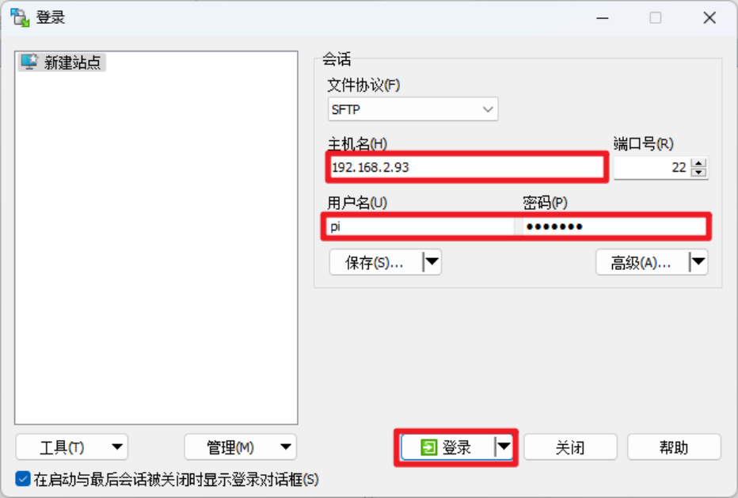
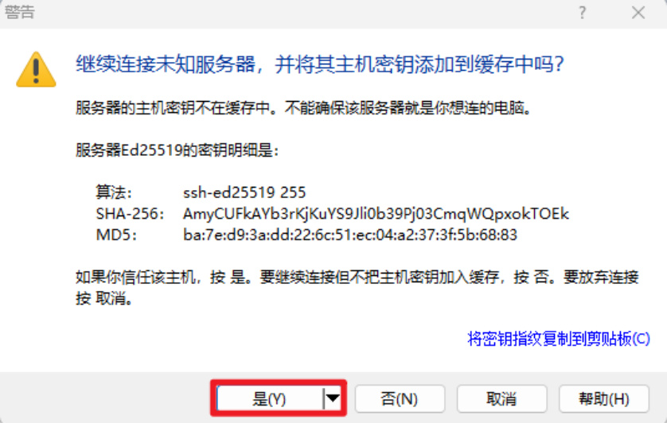
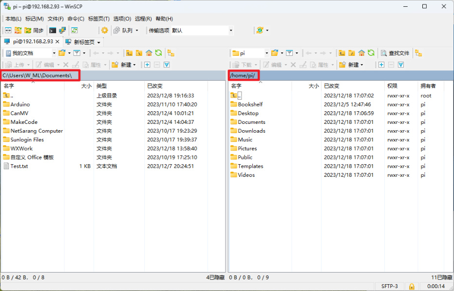
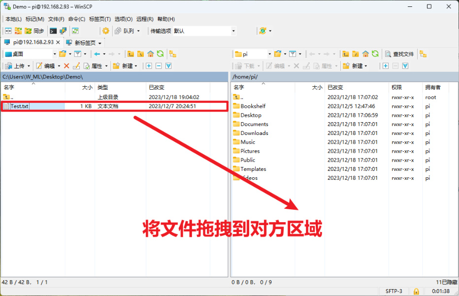
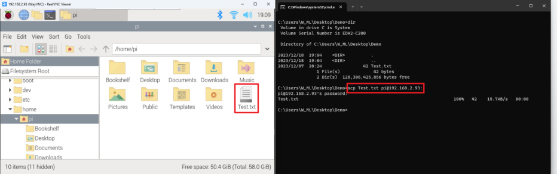
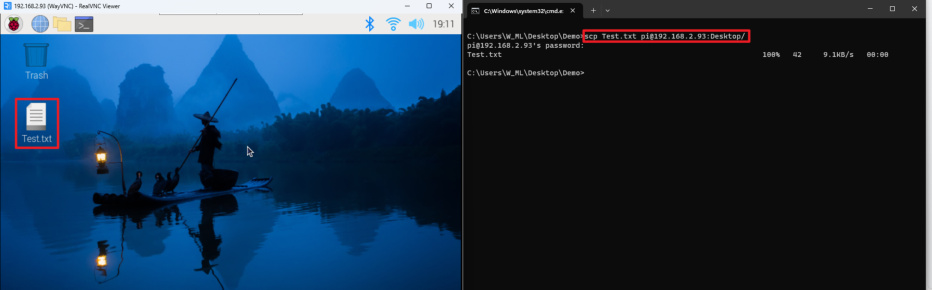
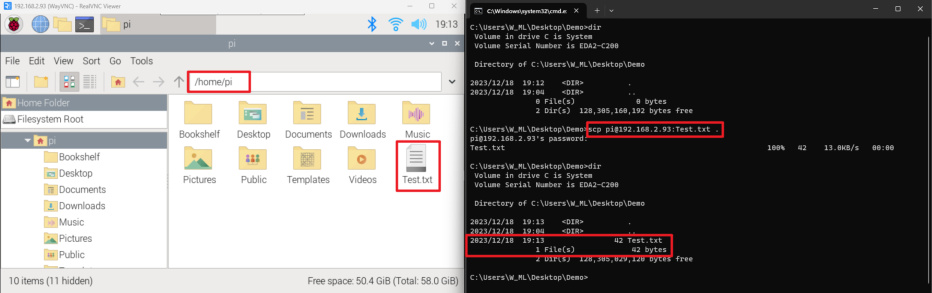

# Transfer files remotely
**Transfer files remotely**

1. WinSCP software

Transfer files

2. SCP command

### 1.1. Copy the file to the Raspberry Pi motherboard

### 1.2. Copy files from the Raspberry Pi motherboard to the current computer

It mainly introduces the use of WinSCP software to transfer files and the scp command to transfer

files. The former is recommended first!
## 1. WinSCP software
Install the WinSCP software by yourself. Here we mainly introduce how to connect to the

Raspberry Pi system based on IP, username and password information.

Connection success interface:

**Transfer files**

You can directly drag local files to the other party's area, so that the files can be copied; the

following demonstration is to transfer the Text.txt file to the Raspberry Pi system.

## 2. SCP command
Use the scp command to send files to the Raspberry Pi system through ssh. This operation does

not require the use of software, just use the terminal!

### 1.1. Copy the file to the Raspberry Pi motherboard
**Single file copy command: scp file name username@IP address:path**

Copy the file to the user directory: scp Test.txt pi@192.168.2.93:

Copy the file to the desktop: scp Test.txt pi@192.168.2.93:Desktop/

### 1.2. Copy files from the Raspberry Pi motherboard to the
**current computer**

**Single file copy command: scp username@IP address: file name**

Copy the files in the Raspberry Pi system to the current directory of the computer: scp

pi@192.168.2.93:Test.txt.

