# Set display resolution and rotation
**Set display resolution and rotation**

1. Display display settings

### 1.1. System settings adjustment

### 1.2. Modify configuration file adjustment

2. VNC remote display

### 2.1. Graphical interface

### 2.2. Command line

This tutorial mainly introduces the relevant settings of the Raspberry Pi motherboard system

interface display:

1. Connect the resolution and rotation direction settings of the display screen

2. Resolution setting of VNC remote display when no display is connected

## 1. Display display settings
### 1.1. System settings adjustment
Adjust the resolution and rotation direction of the display: applications menu → Preferences →

Screen Configuration

Right-click the corresponding HDMI output interface to set the resolution, rotation direction, etc.

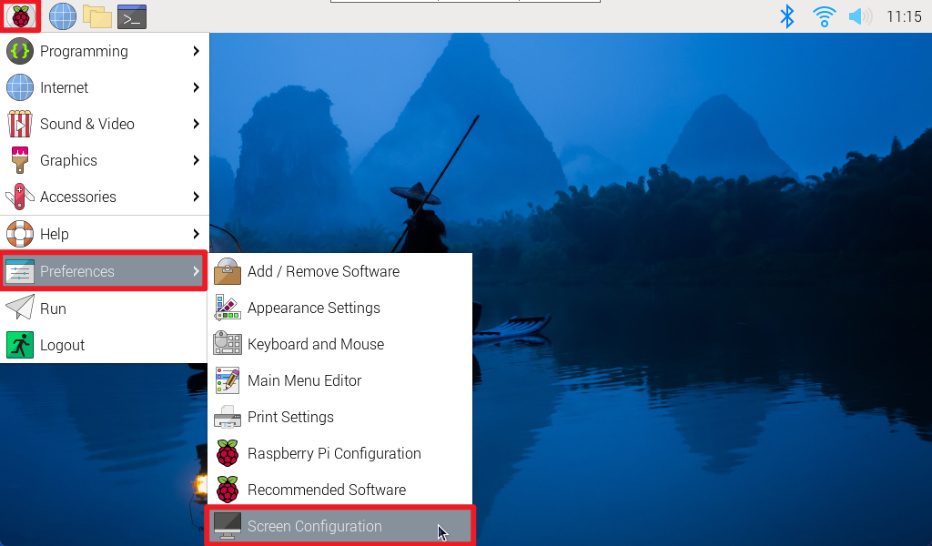
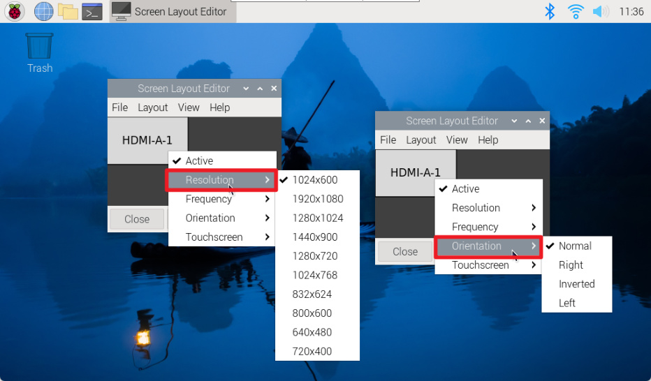
### 1.2. Modify configuration file adjustment
Enter the user directory of the Raspberry Pi system, display hidden files, and then enter the .config

folder to modify the wayfire.ini file

Show hidden files

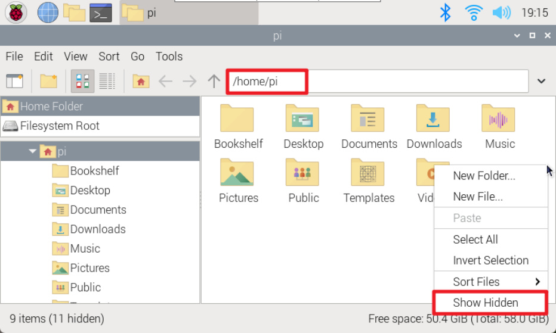
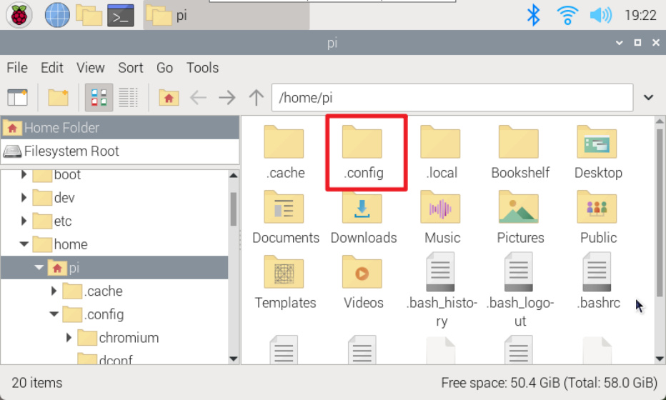

Enter the .config folder and modify the wayfire.ini file

## 2. VNC remote display
Adjust the resolution displayed when remote.

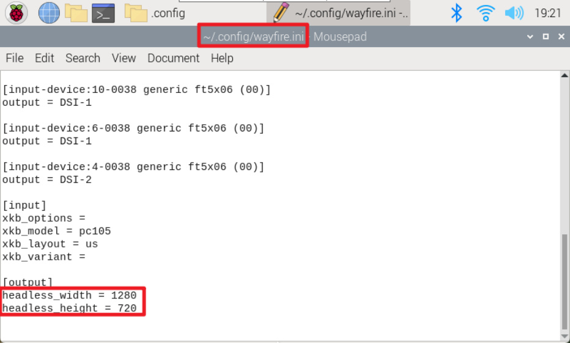

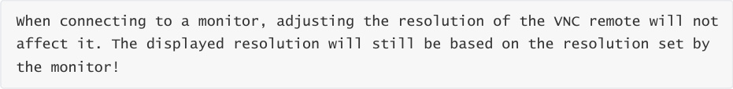

### 2.1. Graphical interface
Enter Display to modify the VNC remote resolution. After modification, you need to restart the

system and reconnect to VNC!

applications menu → Preferences → Raspberry Pi Configuration → Display

### 2.2. Command line
Use the raspi-config tool to adjust the VNC resolution.

Display Options

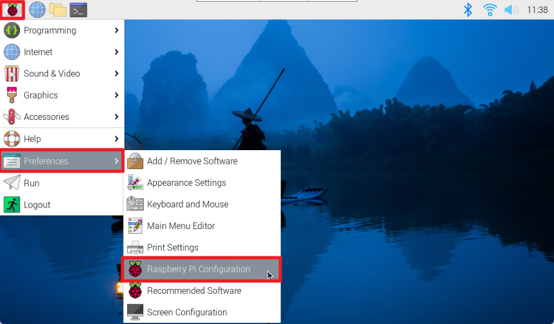

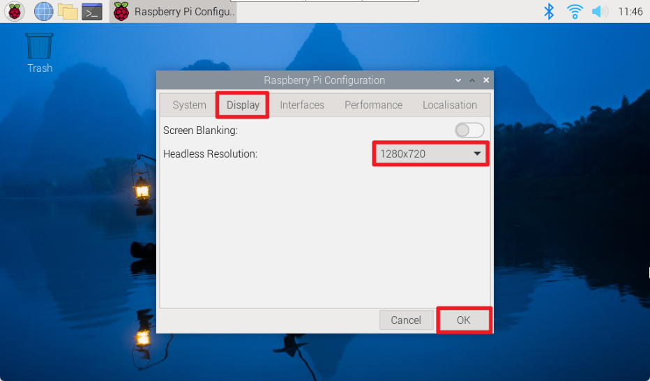
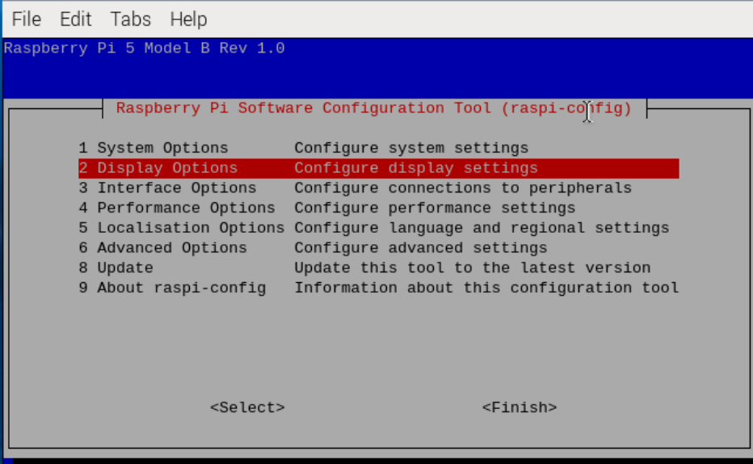

VNC Resolution

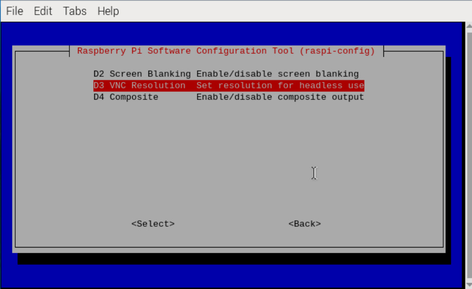
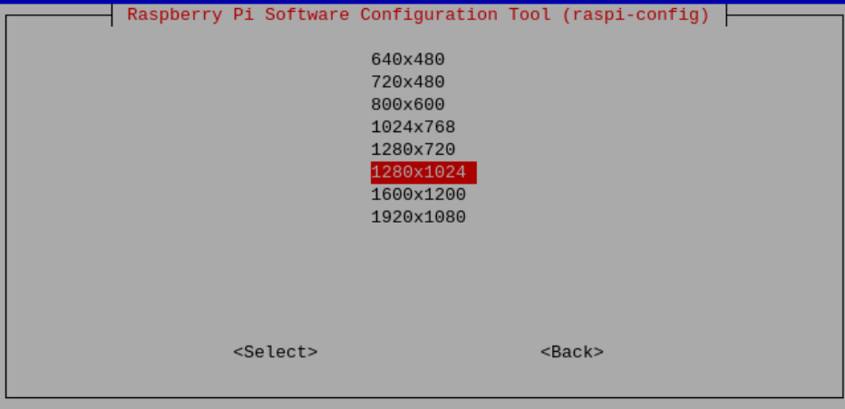
