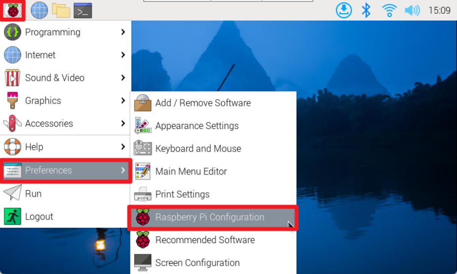
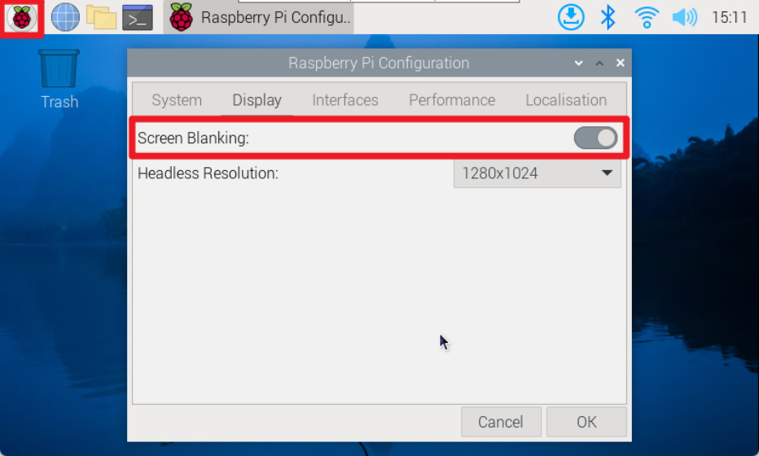
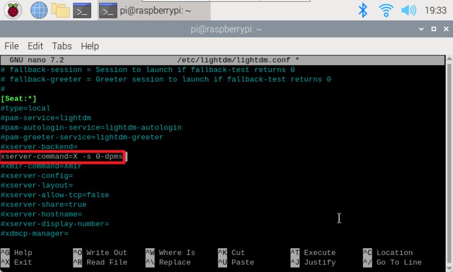

# Set screen to sleep
**Set screen to sleep**

environment

Idea 1 (recommended)

Graphical interface

Command Line

Restart

Idea 2

Configuration file modification

Restart

The tutorial mainly introduces how to set the screen to always be on. If the screen is turned on on

the Raspberry Pi system, the default is to automatically turn off the screen after 10 minutes of no

operation.

**environment**

System: Raspberry Pi OS

**Idea 1 (recommended)**

**Graphical interface**

Turn on automatic screen break: applications menu → Preferences → Raspberry Pi Configuration

Display → Screen Blanking: Turn on (if you need to turn off the screen blanking, just turn off the

switch)

**Command Line**

Use the raspi-config tool to automatically blank the screen: Display Options → Screen Blanking:

enable

**Restart**

The modified configuration will take effect after restarting!

**Idea 2**

You can configure the lightdm desktop display manager to use xservice to keep the screen always

on.

**Configuration file modification**

lightdm.conf file location:/etc/lightdm

Cancel the comment character # of xserver-command=X in the file and change it to xserver
command=X -s 0-dpms. After the modification is completed.

Save and exit the nano editor: press Ctrl+X, enter y, and press Enter.

**Restart**

Enter the reboot command in the terminal to restart the system, and the modified configuration

file will take effect after restarting!
