# Using USB camera
**Using USB camera**

Install FSWebcam

View USB camera device

Photograph

Time-lapse photography

Using Cron (scheduled tasks)

Web page preview camera

Install Motion

Modify configuration file

Start service

Web page preview screen

Take photos and videos on your Raspberry Pi using a standard USB camera.

**Install FSWebcam**

FSWebcam is a simple and clear webcam application. The software installation command is as

follows:

Add user permissions: sudo usermod -a -G video

Example: Add pi user permissions to the group

Check if the user has been added to the group correctly

Command: groups

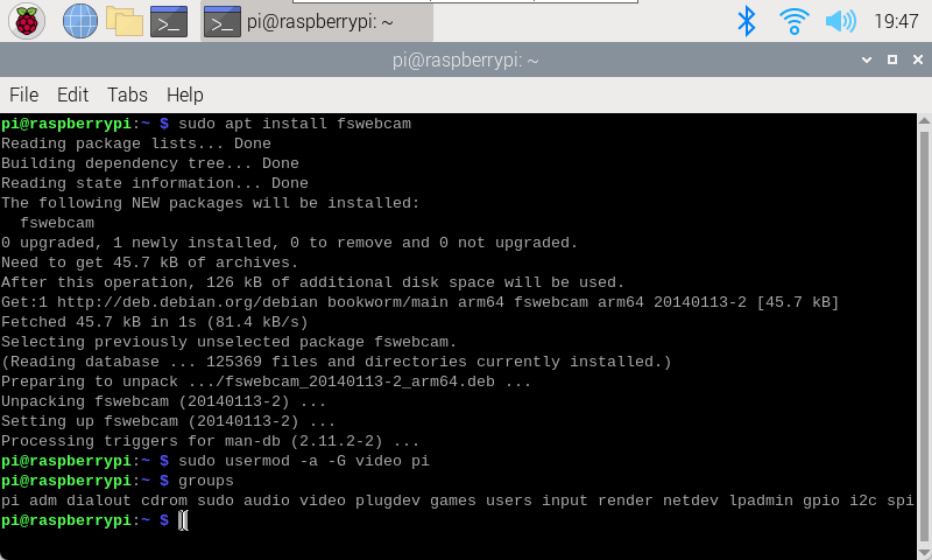
**View USB camera device**

Use the lsusb command to view all USB devices recognized by the system;

Use the ls /dev/video* command to list all video devices recognized by the system.

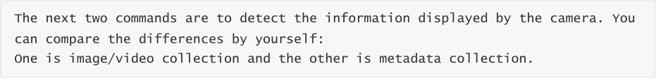

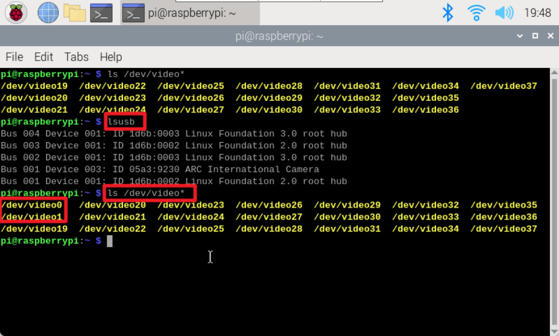

**Photograph**

fswebcam <image_name>

Example: Take a photo and save it as image.jpg (the file saving path defaults to the user directory)

fswebcam -r resolution <image_name>

Example: Take an image file with a resolution of 1280x720 and save it as image2.jpg

fswebcam -r resolution --no-banner <image_name>

Example: Take an image file with a resolution of 1280x720, no information such as time is

displayed on the picture, and save it as image3.jpg

**Time-lapse photography**

Create a new Webcam folder and enter the file

Create a new webcam.sh script file and edit the content

File content: The file saving path needs to be modified by yourself. My system username directory

is yahboom.

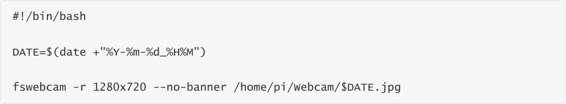

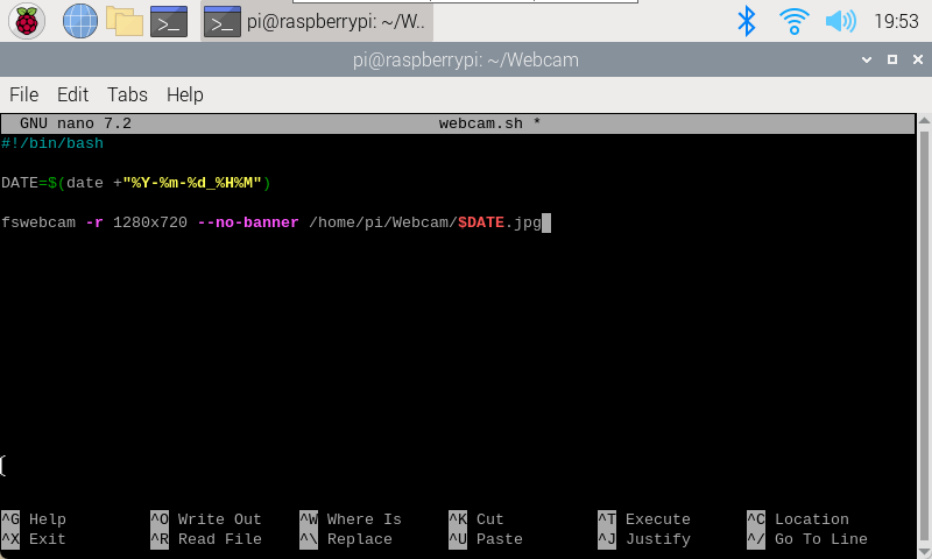

Hold down Ctrl+X, enter Y, and press Enter.

Add executable permissions

run script

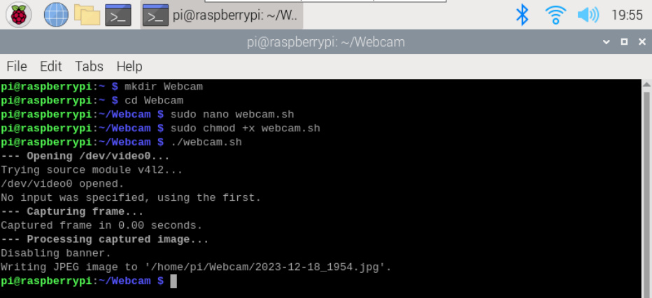

**Using Cron (scheduled tasks)**

Open the cron table for editing. You will be prompted to select an editor when using it for the first

time. It is recommended to use the nano editor.

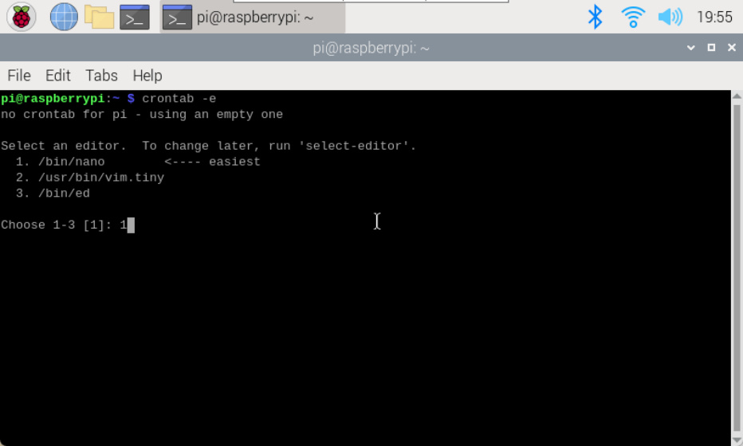

Add the following code to the edited document: the first 5 * symbols represent a timer of 1

minute, and 2>&1 is to input the error output to the standard output.

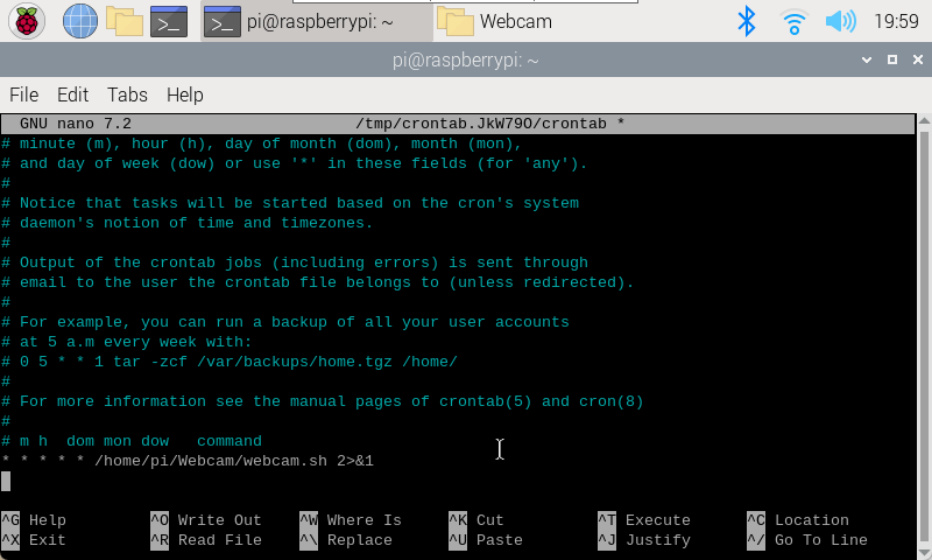

After saving the file and exiting, the terminal will output the following content:

For Cron jobs, you can learn about format and syntax by yourself!

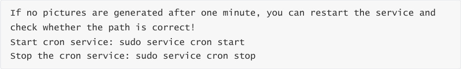

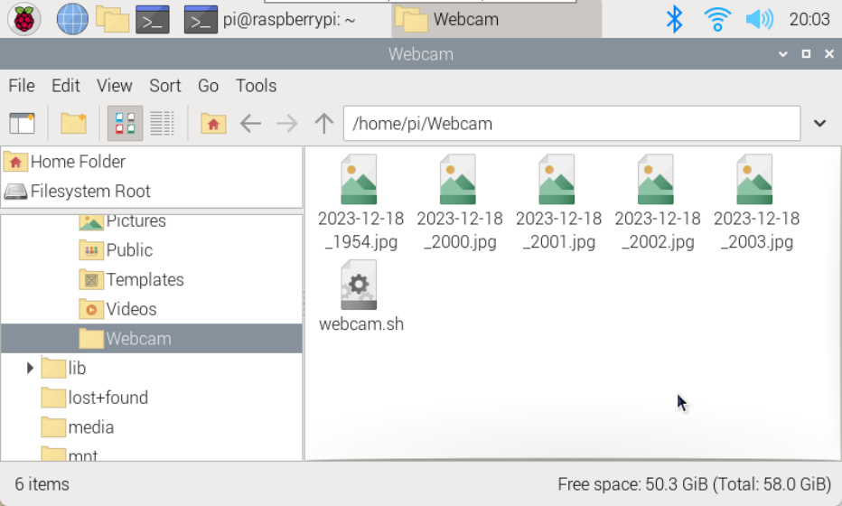

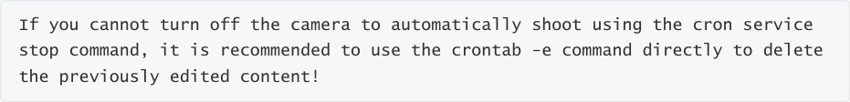
**Web page preview camera**

Use Motion to view the video captured by the USB camera in real time on the web page.

**Install Motion**

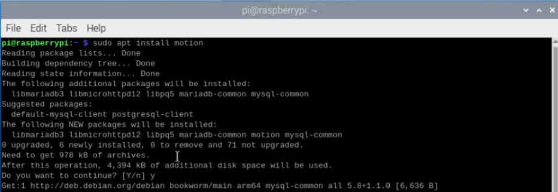

**Modify configuration file**

-motion.conf

Add or modify the following:

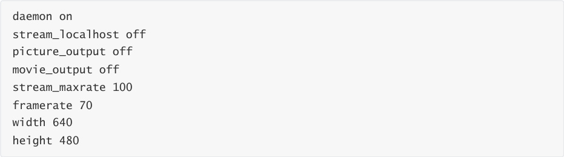

illustrate:

1. The above options that are not found in the configuration file can be added directly to the

file. For example, the stream_maxrate option needs to be added by yourself, but other

options are available.

2. Frame rate: You can modify it yourself (the above parameters are my best results)

3. The nano editor can use the Ctrl+W shortcut keys to search for keywords and quickly locate

the content that needs to be modified.

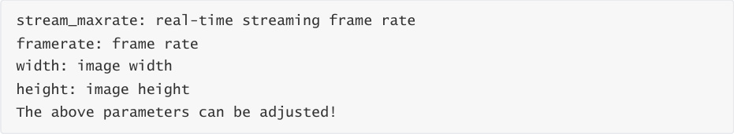

motion

Add the following code: motion runs in the background

**Start service**

Start service

Out of service

Restart service

Turn on motion

**Web page preview screen**

Enter the start motion service and enable motion commands in the terminal:

Preview screen

After turning on motion, enter the car IP: 8081 on the browser on the same LAN to view the real
time image of the camera.

Example: 192.168.2.93:8081
