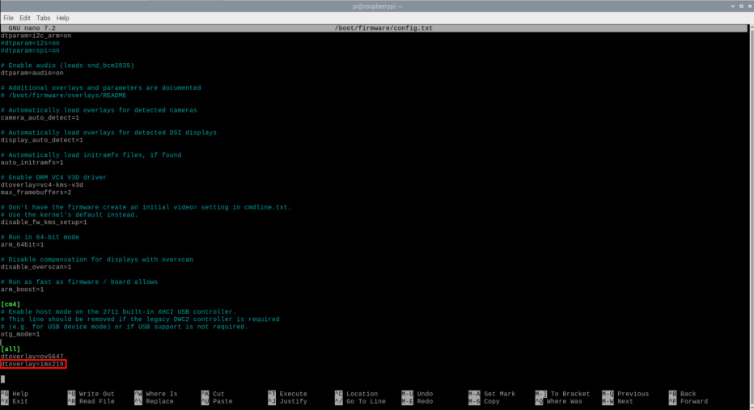
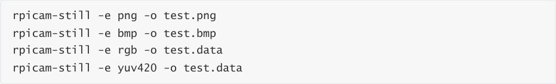
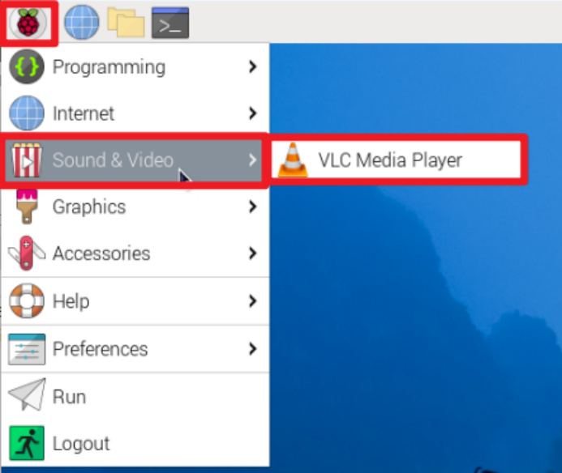
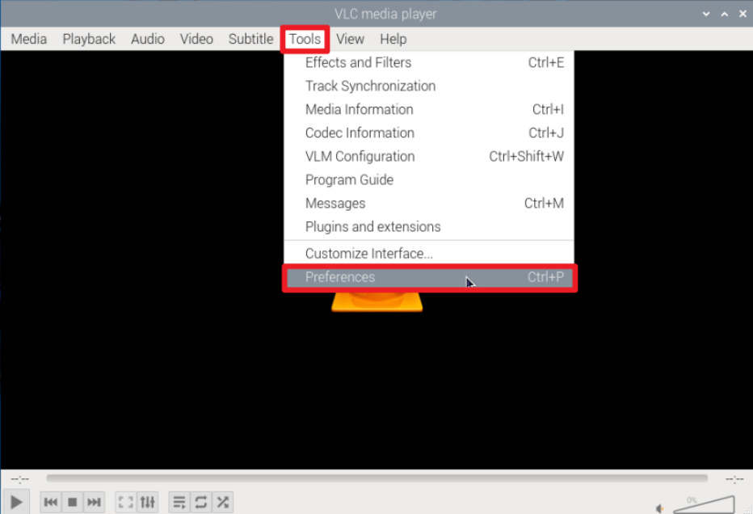
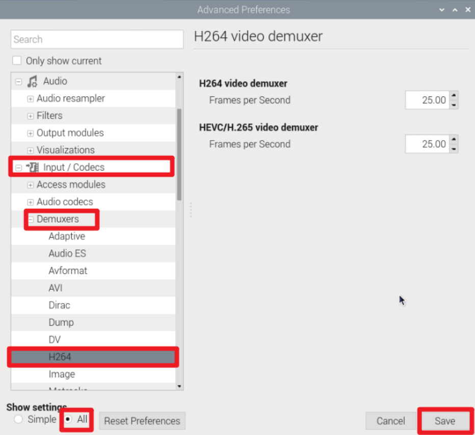
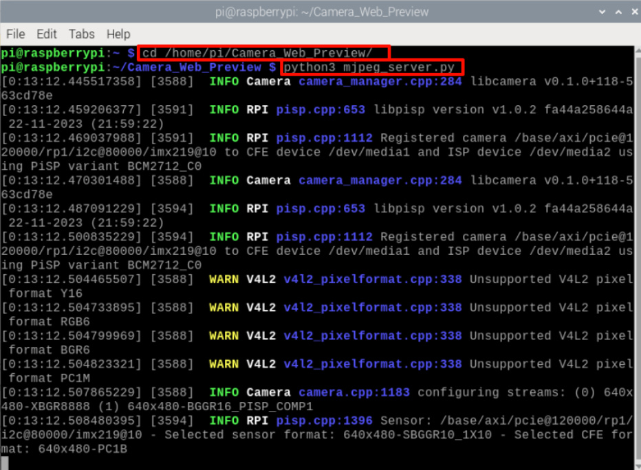
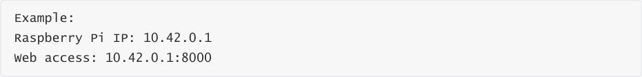
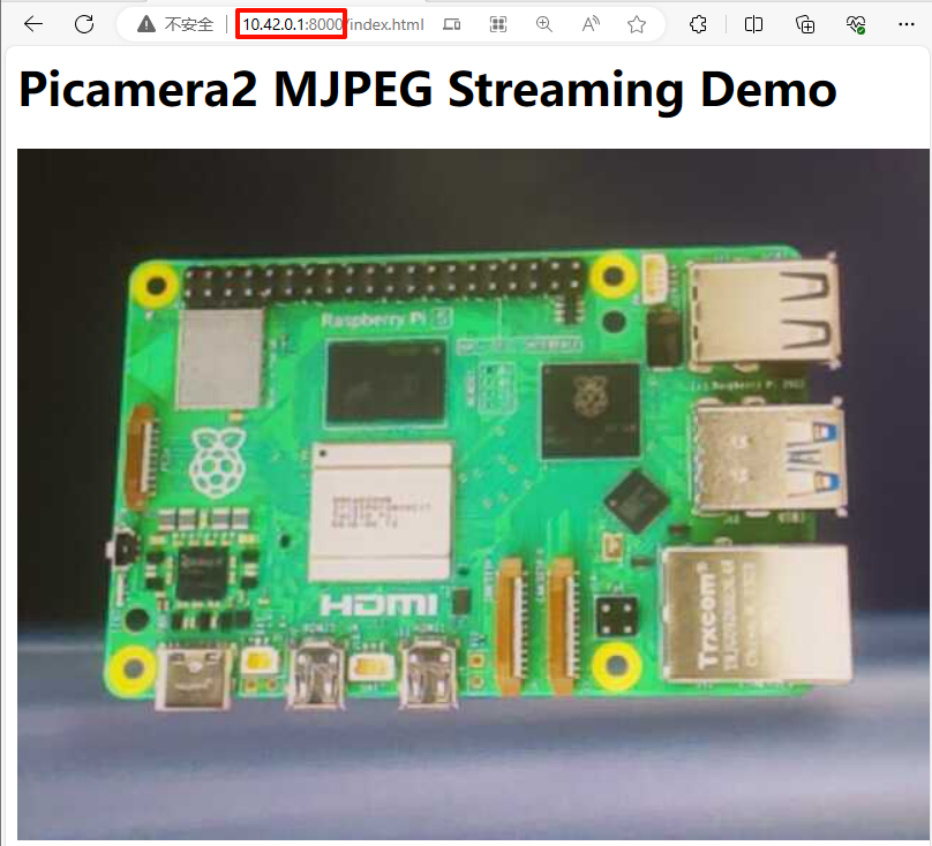

# Using MIPI camera
**Using MIPI camera**

Configure camera

Use camera

Preview camera

Photograph

rpicam-still

Video

rpicam-vid

Error resolution

Web page preview camera

Run script

Web access

The Raspberry Pi 5 combines the previous CSI and DSI interfaces into two dual-purpose CSI/DSI

(MIPI) ports.

**Configure camera**

When using a Raspberry Pi camera or a third-party camera, you can modify the camera

configuration according to the following table:

|Camera module|File located at: /boot/firmware/config.txt|
|---|---|
|V1 Camera (OV5647)|dtoverlay=ov5647|
|V2 camera (IMX219)|dtoverlay=imx219|
|HQ Camera (IMX477)|dtoverlay=imx477|
|GS camera (IMX296)|dtoverlay=imx296|
|Camera module 3 (IMX708)|dtoverlay=imx708|
|IMX290 and IMX327|dtoverlay=imx290,clock-frequency=74250000 or (both modules share the IMX290 kernel driver; for the correct frequency, see the module vendor's instructions) dtoverlay=imx290,clock-frequency=37125000|
|IMX378 type|dtoverlay=imx378|
|OV9281 series|dtoverlay=ov9281|

If you are not using the official Raspberry Pi camera, you can modify the config.txt file as shown in

the table and add the dtoverlay content to the /boot/firmware/config.txt file.

For example: Raspberry Pi uses IMX219 camera, connect the camera to the Raspberry Pi J4

interface, and then modify the /boot/firmware/config.txt file:

Modify the configuration file and restart to take effect!

**Use camera**

**Preview camera**

rpicam-hello

Entering this command in the terminal will display the preview window for about 5 seconds.

rpicam-hello -t 0

Running this command in the terminal will always display the preview window. You can use the

window close button and Ctrl+C to exit!

**Photograph**

rpicam-jpeg -o test.jpg

Display a preview for 5 seconds, then capture the image and save it as a test.jpg file

rpicam-jpeg -o test.jpg -t 2000 --width 640 --height 480

Show a preview for 2 seconds, then capture and save the image as a test.jpg file, with the image

having a width of 640 pixels and a height of 480 pixels.

**rpicam-still**

This command can be used to save files in different formats:

Raw image capture

Time-lapse shooting

Capture images continuously at intervals of 2 seconds for a total capture duration of 30 seconds,

and save each image as a file name similar to image0001.jpg:

**Video**

**rpicam-vid**

Commands for video recording using the camera module on the Raspberry Pi.

Example: Record 10 seconds of video and write to test.h264 file

play video

**Note** : If the test.h264 file cannot be played and an error occurs, please try the following method

to solve it.

**Error resolution**

Modify the frame rate of H264 playback per second

**Web page preview camera**

Use Python script files to preview camera images on web pages.

**Run script**

Code path:/home/pi/Camera_Web_Preview/

**Web access**

Devices under the same LAN can enter :8000 through the browser to view the real-time camera

view!

