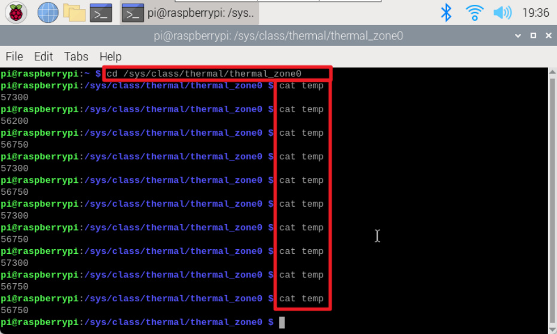

# Get real-time temperature of Raspberry Pi
**Get real-time temperature of Raspberry Pi**

environment

Ideas

Get temperature parameters

actual effect

Enter the command through the terminal to check the current CPU temperature of the Raspberry

Pi.

**environment**

System: Raspberry Pi OS

**Ideas**

The CPU temperature information of the Raspberry Pi is located in the file

/sys/class/thermal/thermal_zone0/temp, which is a read-only file; we can read the value and

convert it to the actual temperature.

**Get temperature parameters**

Open the terminal and run the following two commands to obtain the temperature parameters:

**actual effect**

