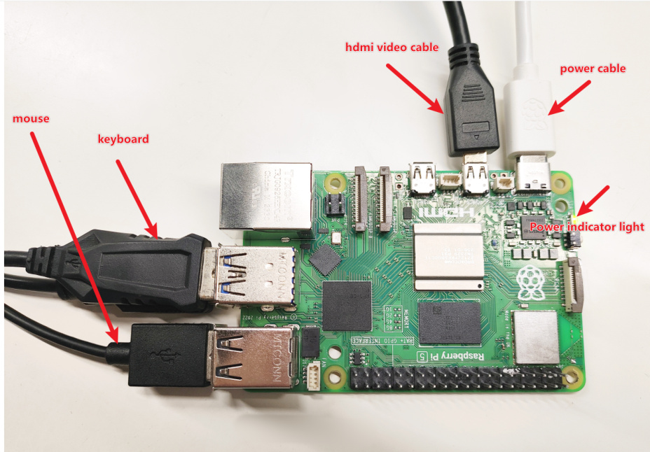
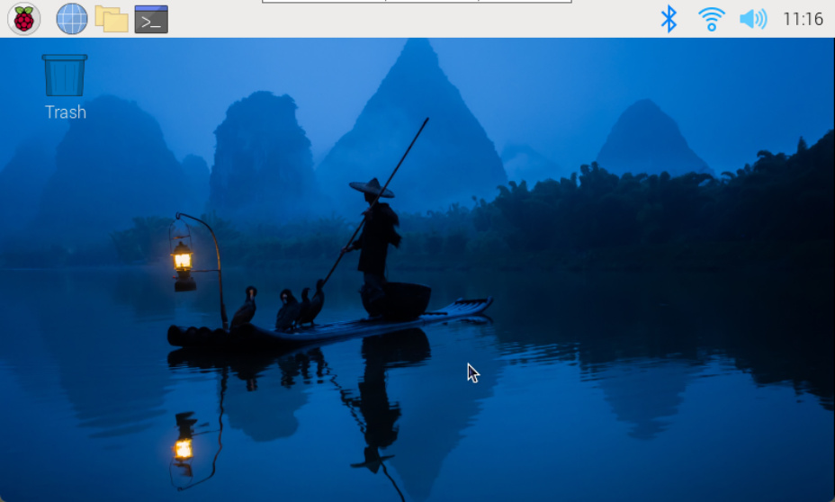

# 4. Startup of Raspberry PI 5
After burning the image, insert the SD card directly into the Raspberry Pi, then connect the

monitor, power supply, mouse, and keyboard to the Raspberry Pi to enter the Raspberry Pi

system.

Under normal circumstances, the signal light lights up red when the computer is turned on, and

then turns green. Wait for a few seconds before the green light flashes irregularly, enter the

desktop, and then the green light stays on.

