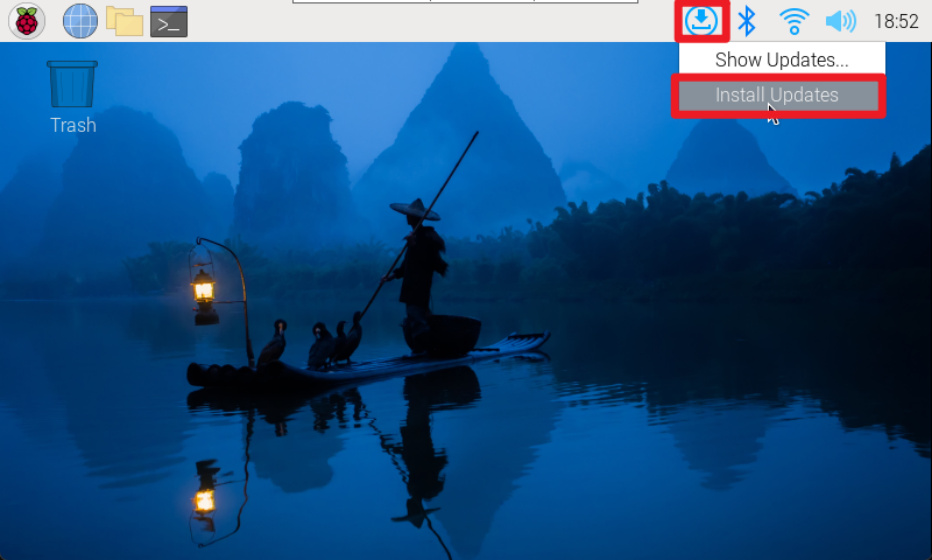
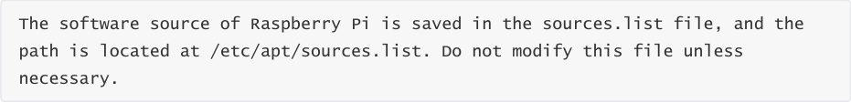
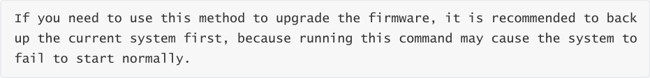

# Update and upgrade operating system
**Update and upgrade operating system**

Graphical interface

Use APT

Update software list

Update software to the latest version

Search software

View software information

install software

Uninstall software

Use rpi-update

Upgrade firmware

Roll back to stable version

Keeping the Raspberry Pi up to date can improve the security of the system, but it is not

recommended for developers to update randomly!

**Graphical interface**

Generally, the Raspberry Pi system update prompt will be displayed in the upper right corner of

the desktop. You can click the corresponding option to update!

**Use APT**

Tools for managing software installation, upgrades and removals.

**Update software list**

**Update software to the latest version**

**Search software**

Command: apt-cache search <package_name>

Function: Used to search for specific packages in the package repository.

Example: Search the package management system for packages related to "locomotive"

**View software information**

Command: apt-cache show <package_name>

Function: Used to display detailed information of a specific software package.

Example: Display details for a package named "sl"

**install software**

Command: sudo apt install <package_name>

Function: Used to install specific software packages with administrator privileges.

Example: Use administrator rights (sudo) to install software named "tree"

Command: sudo apt install <package_name> -y

Function: Automatically confirm the installation of specific software packages with administrator

privileges.

Example: Installing a package named "tree" with automatic confirmation (-y) with administrator

privileges

**Uninstall software**

Command: sudo apt remove <package_name>

Function: Used to remove specific software packages with administrator privileges.

Example: Uninstalling a package named "tree" with administrator privileges.

Command: sudo apt purge <package_name>

Function: Used to completely clear specific software packages, including configuration files and

useless dependencies, with administrator privileges.

Example: Completely clear the package named "tree" with administrator privileges, including

configuration files and useless dependencies.

**Use rpi-update**

Used to update startup files and firmware on the Raspberry Pi to provide support for new

hardware, features, or fixes.

**Upgrade firmware**

rpi-update needs to be run as root; you will need to reboot after the update is complete.

**Roll back to stable version**

If the firmware upgrade still does not work properly, you can use the following command to

reinstall the stable version of the firmware.
