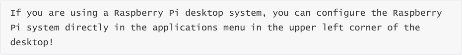
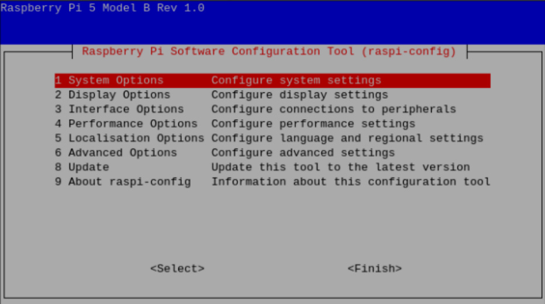
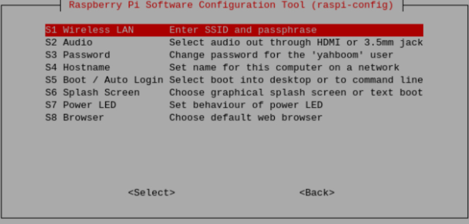
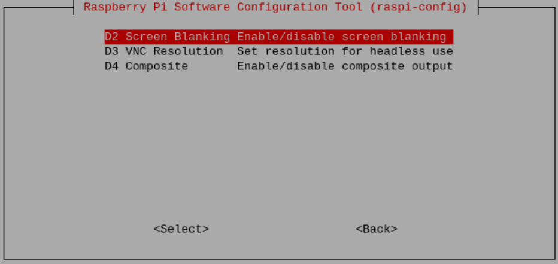
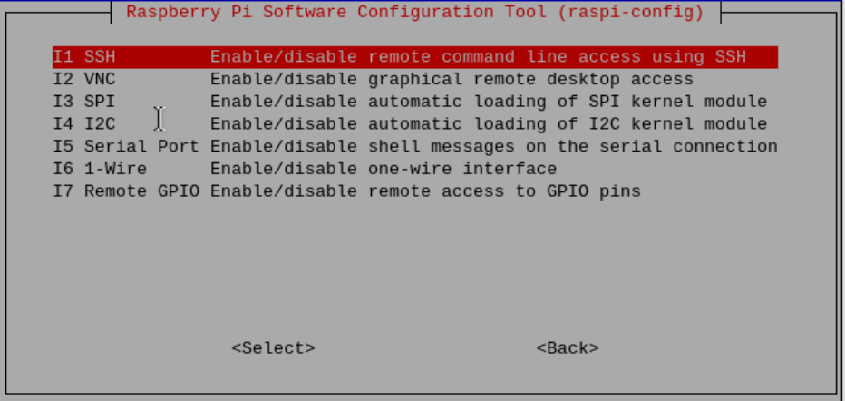
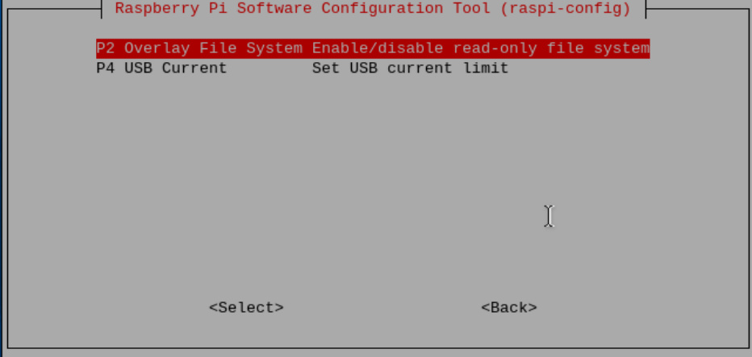
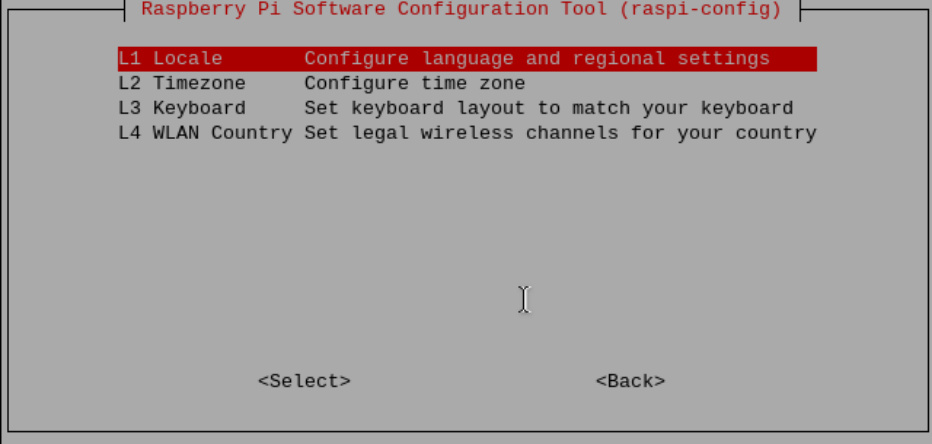
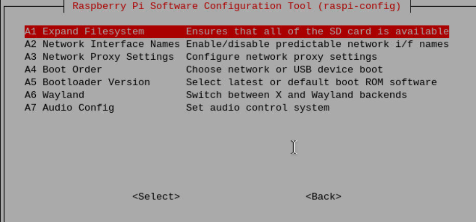
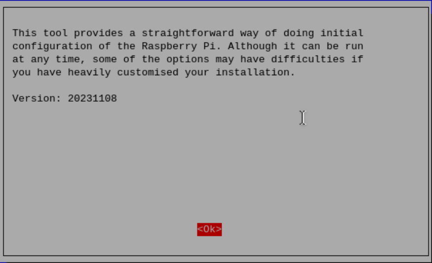

# Introduction to raspi-config tool
**Introduction to raspi-config tool**

Open

Options list

System options

Show options

Interface options

Performance options

Localization options

advanced options

Update

About raspi-config

raspi-config is a pre-installed configuration tool in Raspberry Pi OS;

raspi-config provides a simple and convenient command line interface to manage the

configuration of the Raspberry Pi system, allowing users to easily customize and optimize their

system settings.

**Open**

To open the raspi-config tool, you need to run the following command in the terminal:

**Options list**

Since versions of the raspi-config tool are constantly being updated, the following list of options

may not be exactly the same.

**System options**

**Wireless LAN**

Set wireless LAN SSID and password.

**Audio**

Specify the audio output destination.

**password**

Change the "default" user password.

**CPU name**

Set the visible name of this Raspberry Pi on the network.

**Start/auto login**

Choose whether to boot to the console or desktop, and whether a login is required.

**Initial screen**

Enable or disable the content displayed at startup. You can turn this feature on/off to observe the

Raspberry Pi startup screen.

**Power Indicator**

Raspberry Pi 5 currently does not support changing power indicator options.

**Browser**

Set default browser options.

**Show options**

**Screen pause**

Enable or disable screen snooze.

**VNC Resolution**

The resolution of the remote display when there is no monitor.

**Compound**

Set the video output to pass through the composite video output port.

**Interface options**

**SSH**

Enable/disable SSH, which is remote command line access to the Raspberry Pi.

**VNC**

Enable/disable WayVNC or RealVNC virtual network computing server.

**SPI**

Enable/disable automatic loading of SPI interface and SPI kernel modules.

**I2C**

Enable/disable automatic loading of I2C interface and I2C kernel modules.

**Serial port**

Enable/disable shell and kernel messages on serial connections.

## 1-Wire
Enable/disable the Dallas 1-wire interface. This is typically used for the DS18B20 temperature

sensor.

**Remote GPIO**

Enable or disable remote access to GPIO pins.

**Performance options**

**Overwrite file system**

Enable or disable read-only file systems.

**USB current**

Set the current output of the USB interface.

**Localization options**

**area**

select area.

**Time zone**

Select your local time zone.

**Keyboard**

Choose a keyboard layout.

**WLAN Country**

Set the country for your wireless network.

**advanced options**

**Expand file system**

Extend SD card partition.

**Network interface name**

Enable or disable predictable network interface names.

**Network proxy settings**

Configure proxy settings for your network.

**Startup sequence**

Choose SD card, USB or network boot.

**Bootloader version**

Latest boot ROM software; revert to factory defaults if latest version causes issues.

**Wayland**

Use this option to switch between X11 and Wayland backends.

**Audio configuration**

Use this option to switch between the PulseAudio and PipeWire audio backends.

**Update**

Update this tool to the latest version.

**About raspi-config**

The above is an introduction to the options involved in the raspi-config tool!

