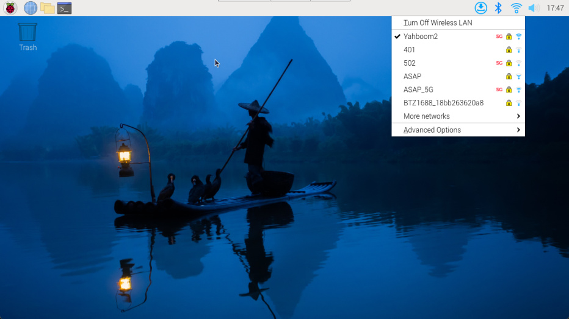
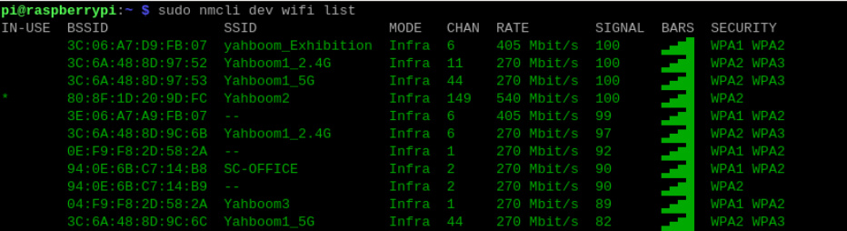
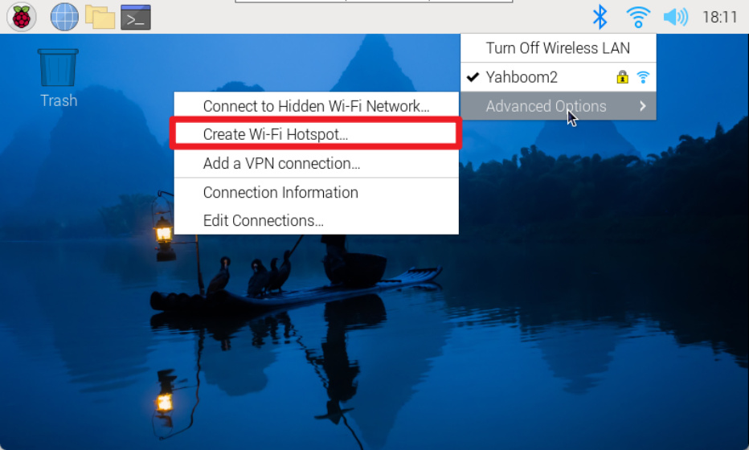
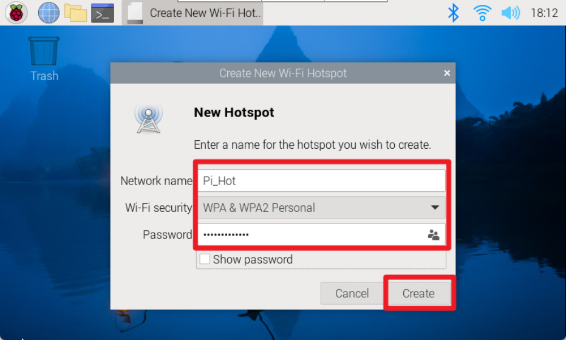
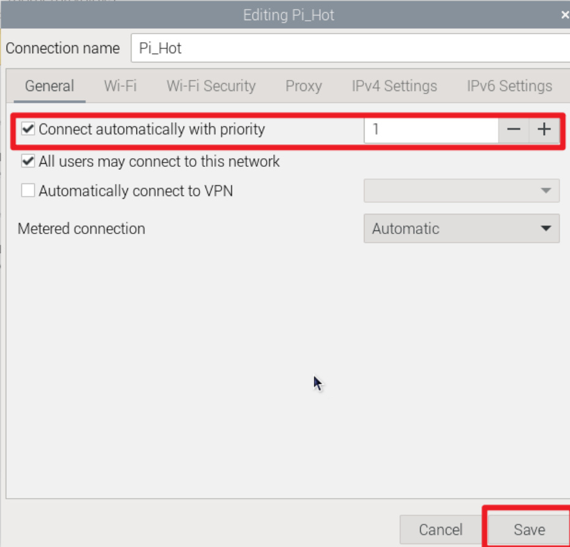

# Network Configuration
**Network Configuration**

1. WiFi connection

2. Turn on hotspot

3. Hotspot/WiFi starts automatically after booting

Network configuration mainly introduces WiFi connection and hotspot opening.
## 1. WiFi connection
**Graphical interface**

Using the Raspberry Pi graphical desktop system, we can connect to the corresponding WiFi by

clicking the network icon in the upper right corner of the menu bar.

**Command Line**

For systems without a graphical interface, you can configure the network through the command

line.

Use the raspi-config tool: enter sudo raspi-config in the terminal

Set WLAN country:

Localization Options → WLAN Country → CN China → OK

After completing the above option settings, select Finish to exit the raspi-config tool.

View WiFi enabled status command: nmcli radio wifi

Turn on WiFi status command: nmcli radio wifi on

Turn off WiFi status command: nmcli radio wifi off

Find network command: sudo nmcli dev wifi list

Connect to the network command: sudo nmcli --ask dev wifi connect <example_ssid>

The above information prompt appears indicating that the WiFi connection is successful!
## 2. Turn on hotspot
Using the Raspberry Pi graphical desktop system, we can create a hotspot by clicking the network

icon in the upper right corner of the menu bar.

After the creation is successful, you can use your mobile phone to view the hotspot!
## 3. Hotspot/WiFi starts automatically after booting
We can set up the Raspberry Pi system to connect to WIFI or turn on a hotspot by modifying the

priority of the network settings.

