# remote access
**remote access**

1. Preliminary preparation

### 1.1. Enable SSH and VNC

Graphical interface

Command Line

### 1.2. Obtain IP

Graphical interface

2. SSH remote control

3. VNC remote login

We often use SSH and VNC tools to remotely control the Raspberry Pi system.
## 1. Preliminary preparation
Before performing SSH or VNC remote login, you need to enable SSH and VNC functions in the

Raspberry Pi system settings or use the raspi-config tool.

### 1.1. Enable SSH and VNC
**Graphical interface**

Enable SSH and VNC: applications menu → Preferences → Raspberry Pi Configuration

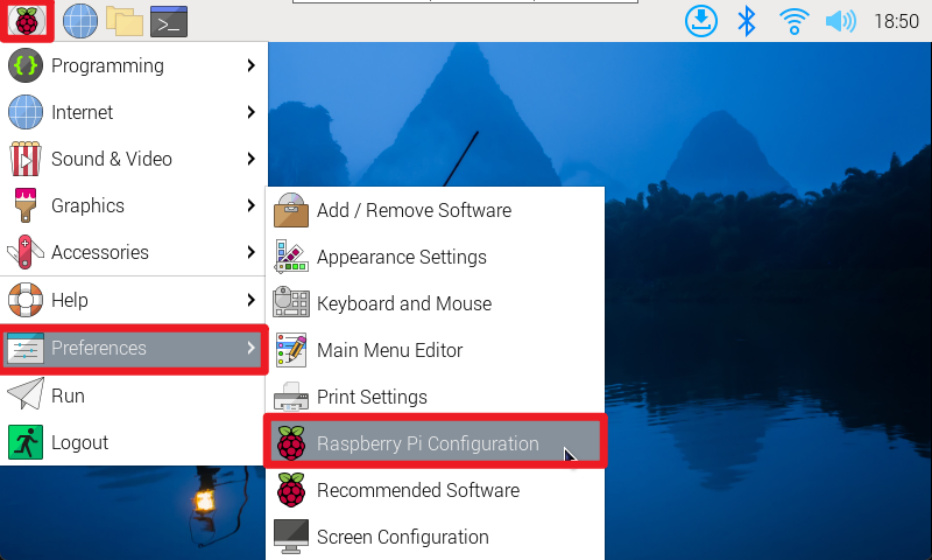
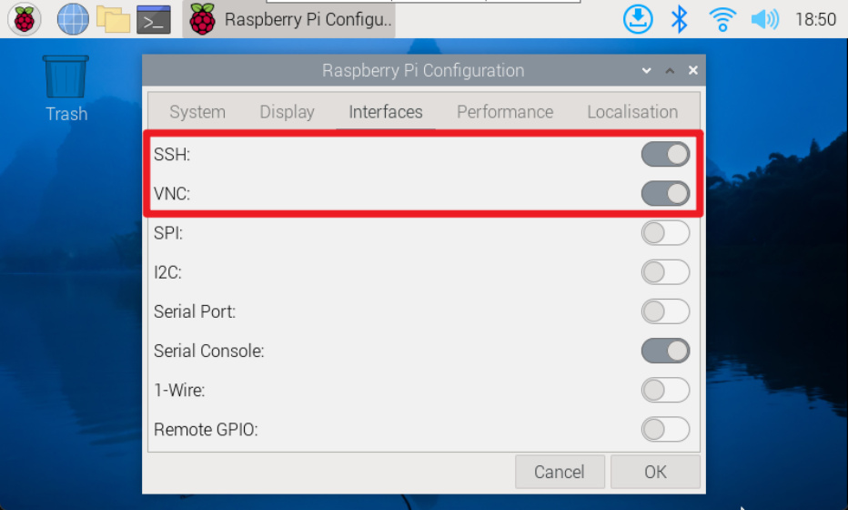

**Command Line**

Use the raspi-config tool to enable SSH and VNC functions: Interface Options → SSH/VNC: enable

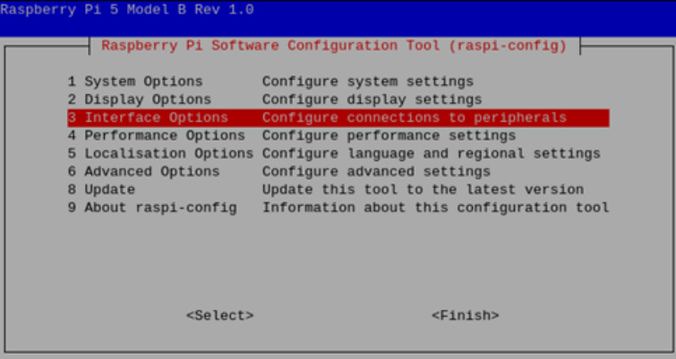

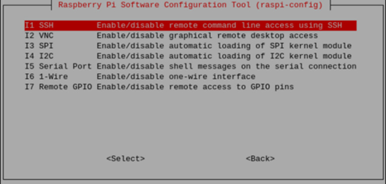
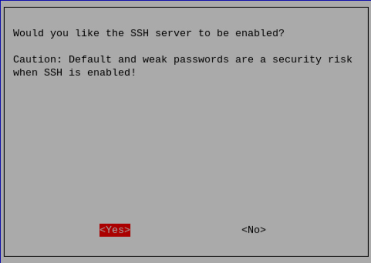

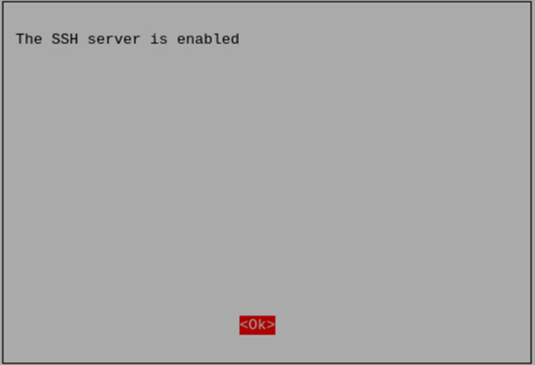

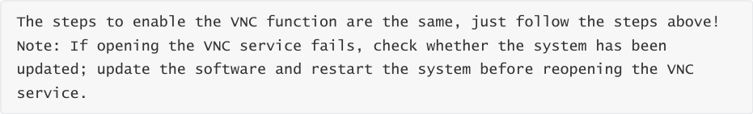

### 1.2. Obtain IP
After enabling SSH and VNC functions, you can remotely control the Raspberry Pi based on its IP!

**Graphical interface**

After the system is connected to WiFi, hover the mouse on the WiFi icon to see the corresponding

IP address.

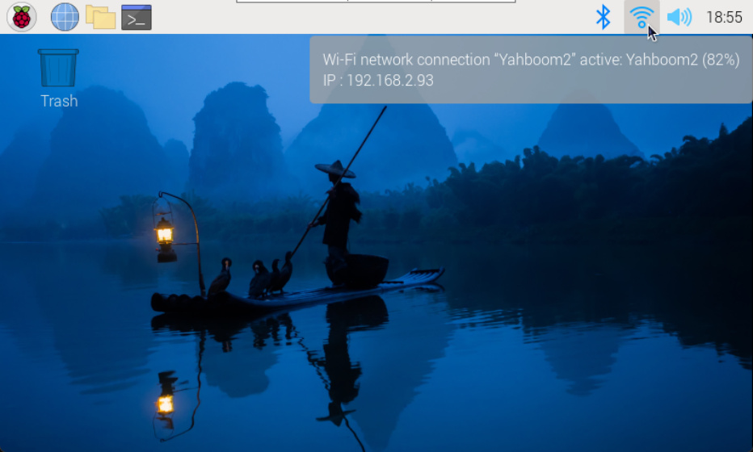

Use the command to view the IP address: hostname -I or ifconfig

## 2. SSH remote control
After obtaining the IP address of the Raspberry Pi motherboard, you can perform SSH remote

login on the terminal based on the user name and password of the Raspberry Pi system.

SSH remote login command: ssh username@IP address

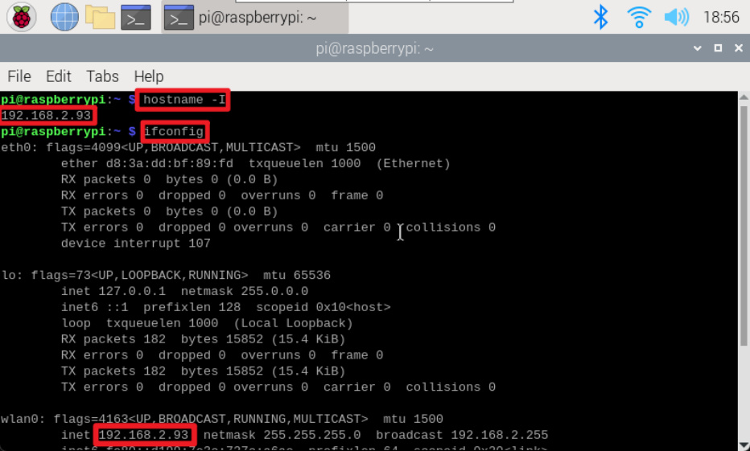

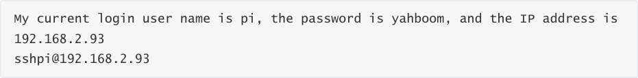

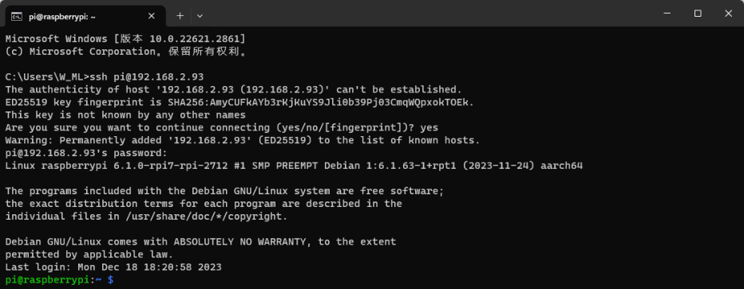
## 3. VNC remote login
After obtaining the IP address of the Raspberry Pi motherboard, you can use the RealVNC Viewer

software to log in remotely.

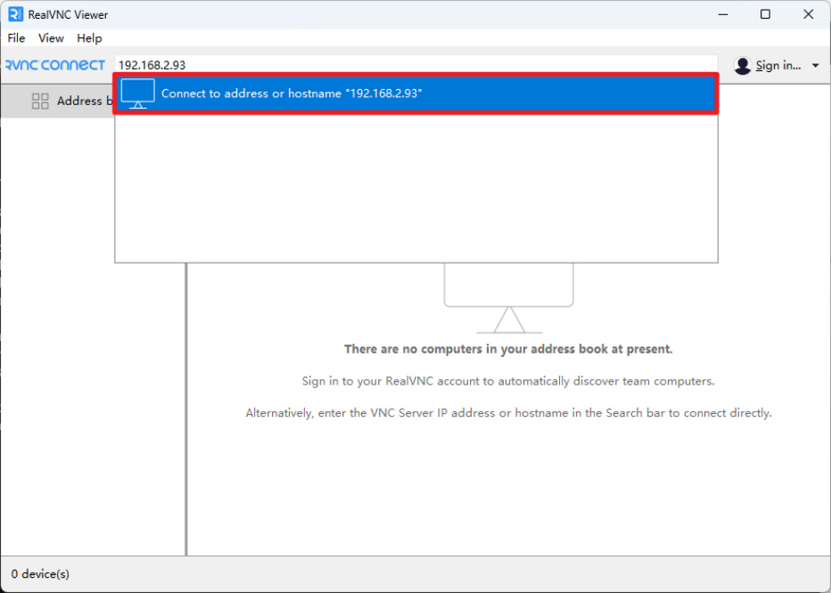
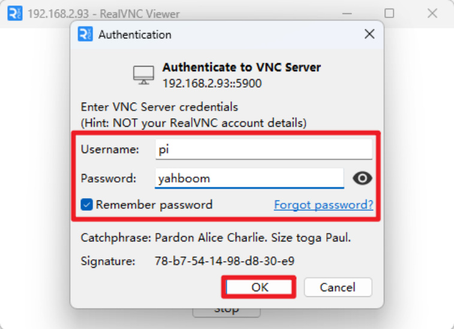

After successful remote login, the Raspberry Pi system desktop will be displayed!

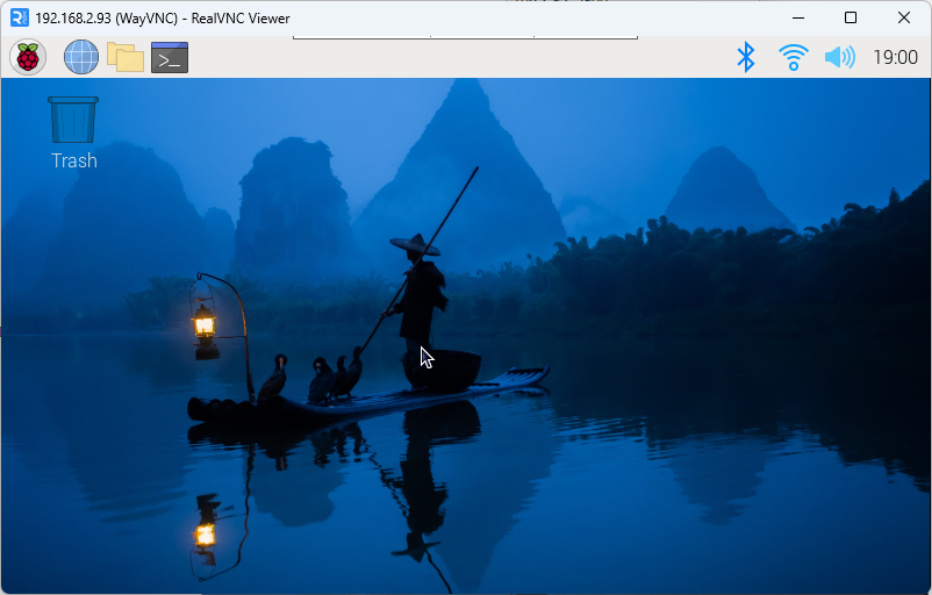
