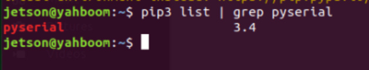
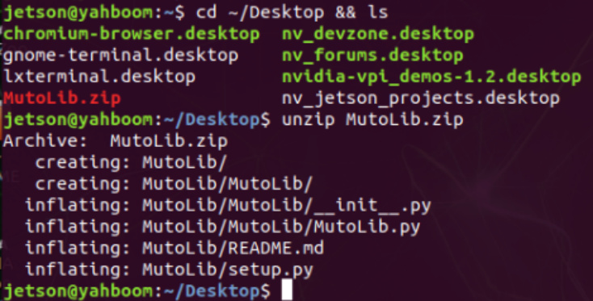
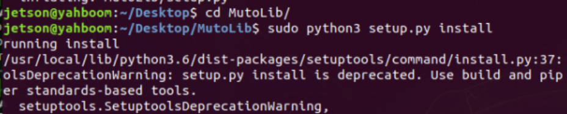
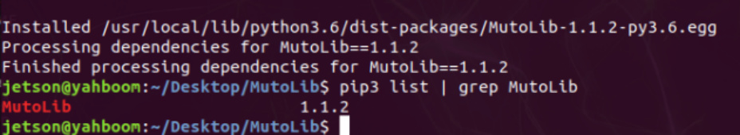
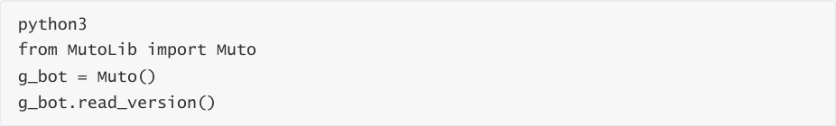
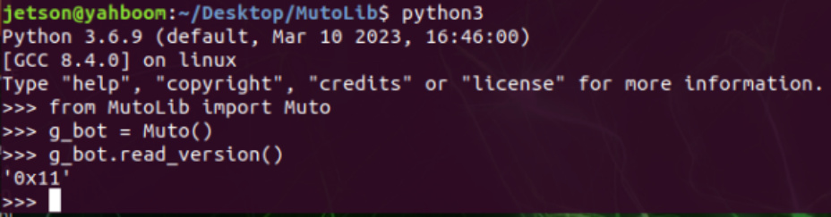

# 10.Driver library and communication
10.Driver library and communication

1、Install serial port driver library

2.Install robot driver library

## 1、Install serial port driver library
Since the robot and the underlying expansion board use serial port communication, the serial

port driver library needs to be installed before it can be used. The Yahboom Muto system has

already installed the serial port driver, so you can ignore the following steps.

The Ubuntu system has multiple serial libraries. Installation errors may cause the serial port to fail

to communicate properly. Please follow the steps below to install the serial port driver library.

Open the terminal and enter the following command to install the serial port driver

Check the version number of the serial port driver library

## 2.Install robot driver library
The Yahboom Muto mirror system has already installed the latest robot driver library, so there is

no need to reinstall it.

You only need to install the robot driver library if you are not using a Yahboom image or if the

driver library has updated content.

The following installation process takes Jetson Nano’s installation of the MutoLib driver library as

an example:

Transfer the driver library file to the system, taking transferring to the desktop as an example,

and decompress it to obtain the corresponding MutoLib folder.

Start install drive library.

Check the version number after installation.

Test the underlying firmware version number of the read version.

Muto has two optional parameters Muto (port="/dev/myserial", debug=False).

The port parameter indicates the specified serial port device number.

By default, /dev/myserial has been specified. If the factory image is not used, it can be modified to

/ Device numbers such as dev/ttyUSB0; the parameter debug=True means printing debugging

information, False means not printing debugging information.
