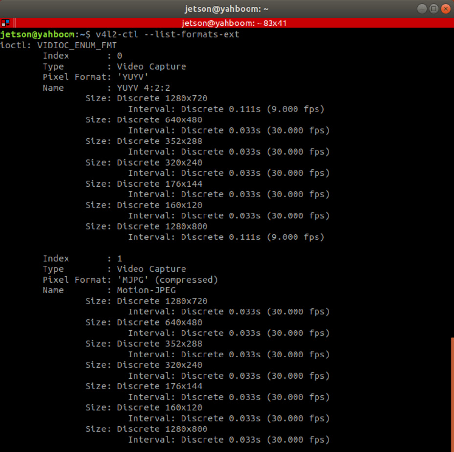
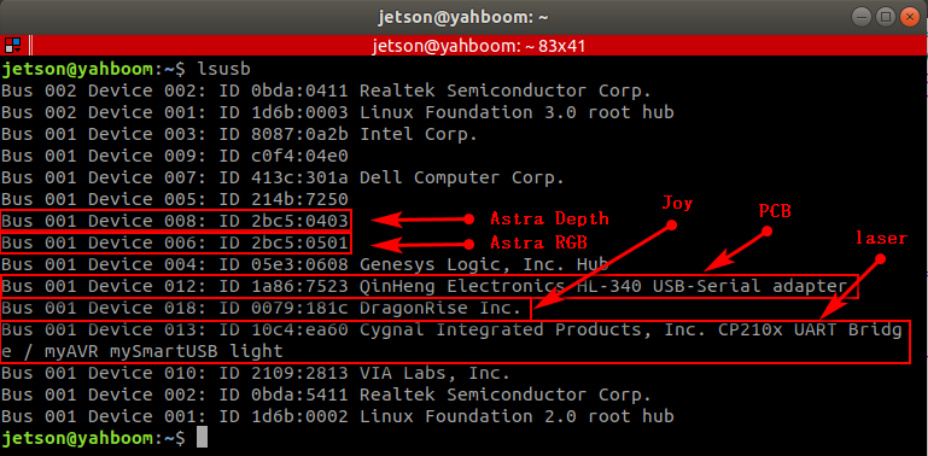
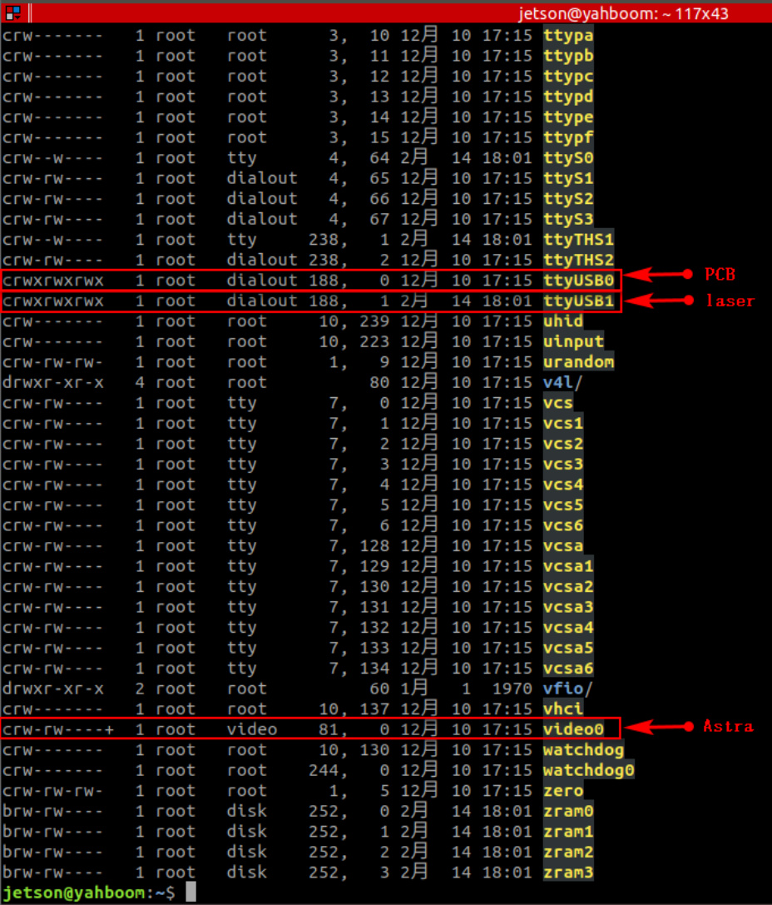
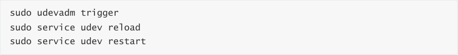
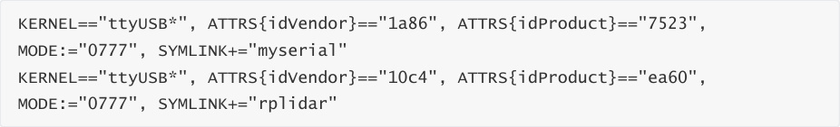
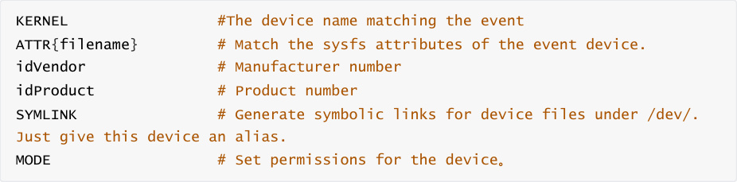
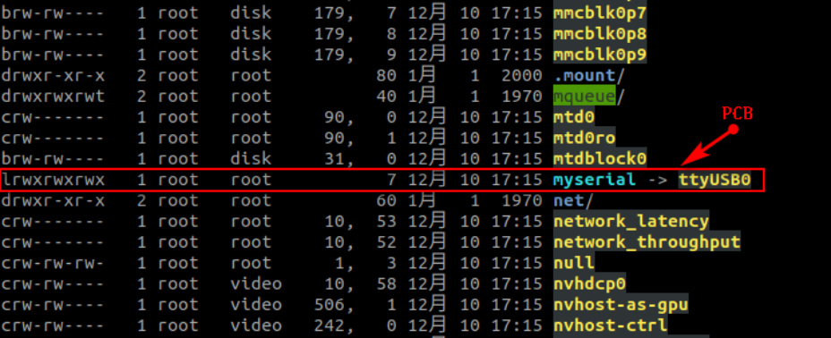
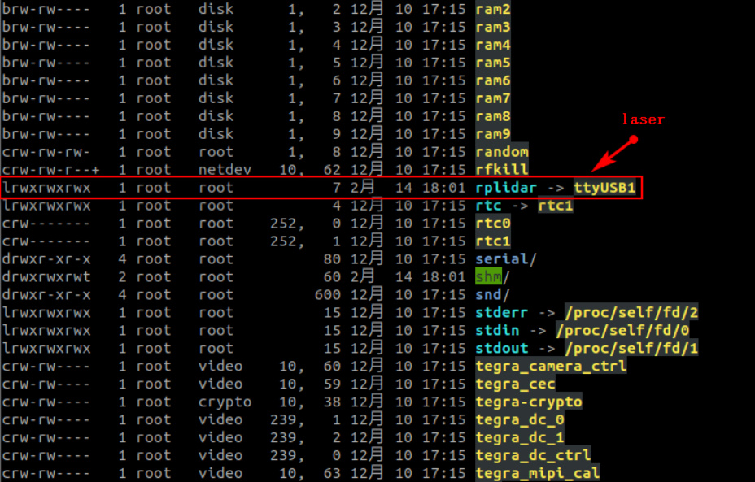
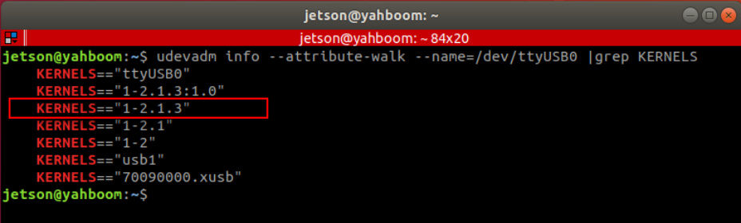
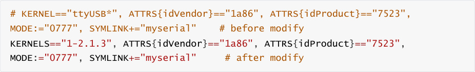

# 12.Bind device ID
12.Bind device ID

1.Device view command

2. Establish port mapping relationship

### 2.1. Device binding

### 2.2. Introduction to rule file syntax

3. Verify view

4. Bind USB port

When the robot uses two or more USB serial devices, the corresponding relationship between the

device name and the device is not fixed, but is assigned in sequence according to the order in

which the devices are connected to the system.

Inserting one device first and then another device can determine the relationship between the

device and the device name, but it is very troublesome to plug and unplug the device every time

the system starts. The serial port can be mapped to a fixed device name. Regardless of the

insertion order, the device will be mapped to a new device name. We only need to use the new

device name to read and write the device.

## 1.Device view command
View camera device parameters

Enter the following command in the terminal to view the corresponding relationship between the

camera's pixel size and frame rate.

View device ID

As can be seen from the picture below, Astra depth camera has an official document for binding

the device to the ID number of each device. Generally, the controller does not need to be bound,

and it can mainly be bound to the PCB and radar.

View device ID

## 2. Establish port mapping relationship
### 2.1. Device binding
Astra binding

There is a create_udev_rules file in the scripts folder under the astra_camera function package.

Run this file to automatically bind it.

Run the command as follows

Enter rules.d directory

You can find the 56-orbbec-usb.rules file, which is the Astra camera device binding file.

PCB and lidar binding

Enter rules.d directory

Create a new rplidar.rules file

Open the rplidar.rules file

Write the following content

Exit for the rules to take effect

### 2.2. Introduction to rule file syntax

Analyze

From [6.1], we can see that the PCB device number is [ttyUSB0] and is easy to change. The ID

number is [1a86, 7523] and is fixed. [ttyUSB*] means that no matter the device number becomes

[ttyUSB] in the future, it will be followed by [ 0, 1, 2, 3, 4,...] are all bound to [myserial]; the radar

device [ttyUSB1] is the same; the same is true for other devices that need to be bound.

## 3. Verify view
View device number

PCB

laser

## 4. Bind USB port
The above situations are all different ID numbers. If the ID numbers of the radar and PCB are the

same, or there are two or more PCBs (radars) with the same ID, the above binding will be

confusing.

Then, we need to bind the USB port. After binding, the USB port cannot be changed at will. Each

device can only be connected to a fixed USB port.

Binding method, take [ttyUSB0] as an example to check the port of the device at this time

We need is to modify it in the rules file

