# 3.Ubuntu common commands
### 3.1、Add
New create file

New create folder

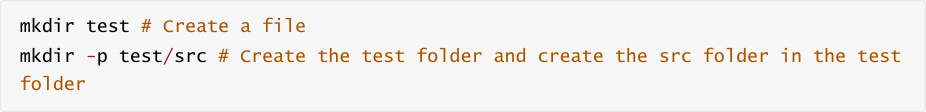

Copy

### 3.2、Delete
|-i|To execute interactively|
|---|---|
|-f|Forced deletion, ignoring non-existent files without prompting|
|-r|Recursively delete the contents of a directory|

### 3.3、Modify
move、re-name

chmod changes file permissions

Permission settings

|Symbol|Meaning|
|---|---|
|+|Add permissions|
|-|Revoke permission|
|=|Set permissions|

rwx

|Letter permissions|Meaning|
|---|---|
|r|read means read permission. For a directory, if there is no r permission, it means that the contents of this directory cannot be viewed through ls.|
|w|write means write permission. For a directory, if there is no w permission, it means that new files cannot be created in the directory.|
|x|execute means executable permission. For a directory, if there is no x permission, it means that the directory cannot be entered through cd.|

Add a shortcut to all permissions

Set root password

Set user password

### 3.4、View
View system version

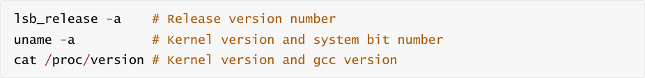

View hardware information

View file information

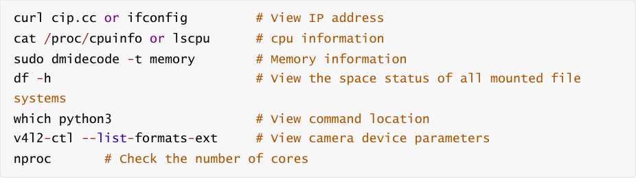
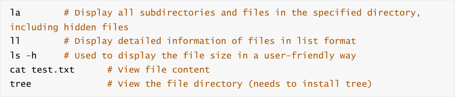

tree installation command

Find files

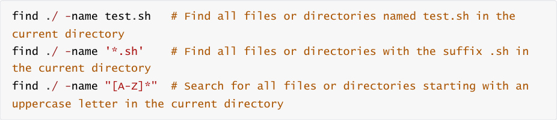

### 3.5、Other
tar command

tar usage format: tar [parameter] package file name file

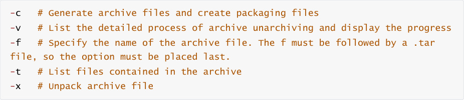

Pack

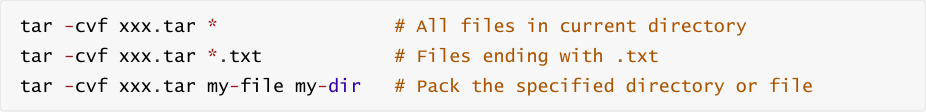

Unpack

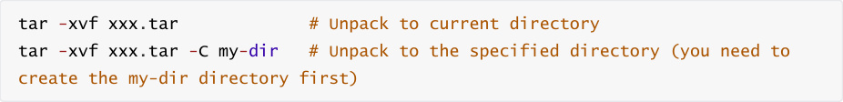

zip、unzip command

Compressed file: zip [-r] target file (no extension) source file

Unzip the file: unzip -d directory file after decompression compressed file

ln command

Soft link: Soft link does not occupy disk space. If the source file is deleted, the soft link will become

invalid. Commonly used, you can create files or folders

Hard links: Hard links can only link ordinary files, not directories. Even if the source file is deleted,

the linked file still exists

scp remote copy

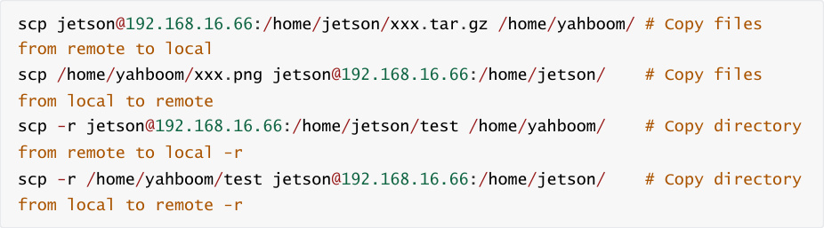

wget file download

Search for an image address on Baidu as an example.

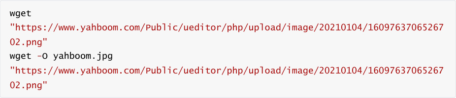

Other

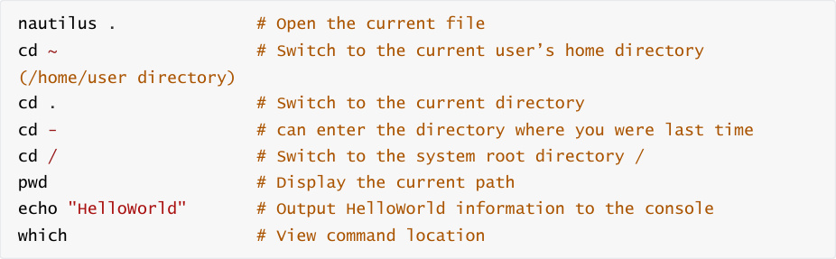
