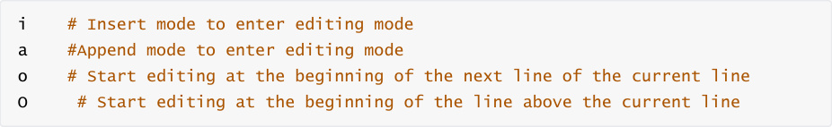
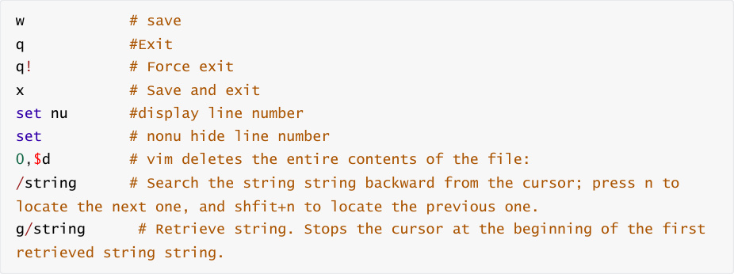
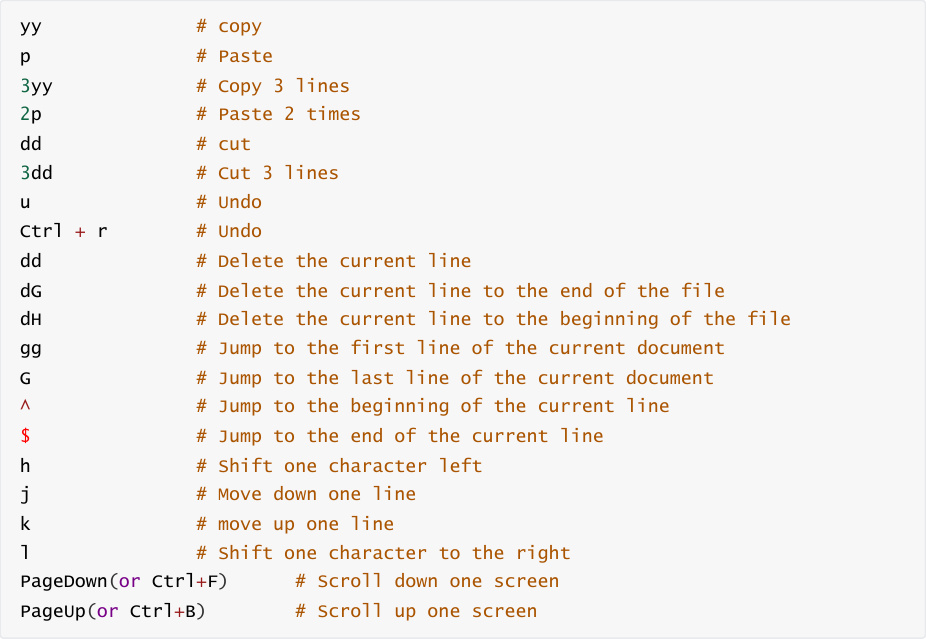
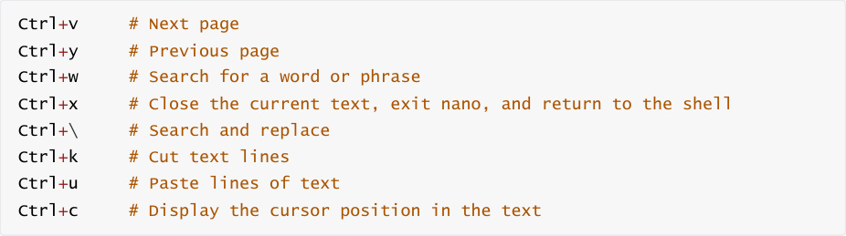

# 4.Ubuntu common editors
### 4.1Editor
#### 4.1.1、vim
vim is an upgraded version of vi. The most common difference is that it can display some special

information of system files in multiple colors.

Installation command

Three main modes

Command mode (edit mode): Default mode, move cursor, cut/paste text (interface performance:

file name is displayed in the lower left corner or is empty)

Insert mode (input mode): Modify text (interface performance: -INSERT– is displayed in the lower

left corner) In insert mode, press the ESC key to return to command mode

Last line mode (extended mode): save, exit, etc. (Interface performance: -VISUAL– displayed in the

lower left corner) In last line mode, press the ESC key twice in succession to return to last line

mode.

Mode switch

Switch command mode to edit mode

Switch command mode to last line mode

Switch to command mode from last line mode: press 【esc】

Switch from edit mode to command mode: press 【esc】

Esc: exit to current mode

Esc build Esc build: always return to command mode

Last line mode

Command mode

#### 4.1.2、nano
nano is a text editor for Unix and Unix-like systems, a copy of Pico.

Install

New/open file

Control commands

#### 4.1.3、gedit
In the editor, we can click the "Open" button to browse the recently opened file list and open the

file; click the "Save" button to save the file currently being edited; click the menu bar on the right

to perform more operations.

The gedit editor must be started when the interface can be displayed, and it cannot be started

remotely without an interface such as ssh, jupyter, putty, etc.
