# 1.Virtual machine installation
User name：yahboom

Password：yahboom

VM password：Ubuntu20.04

### 1.1 Virtual machine installation
The virtual machine VMware Workstation is a paid software, and we do not provide VMware

downloads. You need to download it online and then double-click the downloaded exe installation

file.

Click "Next".

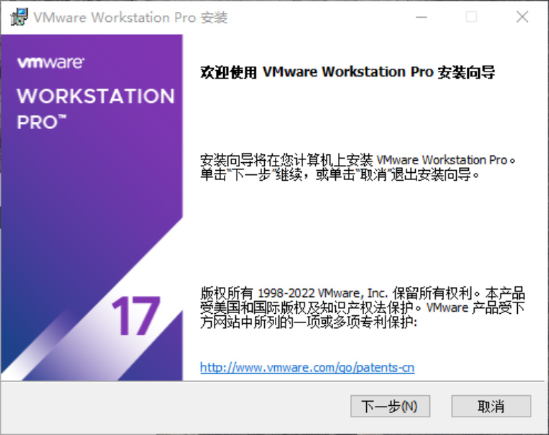
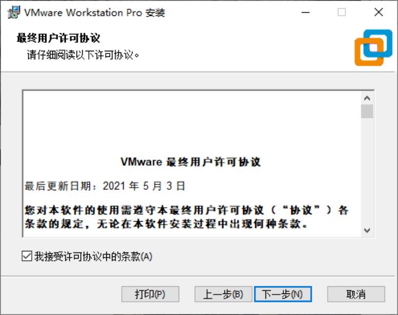

Check the box to accept the license and click "Next".

Select the installation location, check Add console tools to the system, and click "Next".

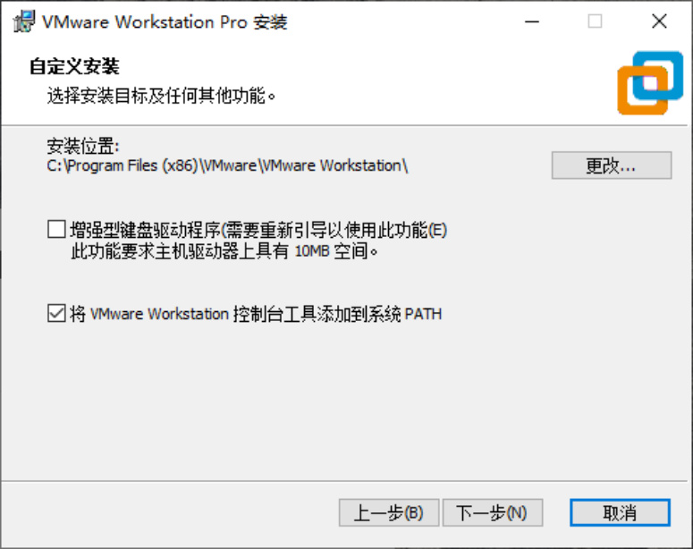
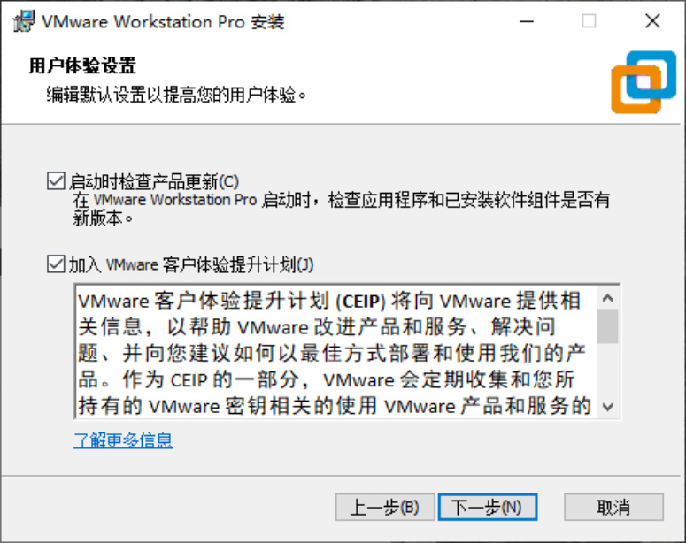

Keep clicking Next until the following interface.

Click "Install" and wait a few minutes.

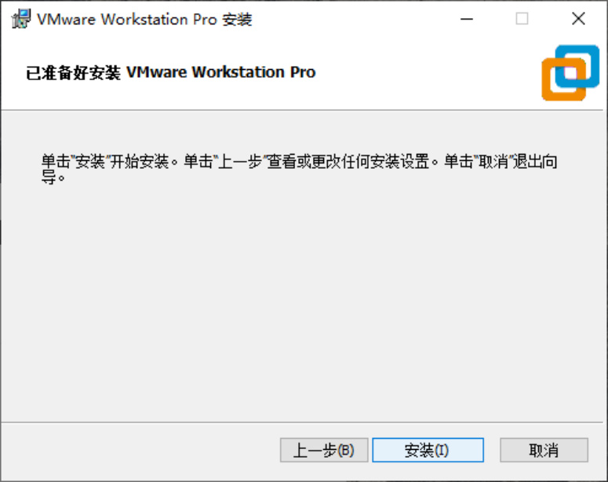
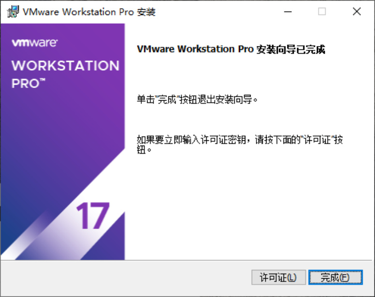

The above completes the installation of VMWare. You can open VMWare on the desktop, as

shown below.

### 1.2 Virtual machine usage
Find a local hard drive with more than 40G of remaining space and decompress the system

compressed files.

After installing the VMware Workstation virtual machine, double-click to open it and enter the

interface as shown in the figure. Click [Open Virtual Machine]

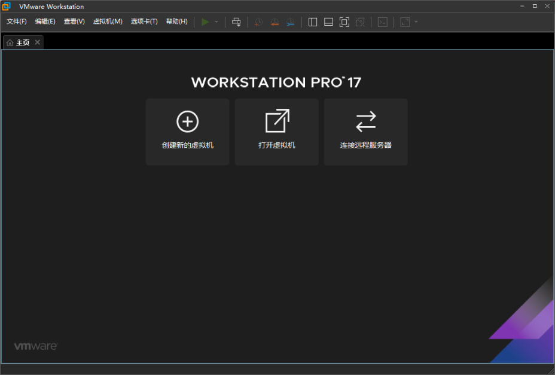
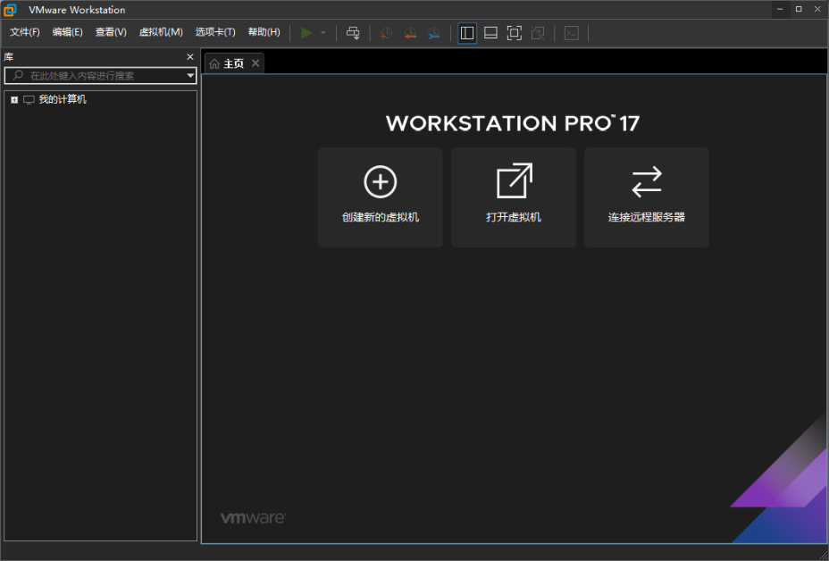

Select the unzipped system file, as shown in the figure below.

Click [Start this virtual machine]

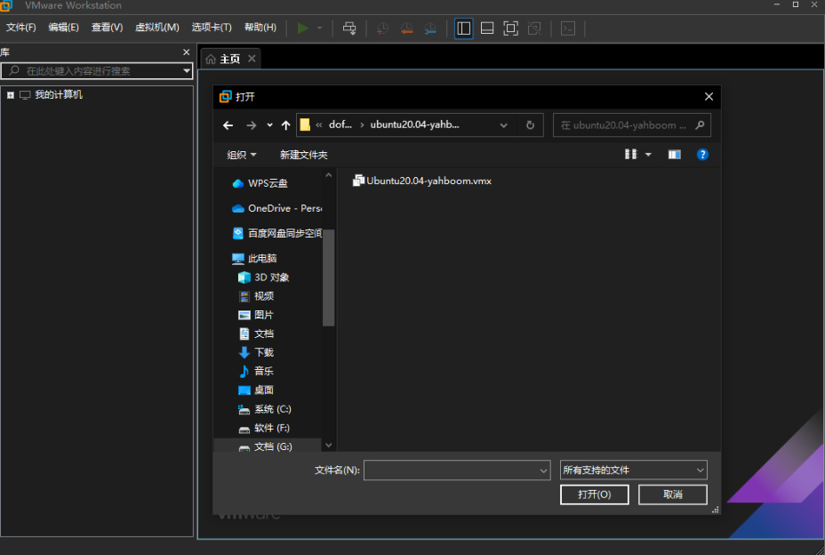
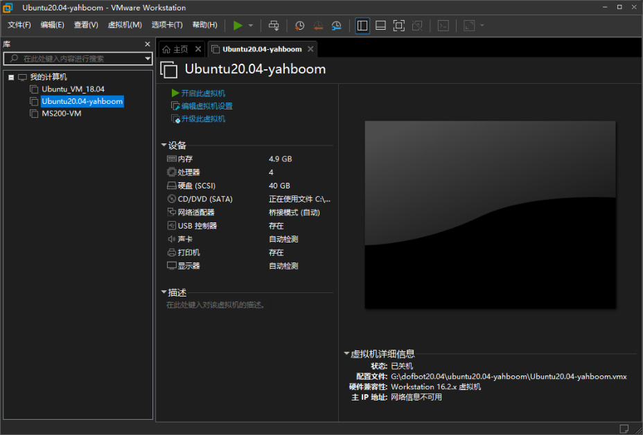

If the prompt shown in the figure below appears, directly select [I have copied this virtual machine

(p)].

Click【yahboom】

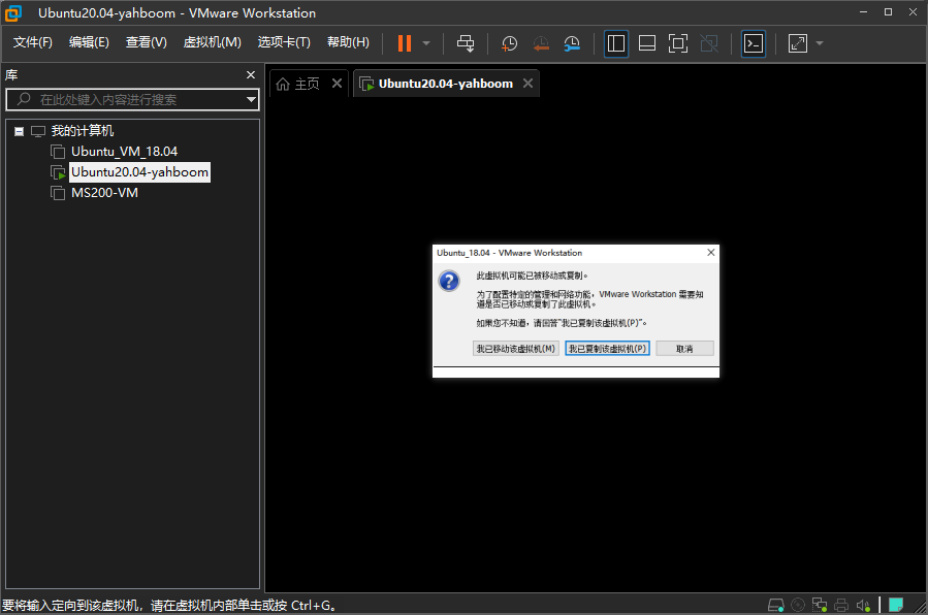
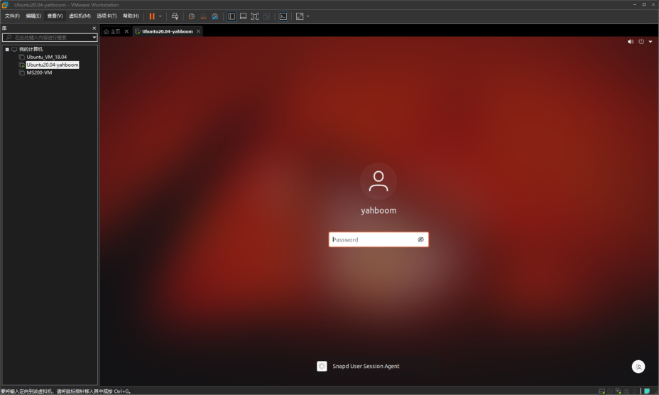

Enter the password 【yahboom】and click the 【enter key】 on the keyboard to confirm.

### 1.3 Virtual machine settings
You can edit the virtual machine settings before starting, as shown below, then click 【Edit Virtual

Machine Settings】.

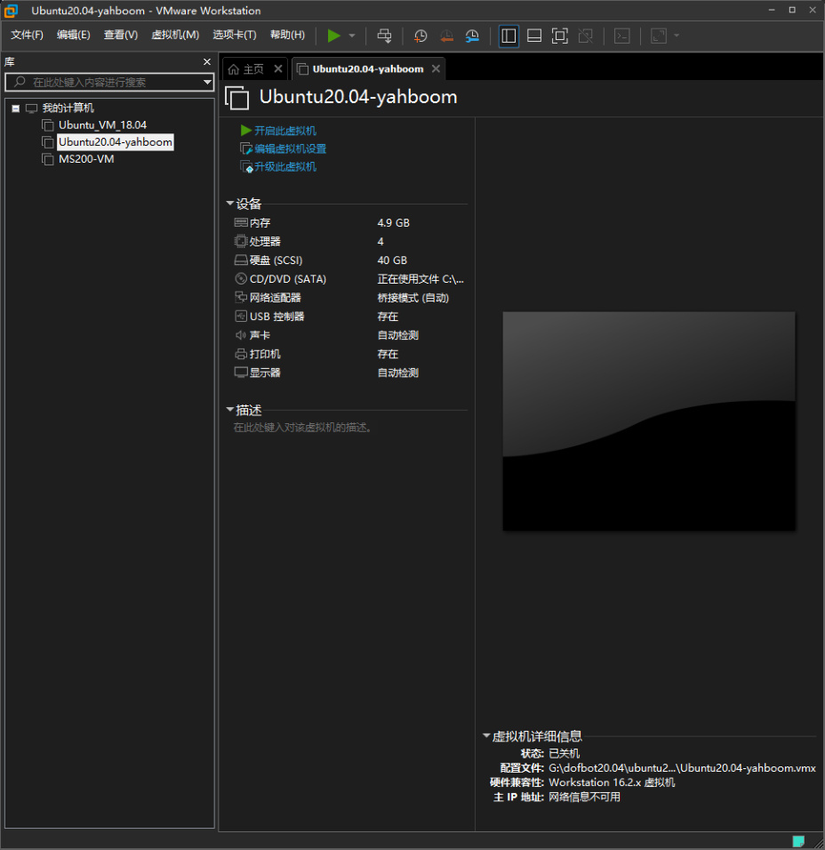

The 【Virtual Machine Settings】 dialog box will pop up.

Since the situation of each computer is different, settings can be made according to the actual

situation. The higher the virtual machine memory setting, the faster the virtual machine will run,

but do not exceed the maximum memory.

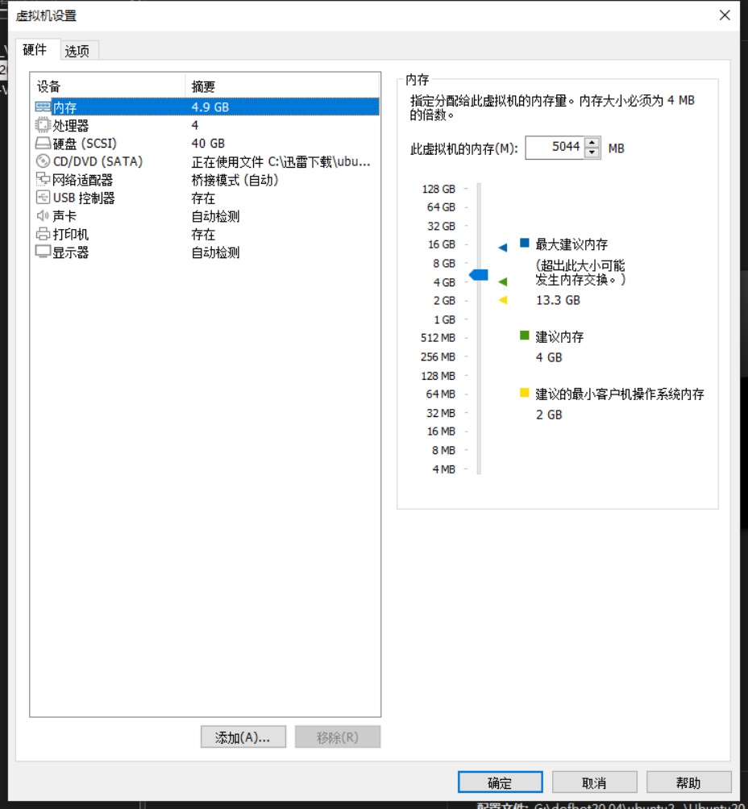

Processor: The higher the number of cores (c) per processor, the smoother the virtual machine

will run, but it must not exceed the total number.

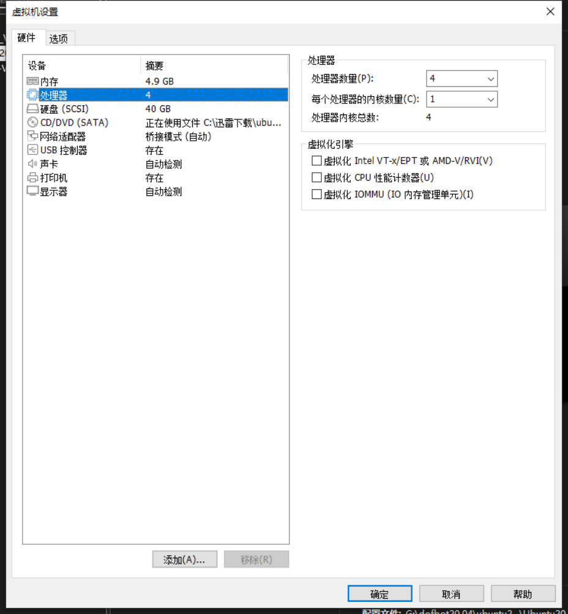

USB controller: USB compatibility is set to 【USB 3.1】, so that USB3.0 devices can be used.

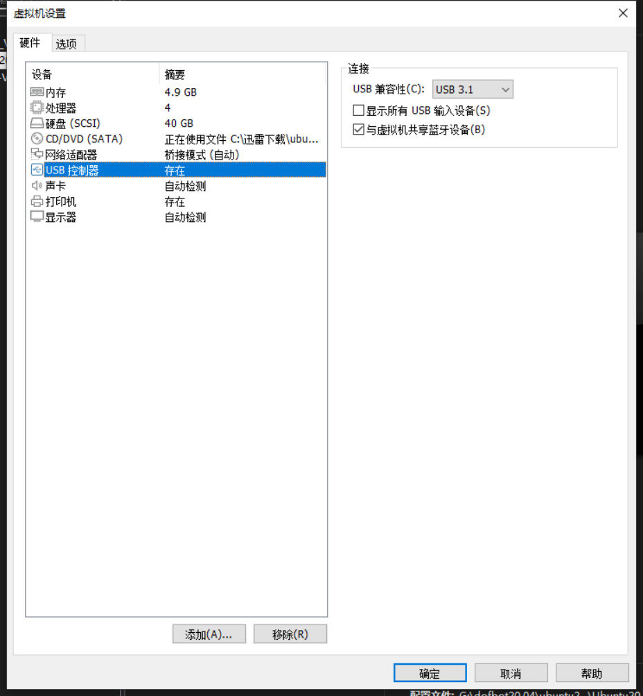
