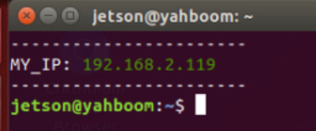
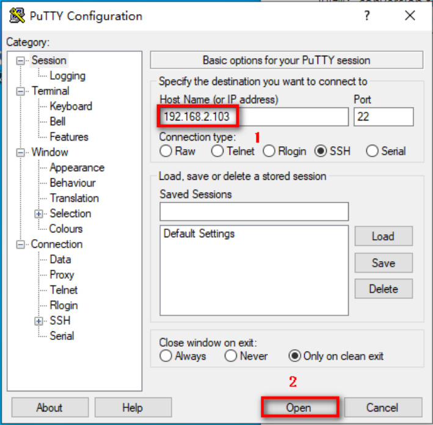
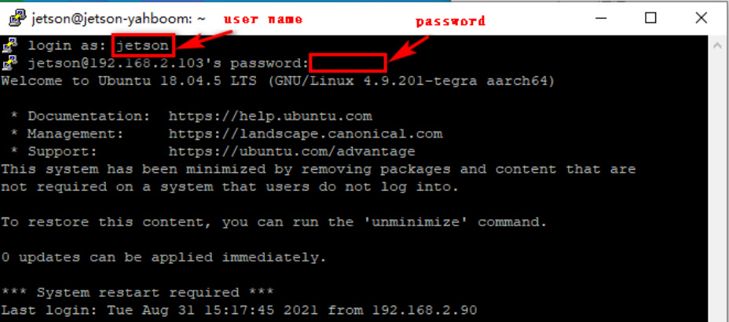
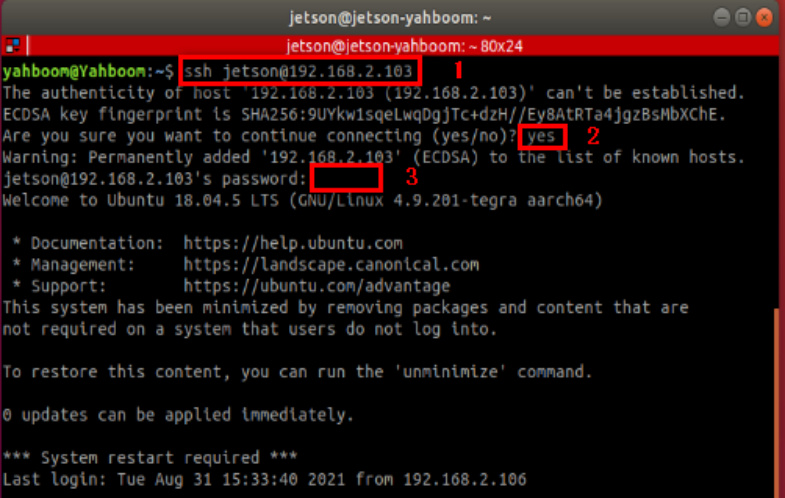
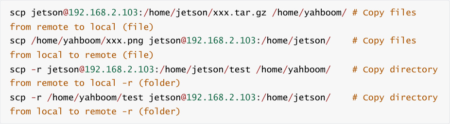

# 7.SSH remote control
7.SSH remote control

1. PuTTY log into

2.SSH

[putty download link：https://www.chiark.greenend.org.uk/~sgtatham/putty/latest.html](https://www.chiark.greenend.org.uk/~sgtatham/putty/latest.html)

**Note: You must know the robot's username, password and IP address before logging in**

**remotely.**

For example, in the picture below: IP address [192.168.2.119], user name [jetson], host name

[yahboom].

**Note:**

**Yahboom Raspberry Pi version Muto RS image, username: pi, password: yahboom**

**Yahboom jetson nano version Muto RS image, username: jetson, password: yahboom**

## 1. PuTTY log into
Download the Putty installation file and double-click the [.exe] file to install it.

Enter the robot IP address and click [open].

Enter the username [jetson] and password [yahboom], and press Enter to confirm.

After successful login, the following figure will appear.

## 2.SSH
Log in

Operate under ubuntu system

1）Enter the following command

2. Then enter [yes]

3. Enter password [yahboom]

Copy files

If jetson's IP is 192.168.2.103, username: jetson; virtual machine username: yahboom

