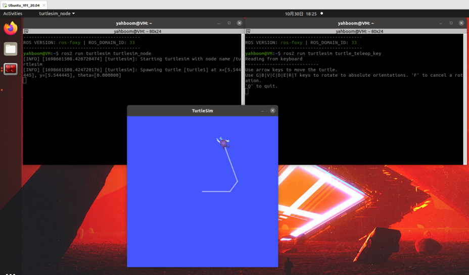
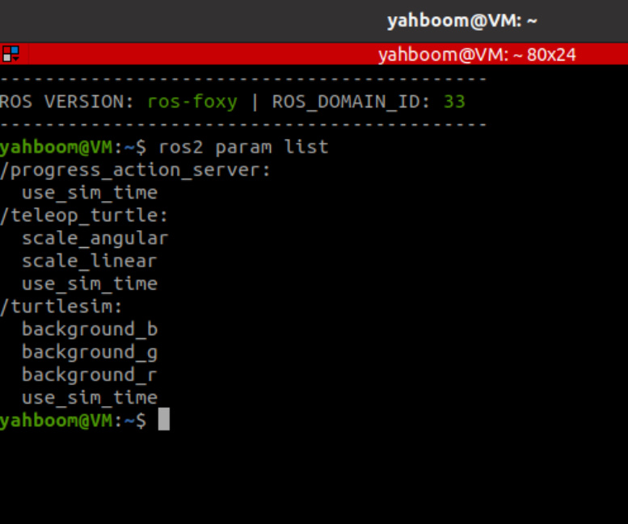
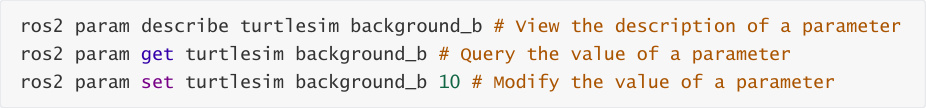
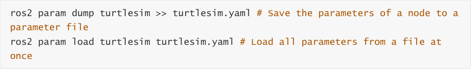
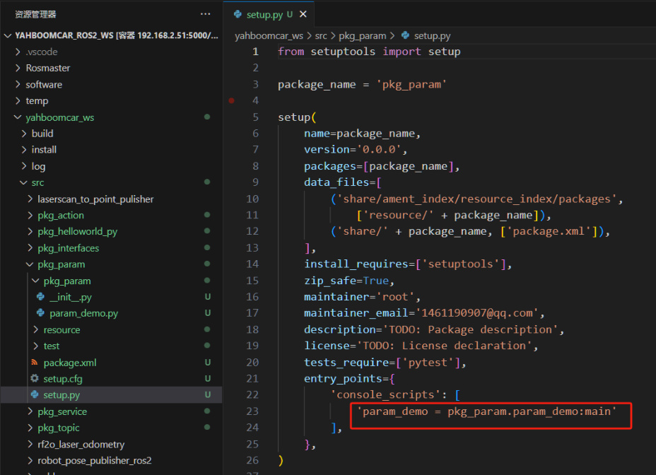
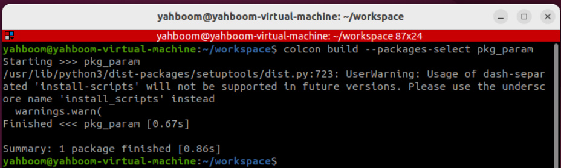
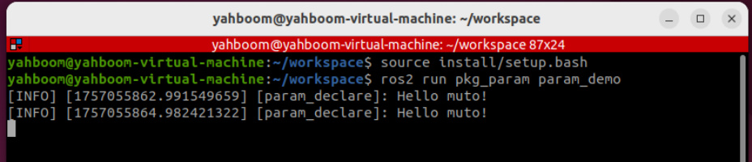
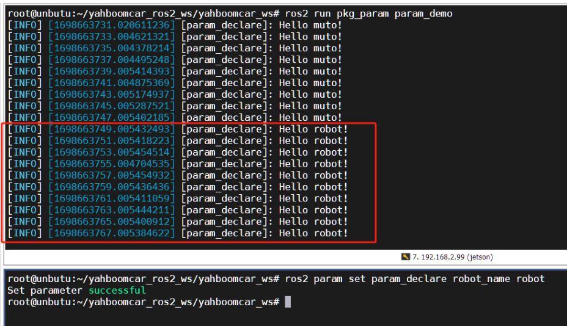

# 11. ROS2 parameter service case
## 1. Introduction to parameters
Similar to global variables in C++ programming, they facilitate sharing data across multiple

programs. Parameters are global dictionaries in the ROS robot system, allowing data to be shared

across multiple nodes.


In the ROS system, parameters exist in the form of a global dictionary. What is a dictionary? Just

like a real dictionary, they consist of a name and a value, also known as a key and a value.

Alternatively, we can think of them as being like parameters in programming: there's a parameter

name, followed by an equals sign, and then the parameter value. To use it, you simply access the

parameter name.


Parameters have a rich set of features. For example, if a node shares a parameter, other nodes

can access it. If a node modifies a parameter, other nodes can immediately be notified and obtain

the latest value.
## 2. Parameters in the Little Turtle Example
In the Little Turtle example, the emulator provides a number of parameters. Let's use this

example to familiarize ourselves with the meaning of parameters and command line usage.


Since a GUI is displayed here, the following examples are demonstrated in the virtual machine

that comes with the tutorial for ease of operation.


1. Launch two terminals in the virtual machine, running the turtle simulator and the keyboard

control node respectively:



2. Launch a terminal in the virtual machine and use the following command to view the

parameter list:




3. Querying and Modifying Parameters


To query or modify the value of a parameter, follow the param command with a get or set

subcommand:





4. Saving and Loading Parameter Files


Querying/modifying parameters one by one is too cumbersome. Why not try using a parameter

file? Parameter files in ROS use the YAML format. You can follow the param command with the

dump subcommand to save all the parameters for a node to a file, or use the load command to

load all the contents of a parameter file at once:





## 3. Parameter Examples
### 3.1. Creating a New Function Package
Create a new function package in the src directory of the workspace


After executing the above command, the pkg_param package will be created, a param_demo

node will be created, and the relevant configuration files will be configured.

### 3.2 Code Implementation
Next, edit [param_demo.py] to implement the publisher functionality and add the following code:

```
 import rclpy # ROS2 Python interface library

 from rclpy.node import Node # ROS2 Node Class

 class ParameterNode(Node):

    def __init__(self, name):

      super().__init__(name)                  # ROS2 node

 parent class initialization

      self.timer = self.create_timer(2, self.timer_callback)  # Create a

 timer (a period in seconds, a callback function that is executed at a fixed

 time)

      self.declare_parameter('robot_name', 'muto')       # Create a

 parameter and set its default value

    def timer_callback(self):                   # Create a

 callback function that is executed periodically by the timer

      robot_name_param =

 self.get_parameter('robot_name').get_parameter_value().string_value # Read

 parameter values from the ROS2 system

```



```
      self.get_logger().info('Hello %s!' % robot_name_param)   # Output log

 information and print the parameter values read

 def main(args=None):                 # ROS2 node main entry main

 function

    rclpy.init(args=args)              # ROS2 Python interface

 initialization

    node = ParameterNode("param_declare")      # Create a ROS2 node object

 and initialize it

    rclpy.spin(node)                 # Loop waiting for ROS2 to

 exit

    node.destroy_node()               # Destroy node object

    rclpy.shutdown()                 # Close the ROS2 Python

 interface

### 3.3. Compile the package
```



### 3.4. Run the program
Refresh the environment variables first, then run the node.




Open another terminal and set robot_name to robot:


You can see the log information being printed in a loop in the terminal. "muto" represents the

default parameter value for "robot_name." Changing this parameter via the command line will

also change the value in the terminal.



