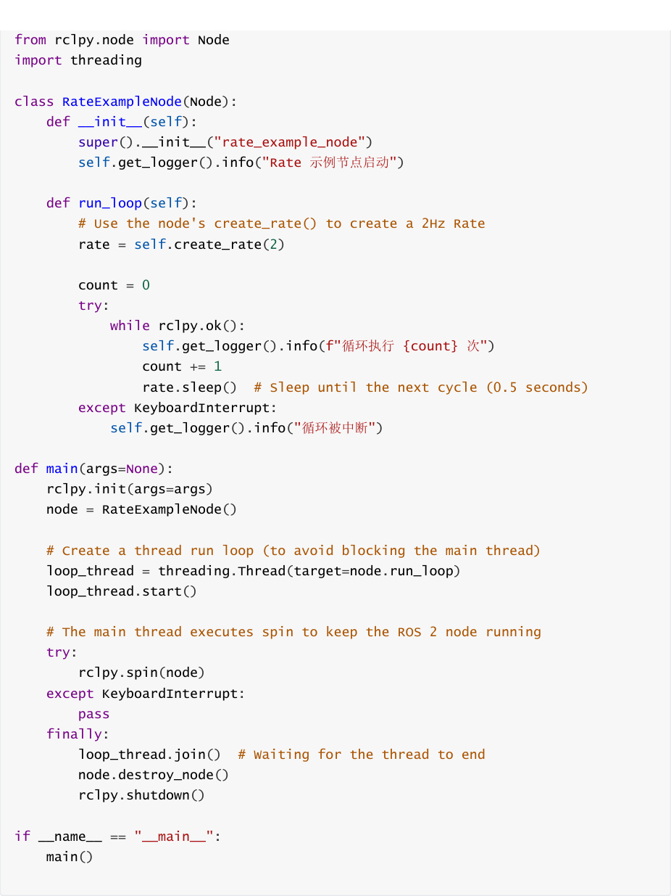
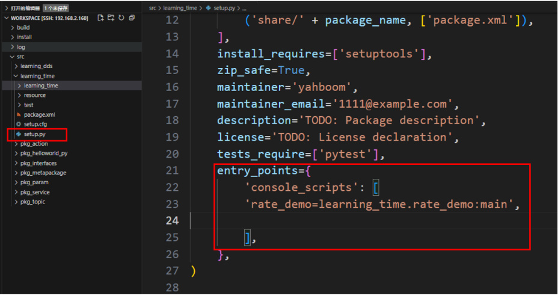
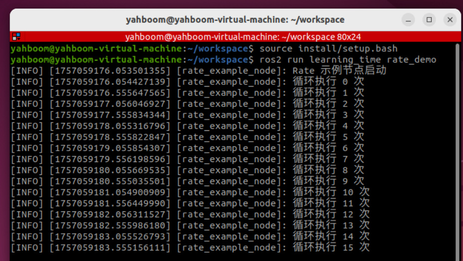
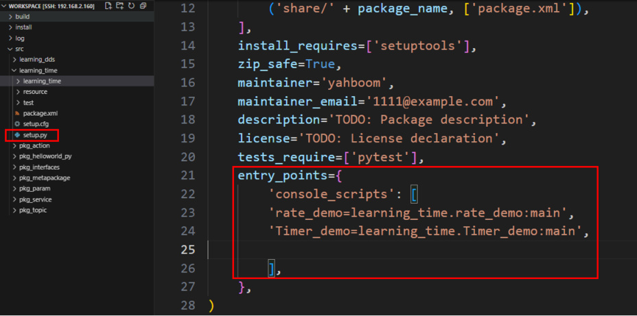
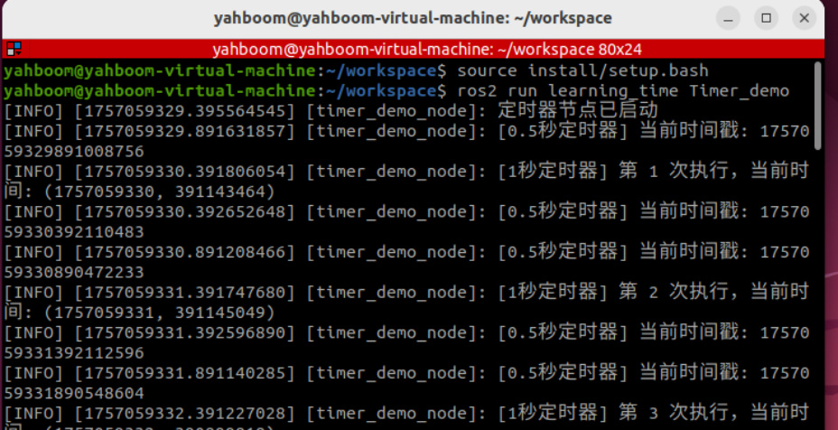
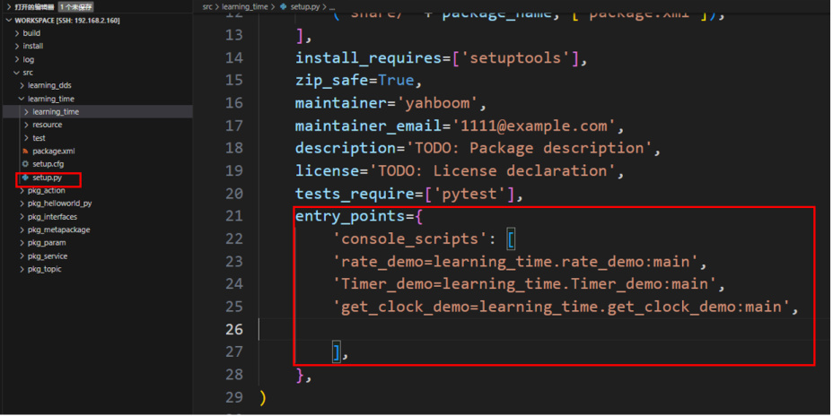
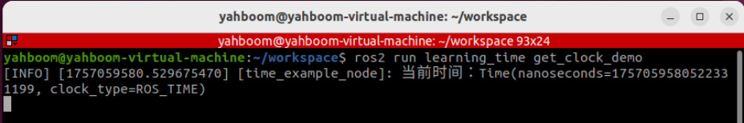
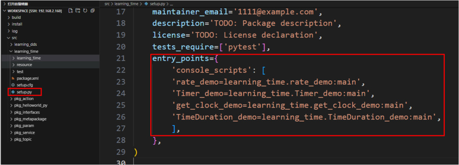
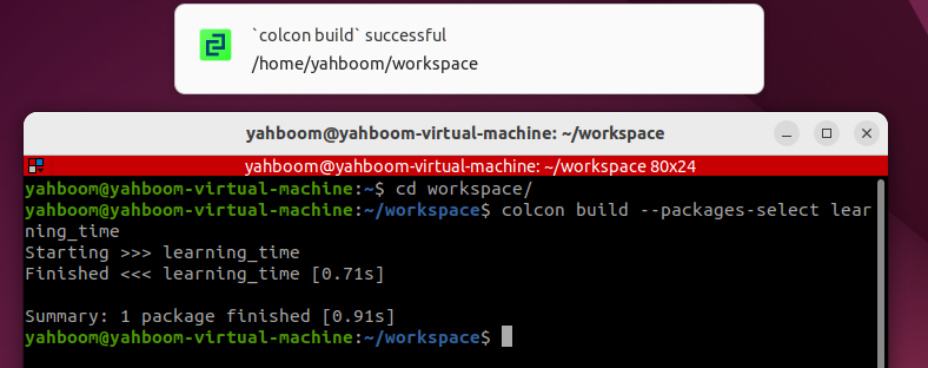
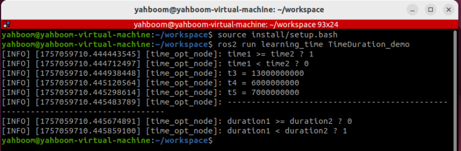

# 15.ROS2 time related API
## 1. Introduction to Time-Related APIs
ROS2's time-related APIs include Rate, Time, Duration, and operations on Time and Duration.

These are explained below.


First, create a function package to store the relevant program files.


## 2. create_rate
ROS2 also provides the create_rate function, a tool for **controlling loop execution frequency** . Its


stability of the loop execution frequency by controlling the "sleep time" of the loop. **Remember**


block callback events. It is generally only used in programs with multi-threaded callbacks or in

child threads.


How it works:


1. Records the start time of each loop;

2. Executes the code within the loop;

3. Calculates the difference between the current loop's actual duration and the target interval;

4. Automatically sleeps for the corresponding difference, ensuring that the interval from the

start of one loop to the start of the next strictly equals the target interval (e.g., 100

milliseconds).


|Features|Rate|Timer|
|---|---|---|
|Implementation|Based on active sleep within a loop<br>(blocking the current thread)|Based on callback functions<br>(non-blocking, triggered by the<br>ROS 2 event loop)|
|Applicable<br>Scenarios|Suitable for loops that need to<br>execute at a fixed frequency within<br>the same thread (such as main<br>control logic)|Suitable for periodic tasks that<br>need to execute<br>asynchronously (without<br>blocking the main thread)|
|Flexibility|Direct control flow within the loop<br>(such as break exit)|Callback execution must be<br>controlled using flags or other<br>methods|


Create a new file in the function package called rate_demo.py

```
import rclpy

```




Configure the corresponding setup.py configuration file and add it in console_scripts




Compile feature package


Refresh the workspace environment and run the node



## 3. Timer Application
Timer is used to create a timer that triggers periodic tasks.

Example: Create two timers: one that prints the execution count every 1 second, and one

that prints the current time every 0.5 seconds.

Create a new program file called Timer_demo.py

```
 import rclpy

 from rclpy.node import Node

 class TimerDemoNode(Node):

    def __init__(self):

      super().__init__('timer_demo_node')

      # Counter, used to demonstrate the number of timer executions

      self.counter = 0

      # Create a timer: execute the callback function every 1 second

      self.timer = self.create_timer(1.0, self.timer_callback)

      # Create a faster timer: execute every 0.5 seconds

      self.fast_timer = self.create_timer(0.5, self.fast_timer_callback)

      self.get_logger().info(" 定时器节点已启动 ")

    def timer_callback(self):

      """1 second timer callback function"""

      self.counter += 1

      current_time = self.get_clock().now()

      # Print the current time and counter value

      self.get_logger().info(
        f"[1 秒定时器 ] 第 {self.counter} 次执行，当前时间 :

 {current_time.seconds_nanoseconds()}"

 )

```

```
  def fast_timer_callback(self):

     """0.5 second timer callback function"""

     # Print the current timestamp (nanoseconds)

     self.get_logger().info(
       f"[0.5 秒定时器 ] 当前时间戳 : {self.get_clock().now().nanoseconds}"

)

def main(args=None):

  # Initializing ROS 2

  rclpy.init(args=args)

  # Creating a Node

  node = TimerDemoNode()

  # Running a Node

  rclpy.spin(node)

  # Shut down ROS 2

  node.destroy_node()

  rclpy.shutdown()

if __name__ == '__main__':

  main()

```

Configure the corresponding setup.py configuration file and add it in console_scripts




Compile function package


Refresh the workspace environment and run the node




It can be seen that the timer is triggered according to the set timing, and the corresponding

log information is printed in each callback function

## 4. Get the Current Time with get_clock
The get_clock function can be used to obtain a clock object and then use the () method to get

the current time.

Create a new program file, get_clock_demo.py, and fill it with the following example program:

```
 import rclpy

 from rclpy.node import Node

 from rclpy.time import Time

 class TimeExampleNode(Node):

    def __init__(self):

```

```
     super().__init__("time_example_node")

     # Get the node's clock object (the system clock is used by default)

     self.clock = self.get_clock()

     # Get the current time (return a Time object)

     current_time = self.clock.now()
     self.get_logger().info(f" 当前时间： {current_time}")

def main(args=None):

  rclpy.init(args=args)

  node = TimeExampleNode()

  rclpy.spin_once(node) # Run a node once

  node.destroy_node()

  rclpy.shutdown()

if __name__ == "__main__":

  main()

```

Configure the corresponding setup.py configuration file and add it in console_scripts




Compile feature package


Refresh the workspace environment and run the node



## 5. Time and Duration
used to mark the moment an event occurred.


to calculate time differences or delays.

Example: Time and Duration Application

Create a new program file, `TimeDuration_demo.py` .

```
 import rclpy

 from rclpy.time import Time

 from rclpy.duration import Duration

 def main():

    rclpy.init()

    node = rclpy.create_node("time_opt_node")

    # How to use the time class to create 'time points and moments'

    time1 = Time(seconds=10)

    time2 = Time(seconds=4)

    # How to use the Duration class to create a 'duration, a period of time'

    duration1 = Duration(seconds=3)

    duration2 = Duration(seconds=5)

    # Moments can be compared

    node.get_logger().info("time1 >= time2 ? %d" % (time1 >= time2))

    node.get_logger().info("time1 < time2 ? %d" % (time1 < time2))

```

```
  # Time periods and times can be mathematically operated

  t3 = time1 + duration1

  t4 = time1 - time2

  t5 = time1 - duration1

  node.get_logger().info("t3 = %d" % t3.nanoseconds)

  node.get_logger().info("t4 = %d" % t4.nanoseconds)

  node.get_logger().info("t5 = %d" % t5.nanoseconds)

  # Time periods can be compared

  node.get_logger().info("-" * 80)

  node.get_logger().info("duration1 >= duration2 ? %d" % (duration1 >=

duration2))

  node.get_logger().info("duration1 < duration2 ? %d" % (duration1 <

duration2))

  rclpy.shutdown()

if __name__ == "__main__":

  main()

```

Configure the corresponding setup.py configuration file and add it in console_scripts




Compile feature package




Refresh the workspace environment and run the node




This example proves that mathematical operations can be performed on time points and

time periods, allowing us to flexibly query and operate on data with different timestamps.
