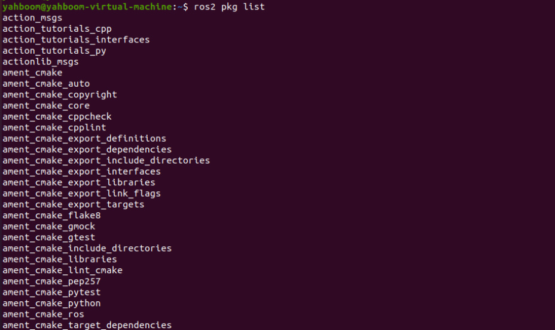
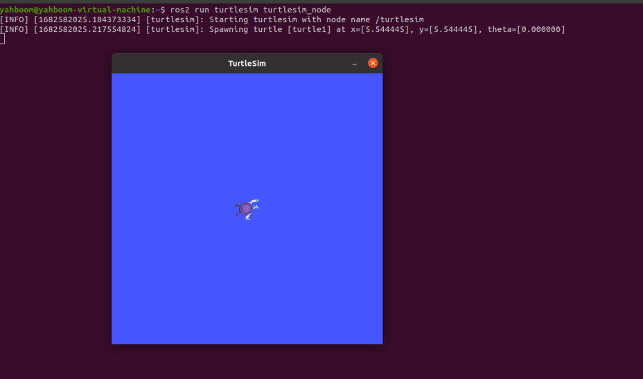
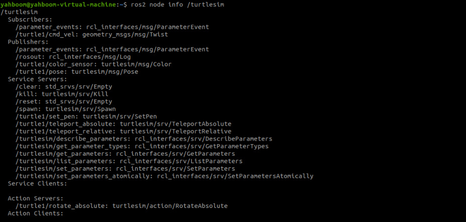
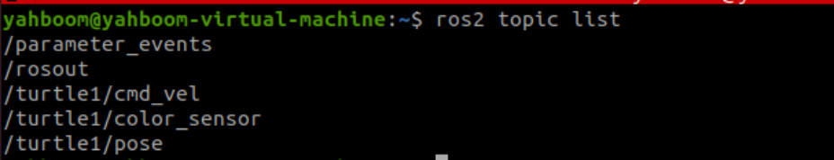
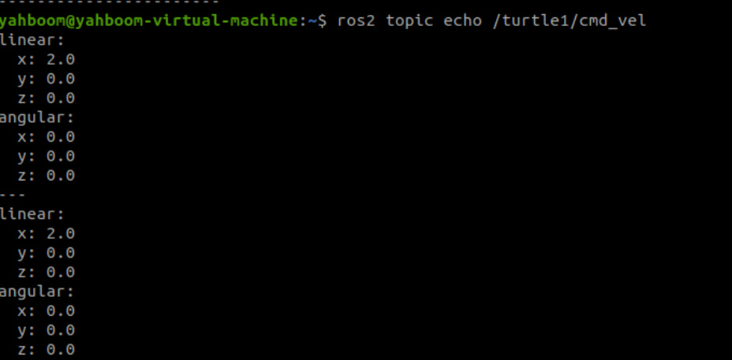
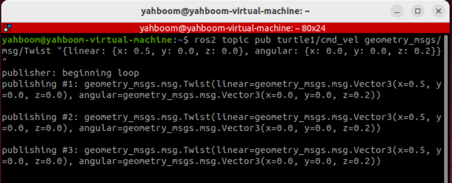
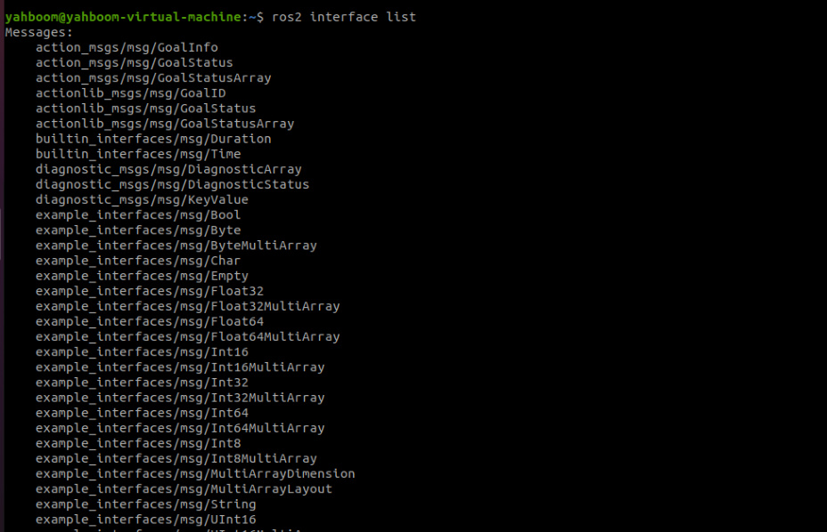
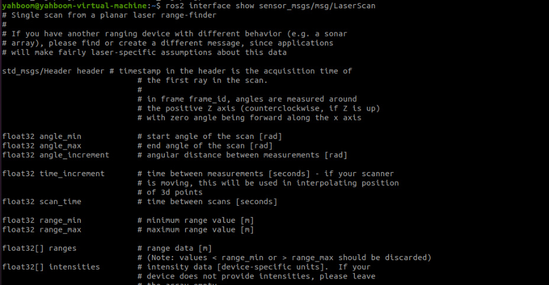
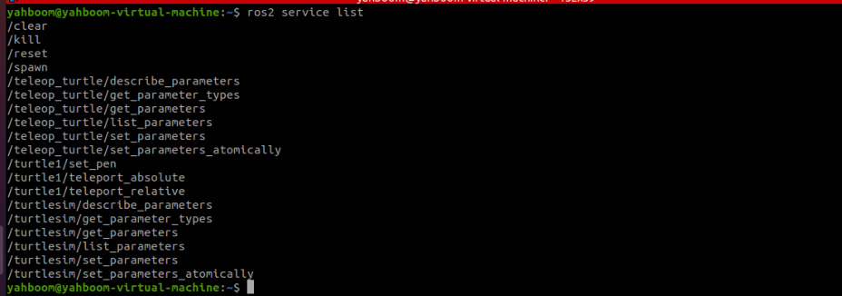
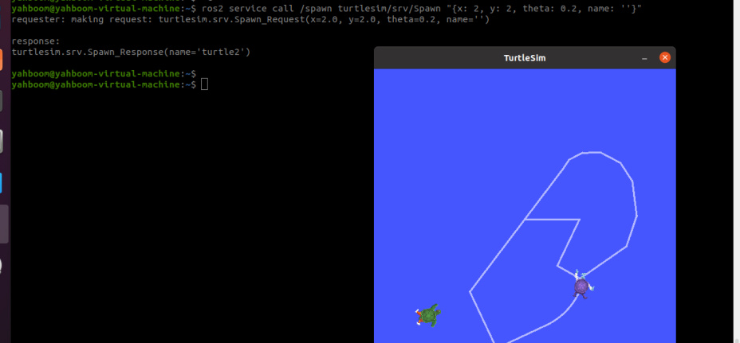

# 16. ROS2 Common Command Tools
## 1. Package Management Tool ros2 pkg
### 1.1. ros2 pkg create
Function: Creates a package. When creating a package, you must specify the package name,

compilation method, dependencies, etc.

Format:

In the ros2 command:

**pkg** : Indicates the functions associated with the package;

**create** : Indicates the creation of a package;

**package_name** : Required: The name of the new package;

**build-type** : Required: Indicates whether the newly created package is C++ or Python. If using

C++ or C, follow ament_cmake; if using Python, follow ament_python;

**dependencies** : Optional: Indicates the package's dependencies. C++ packages must include

rclcpp; Python packages must include rclpy, as well as other required dependencies.

### 1.2, ros2 pkg list
Function: View the list of packages in the system

Format:

### 1.3. ros2 pkg executables
Function: View all executable files in a package

Format:

## 2. Node Run ros2 run
Function: Run the node program in the package

Format:

pkg_name: Package name

node_name: The name of the executable program

## 3. Node-Related Tools: ros2 node
### 3.1. ros2 node list
Function: Lists all node names in the current domain

Format:

### 3.2. ros2 node info
Function: View detailed node information, including subscriptions, published messages, enabled

services, and actions.

Format:

node_name: The name of the node to be viewed.

## 4. Topic-Related Tools: ros2 topic
### 4.1. ros2 topic list
Function: List all topics in the current domain

Format:

### 4.2. ros2 topic info
Function: Display topic message type and number of subscribers/publishers

Format:

topic_name: The name of the topic to be queried.

### 4.3, ros2 topic type
Function: View the message type of a topic

Format:

topic_name: The name of the topic type to be queried.

### 4.4, ros2 topic hz
Function: Display the average publishing frequency of a topic.

Format:

topic_name: The name of the topic whose frequency you want to query.

### 4.5, ros2 topic echo
Function: Print topic messages on the terminal, similar to a subscriber.

Format: ros2 topic echo topic_name

topic_name: The name of the topic whose messages you want to print.

### 4.5, ros2 topic pub
Function: Publish a message on a specified topic on the terminal.

Format:

topic_name: The name of the topic whose messages you want to publish.

message_type: The data type of the topic.

message_content: Message content

The default is to publish at a 1Hz frequency. The following parameters can be set:

Parameter -1 to publish only once, ros2 topic pub -1 topic_name message_type

message_content

Parameter -t count to publish count times, ros2 topic pub -t count topic_name message_type

message_content

Parameter -r count to publish at a count Hz frequency, ros2 topic pub -r count topic_name

message_type message_content

Example:

Publish velocity commands via the command line

Note that there is a space after each colon; otherwise, a format error will be displayed.

## 5. Interface-Related Tools: ros2 interface
### 5.1. ros2 interface list
Function: Lists all interfaces in the current system, including topics, services, and actions.

Format:

### 5.2. ros2 interface show
Function: Displays the detailed information of a specified interface

Format:

interface_name: The name of the interface to be displayed

## 6. Service-Related Tools ros2 service
### 6.1. ros2 service list
Function: Lists all services in the current domain

Format:

### 6.2, ros2 service call
Function: Call a specified service

Format:

service_name: The service to be called

service_type: The service data type

arguments: The parameters required to provide the service

For example, to call the turtle spawn service

