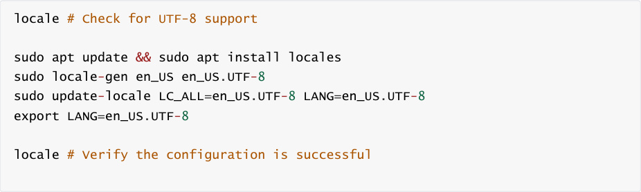
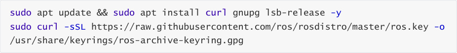
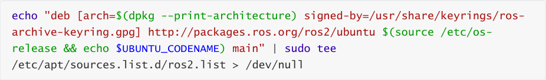
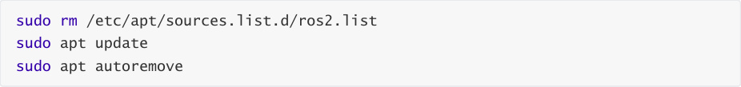

# 2. Installing Humble in ROS2
The ROS2-Humble installation supports Ubuntu 22.04.

If you need to install a different version of ROS2, simply replace the **humble** version

identifier in the installation command with the corresponding version. This applies to all

other ROS-specific software in the ROS2 tutorial series and will not be covered in subsequent

tutorials.
## 1. Set the locale
First, check whether the locale supports UTF-8 encoding. You can run the following command to

check and set the UTF-8 encoding.

Note: The locale can be different, but must support UTF-8 encoding.
## 2. Set up the software source
Start the Ubuntu universe repository

Add the ROS 2 apt repository to the system and authorize our GPG key with apt.

Add the repository to the source list

## 3. Install Humble
First, update the apt repository cache:

Then upgrade the installed software (ROS2 packages are built on the frequently updated Ubuntu

system. Please ensure your system is up to date before installing new packages):

Install the desktop version of ROS2 (recommended), which includes ROS, RViz, examples, and

tutorials. The installation command is as follows. If you need to install a different version, replace

"humble" in the command with the corresponding version number:

Install the colcon build tool

## 4. Configure the Environment
If you are using a different version of ROS2, replace the "humble" version identifier with the

corresponding version. For example, for the foxy version, replace "humble" with "foxy" in the

command.

When executing ROS2 programs in a terminal, you need to run the following command to

configure the environment:

You must execute the above command each time you open a new terminal. Alternatively, you can

run the following command to add the environment configuration instructions to the "~/.bashrc"

file, eliminating the need to manually configure the environment each time you start a new

terminal.

At this point, ROS2 has been installed and configured.
## 5. Run the publisher and subscriber example nodes
The ROS2 desktop version has integrated some example nodes. You can test whether ROS2 is

successfully installed by running these example nodes.

Run the publisher node

Run the subscriber node

## 6. Run and experience the turtle example
The turtle simulator, TurtleSim, is a classic teaching tool in ROS. It helps you quickly understand

core ROS concepts.

Run the turtle simulator

Run the keyboard control node

View velocity topic data

## 7. Uninstallation
After installing ROS2, if you want to uninstall it, you can execute the following command:

You can also delete the ROS2 repository:

