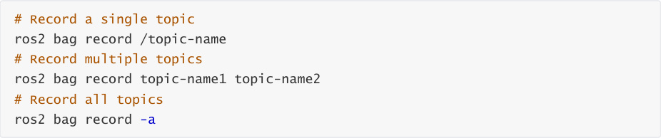
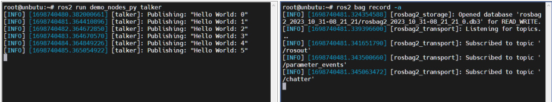
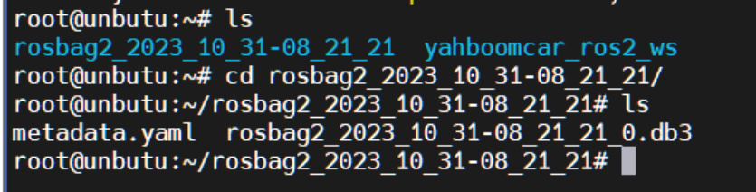
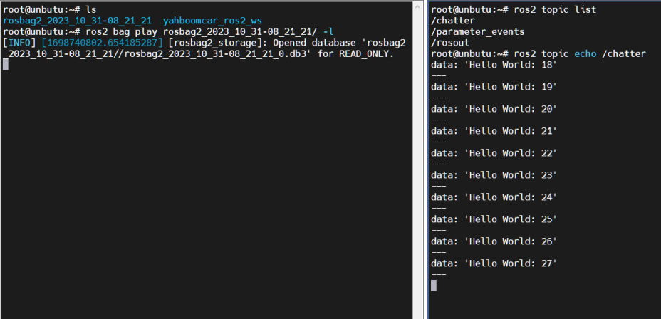

# 20. ROS2 Recording and Playback Tool
## 1. Introduction to Recording and Playback Tools
Bag2, a commonly used recording and playback tool in ROS2, is used to record topic data. We can

use this command to store topic data as a file. Later, we can directly publish the topic data in the

bag file without starting a node.

This tool is very useful when developing a real robot. For example, we can record topic data when

the robot encounters a problem. After recording, we can publish it multiple times for testing and

experimentation, or share the topic data with others to verify algorithms.

We will try using the bag tool to record topic data and replay it.
## 2. Usage Tutorial
### 2.1. Start the topic node to record
For example, the talker in the ros2 demo:

### 2.2. Recording
Other Options

-o name Customize the output file name

-s Storage format

Currently only supports sqllite3; others are available with extensions.

### 2.3. Viewing Recorded Topic Information
Before playing a video, you can view relevant information about the video through the file

information, such as the time, size, type, and number of topic records.

### 2.4. Play and View
#### 2.4.1. Play
Next, we can replay the data using the following command.

#### 2.4.2. View
Use the ros2 topic command to view the data.

#### 2.4.3. Playback Options
1. Play at Multiple Speeds -r

The -r option modifies the playback speed. For example, the -r value, for example, 10 means 10x

speed, playing the topic ten times faster.

2. Loop Playback -l

This is for looping a single song.

3. Play a Single Topic

## 3. Example
### 3.1. Running the talker node
### 3.2. Recording
How do I stop recording? Simply press Ctrl+C in the terminal to interrupt the recording.

You will then find a folder named rosbag2_2023_10_31-08_21_21 in the terminal.

Open the folder to see its contents.

This completes the recording.

### 3.3. Play and View
Here we loop the playback.

Open another terminal to view the topic:

