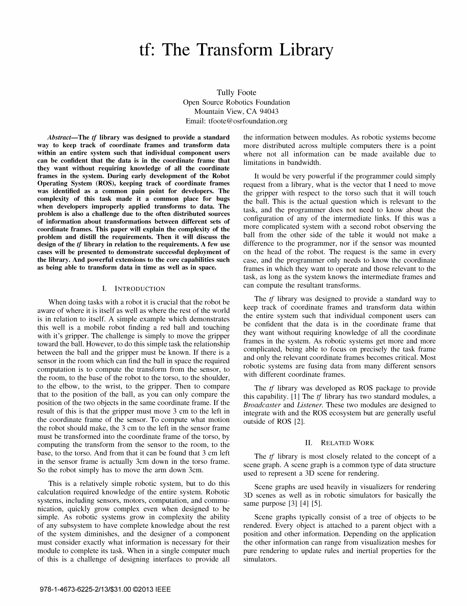

tf: The Transform Library

Tully Foote
Open Source Robotics Foundation
Mountain View, CA 94043
Email: tfoote@osrfoundation.org

Ahstract-The if library was designed to provide a standard

way to keep track of coordinate frames and transform data

within an entire system such that individual component users

can be confident that the data is in the coordinate frame that

they want without requiring knowledge of all the coordinate

frames in the system. During early development of the Robot

Operating System (ROS), keeping track of coordinate frames

was identified as a common pain point for developers. The

complexity of this task made it a common place for bugs

when developers improperly applied transforms to data. The

problem is also a challenge due to the often distributed sources

of information about transformations between different sets of

coordinate frames. This paper will explain the complexity of the

problem and distill the requirements. Then it will discuss the

design of the if library in relation to the requirements. A few use

cases will be presented to demonstrate successful deployment of

the library. And powerful extensions to the core capabilities such

as being able to transform data in time as well as in space.

I. INTRODUCTION

When doing tasks with a robot it is crucial that the robot be
aware of where it is itself as well as where the rest of the world
is in relation to itself. A simple example which demonstrates
this well is a mobile robot finding a red ball and touching
with it's gripper. The challenge is simply to move the gripper
toward the ball. However, to do this simple task the relationship
between the ball and the gripper must be known. If there is a
sensor in the room which can find the ball in space the required
computation is to compute the transform from the sensor, to
the room, to the base of the robot to the torso, to the shoulder,
to the elbow, to the wrist, to the gripper. Then to compare
that to the position of the ball, as you can only compare the
position of the two objects in the same coordinate frame. If the
result of this is that the gripper must move 3 cm to the left in
the coordinate frame of the sensor. To compute what motion
the robot should make, the 3 cm to the left in the sensor frame
must be transformed into the coordinate frame of the torso, by
computing the transform from the sensor to the room, to the
base, to the torso. And from that it can be found that 3 cm left
in the sensor frame is actually 3cm down in the torso frame.
So the robot simply has to move the arm down 3cm.

This is a relatively simple robotic system, but to do this
calculation required knowledge of the entire system. Robotic
systems, including sensors, motors, computation, and commu­
nication, quickly grow complex even when designed to be
simple. As robotic systems grow in complexity the ability
of any subsystem to have complete knowledge about the rest
of the system diminishes, and the designer of a component
must consider exactly what information is necessary for their
module to complete its task. When in a single computer much
of this is a challenge of designing interfaces to provide all

978-1-4673-6225-2/13/$31.00 ©2013 IEEE

the information between modules. As robotic systems become
more distributed across multiple computers there is a point
where not all information can be made available due to
limitations in bandwidth.

It would be very powerful if the programmer could simply
request from a library, what is the vector that I need to move
the gripper with respect to the torso such that it will touch
the ball. This is the actual question which is relevant to the
task, and the programmer does not need to know about the
configuration of any of the intermediate links. If this was a
more complicated system with a second robot observing the
ball from the other side of the table it would not make a
difference to the programmer, nor if the sensor was mounted
on the head of the robot. The request is the same in every
case, and the programmer only needs to know the coordinate
frames in which they want to operate and those relevant to the
task, as long as the system knows the intermediate frames and
can compute the resultant transforms.

The if library was designed to provide a standard way to
keep track of coordinate frames and transform data within
the entire system such that individual component users can
be confident that the data is in the coordinate frame that
they want without requiring knowledge of all the coordinate
frames in the system. As robotic systems get more and more
complicated, being able to focus on precisely the task frame
and only the relevant coordinate frames becomes critical. Most
robotic systems are fusing data from many different sensors
with different coordinate frames.

The if library was developed as ROS package to provide
this capability. [1] The if library has two standard modules, a

Broadcaster and Listener. These two modules are designed to
integrate with and the ROS ecosystem but are generally useful
outside of ROS [2].

II. RELATED WORK

The if library is most closely related to the concept of a
scene graph. A scene graph is a common type of data structure
used to represent a 3D scene for rendering.

Scene graphs are used heavily in visualizers for rendering
3D scenes as well as in robotic simulators for basically the
same purpose [3] [4] [5].

Scene graphs typically consist of a tree of objects to be
rendered. Every object is attached to a parent object with a
position and other information. Depending on the application
the other information can range from visualization meshes for
pure rendering to update rules and inertial properties for the
simulators.

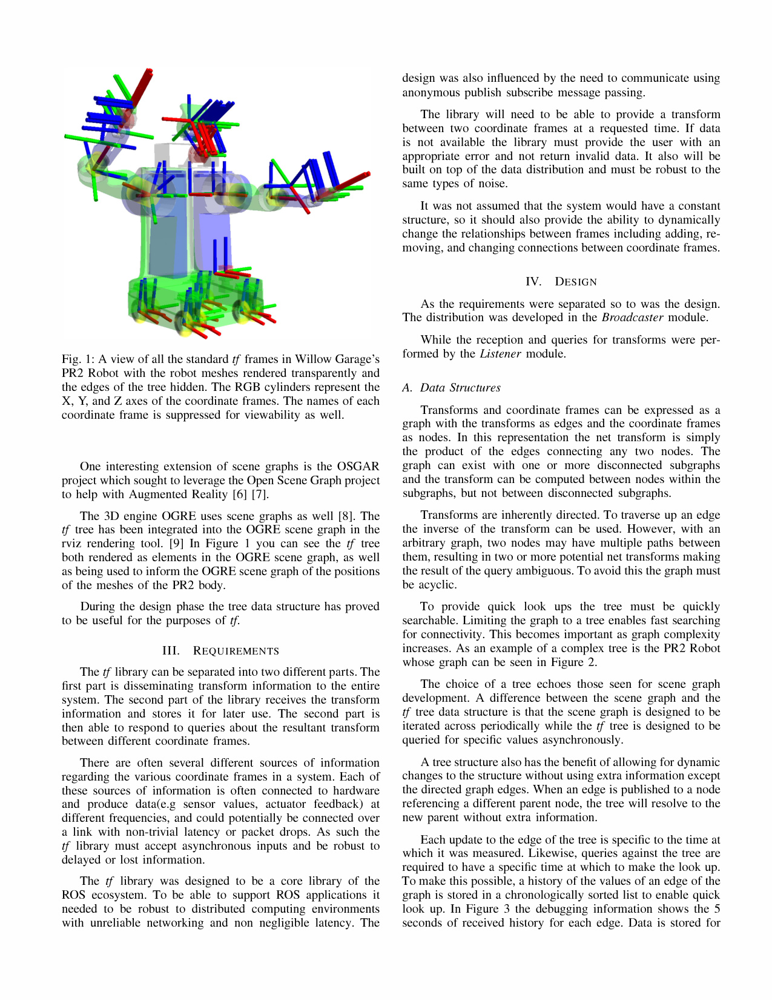

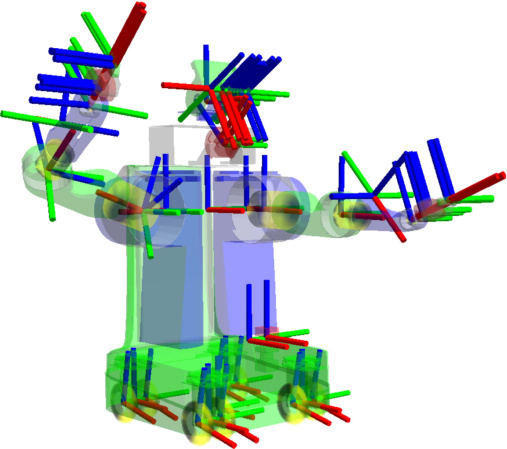

Fig. 1: A view of all the standard if frames in Willow Garage's
PR2 Robot with the robot meshes rendered transparently and
the edges of the tree hidden. The RGB cylinders represent the

X, Y, and Z axes of the coordinate frames. The names of each
coordinate frame is suppressed for viewability as well.

One interesting extension of scene graphs is the OSGAR
project which sought to leverage the Open Scene Graph project
to help with Augmented Reality [6] [7].

The 3D engine OGRE uses scene graphs as well [8]. The
if tree has been integrated into the OGRE scene graph in the
rviz rendering tool. [9] In Figure 1 you can see the if tree
both rendered as elements in the OGRE scene graph, as well
as being used to inform the OGRE scene graph of the positions
of the meshes of the PR2 body.

During the design phase the tree data structure has proved
to be useful for the purposes of if.

III. REQUIREMENTS

The if library can be separated into two different parts. The
first part is disseminating transform information to the entire
system. The second part of the library receives the transform
information and stores it for later use. The second part is
then able to respond to queries about the resultant transform
between different coordinate frames.

There are often several different sources of information
regarding the various coordinate frames in a system. Each of
these sources of information is often connected to hardware
and produce data( e.g sensor values, actuator feedback) at
different frequencies, and could potentially be connected over
a link with non-trivial latency or packet drops. As such the
if library must accept asynchronous inputs and be robust to
delayed or lost information.

The if library was designed to be a core library of the
ROS ecosystem. To be able to support ROS applications it
needed to be robust to distributed computing environments
with unreliable networking and non negligible latency. The

design was also influenced by the need to con nicate using
anonymous publish subscribe message passing.

The library will need to be able to provide a transform
between two coordinate frames at a requested time. If data
is not available the library must provide the user with an
appropriate error and not return invalid data. It also will be
built on top of the data distribution and must be robust to the
same types of noise.

It was not assumed that the system would have a constant
structure, so it should also provide the ability to dynamically
change the relationships between frames including adding, re­
moving, and changing connections between coordinate frames.

IV. DESIGN

As the requirements were separated so to was the design.
The distribution was developed in the Broadcaster module.

While the reception and queries for transforms were per­
formed by the Listener module.

A. Data Structures

Transforms and coordinate frames can be expressed as a
graph with the transforms as edges and the coordinate frames
as nodes. In this representation the net transform is simply
the product of the edges connecting any two nodes. The
graph can exist with one or more disconnected subgraphs
and the transform can be computed between nodes within the
subgraphs, but not between disconnected subgraphs.

Transforms are inherently directed. To traverse up an edge
the inverse of the transform can be used. However, with an
arbitrary graph, two nodes may have multiple paths between
them, resulting in two or more potential net transforms making
the result of the query ambiguous. To avoid this the graph must
be acyclic.

To provide quick look ups the tree must be quickly
searchable. Limiting the graph to a tree enables fast searching
for connectivity. This becomes important as graph complexity
increases. As an example of a complex tree is the PR2 Robot
whose graph can be seen in Figure 2.

The choice of a tree echoes those seen for scene graph
development. A difference between the scene graph and the
if tree data structure is that the scene graph is designed to be
iterated across periodically while the if tree is designed to be
queried for specific values asynchronously.

A tree structure also has the benefit of allowing for dynamic
changes to the structure without using extra information except
the directed graph edges. When an edge is published to a node
referencing a different parent node, the tree will resolve to the
new parent without extra information.

Each update to the edge of the tree is specific to the time at
which it was measured. Likewise, queries against the tree are
required to have a specific time at which to make the look up.
To make this possible, a history of the values of an edge of the
graph is stored in a chronologically sorted list to enable quick
look up. In Figure 3 the debugging information shows the 5
seconds of received history for each edge. Data is stored for

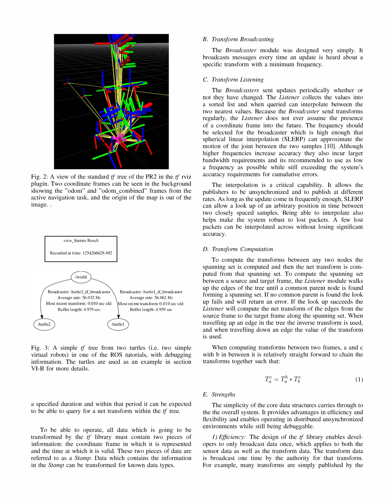

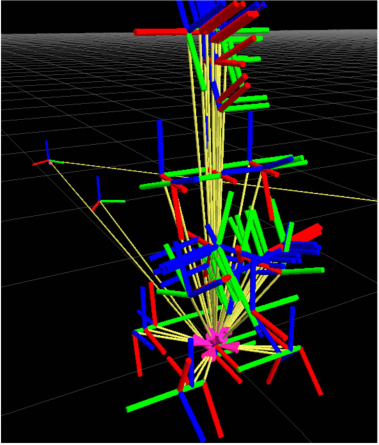

Fig. 2: A view of the standard if tree of the PR2 in the if rviz
plugin. Two coordinate frames can be seen in the background
showing the "odom" and "odom_combined" frames from the
active navigation task, and the origin of the map is out of the
image . .

Fig. 3: A simple if tree from two turtles (i.e. two simple
virtual robots) in one of the ROS tutorials, with debugging
information. The turtles are used as an example in section
VI-B for more details.

a specified duration and within that period it can be expected
to be able to query for a net transform within the if tree.

To be able to operate, all data which is going to be
transformed by the if library must contain two pieces of
information: the coordinate frame in which it is represented
and the time at which it is valid. These two pieces of data are
referred to as a Stamp. Data which contains the information
in the Stamp can be transformed for known data types.

B. Transform Broadcasting

The Broadcaster module was designed very simply. It
broadcasts messages every time an update is heard about a
specific transform with a minimum frequency.

C. Transform Listening

The Broadcasters sent updates periodically whether or
not they have changed. The Listener collects the values into
a sorted list and when queried can interpolate between the
two nearest values. Because the Broadcaster send transforms
regularly, the Listener does not ever assume the presence
of a coordinate frame into the future. The frequency should
be selected for the broadcaster which is high enough that
spherical linear interpolation (SLERP) can approximate the
motion of the joint between the two samples [10]. Although
higher frequencies increase accuracy they also incur larger
bandwidth requirements and its recommended to use as low
a frequency as possible while still exceeding the system's
accuracy requirements for cumulative errors.

The interpolation is a critical capability. It allows the
publishers to be unsynchronized and to publish at different
rates. As long as the update come in frequently enough, SLERP
can allow a look up of an arbitrary position in time between
two closely spaced samples. Being able to interpolate also
helps make the system robust to lost packets. A few lost
packets can be interpolated across without losing significant
accuracy.

D. Transform Computation

To compute the transforms between any two nodes the
spanning set is computed and then the net transform is com­
puted from that spanning set. To compute the spanning set
between a source and target frame, the Listener module walks
up the edges of the tree until a common parent node is found
forming a spanning set. If no common parent is found the look
up fails and will return an error. If the look up succeeds the

Listener will compute the net transform of the edges from the
source frame to the target frame along the spanning set. When
travelling up an edge in the tree the inverse transform is used,
and when travelling down an edge the value of the transform
is used.

When computing transforms between two frames, a and c
with b in between it is relatively straight forward to chain the
transforms together such that:

(1)

E. Strengths

The simplicity of the core data structures carries through to
the the overall system. It provides advantages in efficiency and
flexibility and enables operating in distributed unsynchronized
environments while still being debuggable.

1) Efficiency: The design of the if library enables devel­
opers to only broadcast data once, which applies to both the
sensor data as well as the transform data. The transform data
is broadcast one time by the authority for that transform.
For example, many transforms are simply published by the

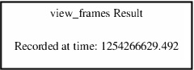

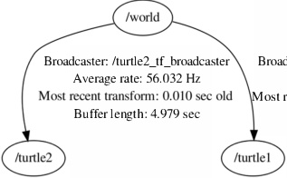
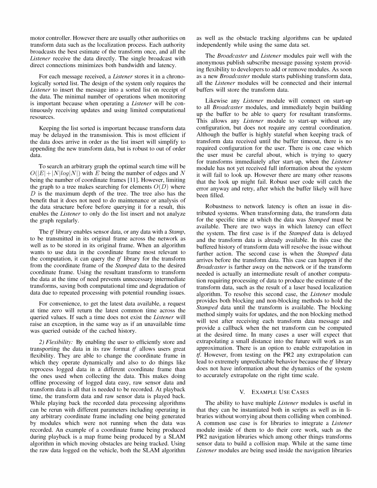

motor controller. However there are usually other authorities on
transform data such as the localization process. Each authority
broadcasts the best estimate of the transform once, and all the

Listener receive the data directly. The single broadcast with
direct connections minimizes both bandwidth and latency.

For each message received, a Listener stores it in a chrono­
logically sorted list. The design of the system only requires the

Listener to insert the message into a sorted list on receipt of
the data. The minimal number of operations when monitoring
is important because when operating a Listener will be con­
tinuously receiving updates and using limited computational
resources.

Keeping the list sorted is important because transform data
may be delayed in the transmission. This is most efficient if
the data does arrive in order as the list insert will simplify to
appending the new transform data, but is robust to out of order
data.

To search an arbitrary graph the optimal search time will be
O(IEI + INlloglNI) with E being the number of edges and N
being the number of coordinate frames [11]. However, limiting
the graph to a tree makes searching for elements O(D) where
D is the maximum depth of the tree. The tree also has the
benefit that it does not need to do maintenance or analysis of
the data structure before before querying it for a result, this
enables the Listener to only do the list insert and not analyze
the graph regularly.

The if library enables sensor data, or any data with a Stamp,
to be transmitted in its original frame across the network as
well as to be stored in its original frame. When an algorithm
wants to use data in the coordinate frame most relevant to
the computation, it can query the if library for the transform
from the coordinate frame of the Stamped data to the desired
coordinate frame. Using the resultant transform to transform
the data at the time of need prevents unnecessary intermediate
transforms, saving both computational time and degradation of
data due to repeated processing with potential rounding issues.

For convenience, to get the latest data available, a request
at time zero will return the latest common time across the
queried values. If such a time does not exist the Listener will
raise an exception, in the same way as if an unavailable time
was queried outside of the cached history.

2) Flexibility: By enabling the user to efficiently store and
transporting the data in its raw format if allows users great
flexibility. They are able to change the coordinate frame in
which they operate dynamically and also to do things like
reprocess logged data in a different coordinate frame than
the ones used when collecting the data. This makes doing
offline processing of logged data easy, raw sensor data and
transform data is all that is needed to be recorded. At playback
time, the transform data and raw sensor data is played back.
While playing back the recorded data processing algorithms
can be rerun with different parameters including operating in
any arbitrary coordinate frame including one being generated
by modules which were not running when the data was
recorded. An example of a coordinate frame being produced
during playback is a map frame being produced by a SLAM
algorithm in which moving obstacles are being tracked. Using
the raw data logged on the vehicle, both the SLAM algorithm

as well as the obstacle tracking algorithms can be updated
independently while using the same data set.

The Broadcaster and Listener modules pair well with the
anonymous publish subscribe message passing system provid­
ing flexibility to developers to add or remove modules. As soon
as a new Broadcaster module starts publishing transform data,
all the Listener modules will be connected and their internal
buffers will store the transform data.

Likewise any Listener module will connect on start-up
to all Broadcaster modules, and immediately begin building
up the buffer to be able to query for resultant transforms.
This allows any Listener module to start-up without any
configuration, but does not require any central coordination.
Although the buffer is highly stateful when keeping track of
transform data received until the buffer timeout, there is no
required configuration for the user. There is one case which
the user must be careful about, which is trying to query
for transforms immediately after start-up, when the Listener
module has not yet received full information about the system
it will fail to look up. However there are many other reasons
that the look up might fail. Robust user code will catch the
error anyway and retry, after which the buffer likely will have
been filled.

Robustness to network latency is often an issue in dis­
tributed systems. When transforming data, the transform data
for the specific time at which the data was Stamped must be
available. There are two ways in which latency can effect
the system. The first case is if the Stamped data is delayed
and the transform data is already available. In this case the
buffered history of transform data will resolve the issue without
further action. The second case is when the Stamped data
arrives before the transform data. This case can happen if the

Broadcaster is farther away on the network or if the transform
needed is actually an intermediate result of another computa­
tion requiring processing of data to produce the estimate of the
transform data, such as the result of a laser based localization
algorithm. To resolve this second case, the Listener module
provides both blocking and non-blocking methods to hold the

Stamped data until the transform is available. The blocking
method simply waits for updates, and the non blocking method
will test after receiving each transform data message and
provide a callback when the net transform can be computed
at the desired time. In many cases a user will expect that
extrapolating a small distance into the future will work as an
approximation. There is an option to enable extrapolation in
if. However, from testing on the PR2 any extrapolation can
lead to extremely unpredictable behavior because the if library
does not have information about the dynamics of the system
to accurately extrapolate on the right time scale.

V. EXAMPLE USE CASES

The ability to have multiple Listener modules is useful in
that they can be instantiated both in scripts as well as in li­
braries without worrying about them colliding when combined.
A common use case is for libraries to integrate a Listener
module inside of them to do their core work, such as the
PR2 navigation libraries which among other things transforms
sensor data to build a collision map. While at the same time

Listener modules are being used inside the navigation libraries

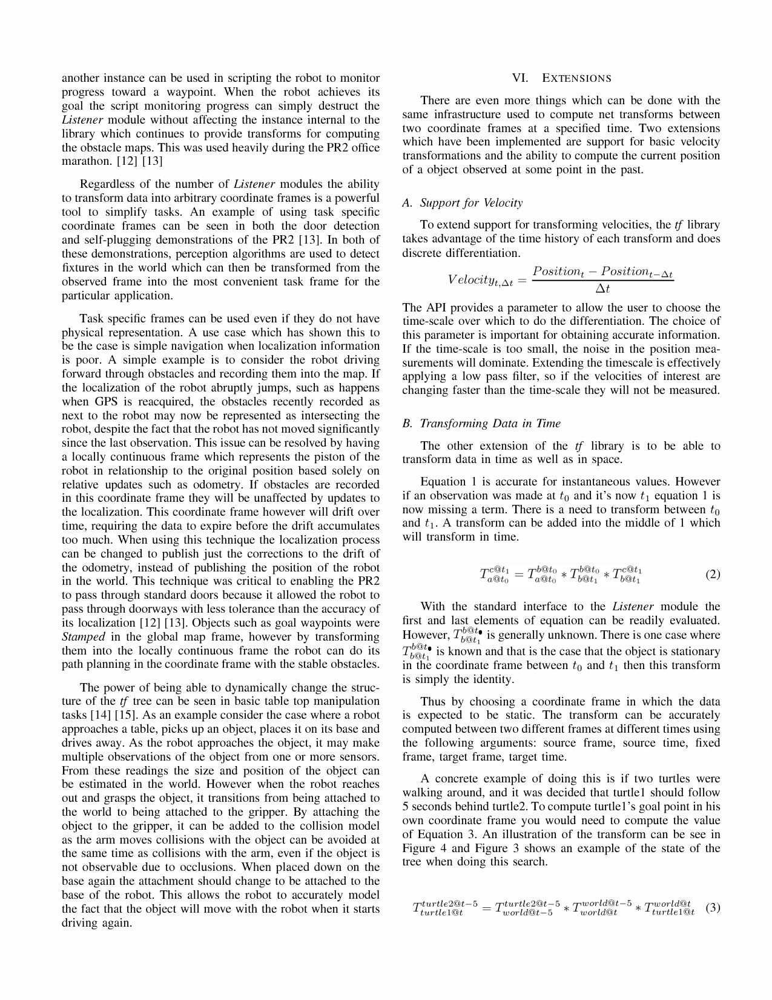

another instance can be used in scripting the robot to monitor
progress toward a waypoint. When the robot achieves its
goal the script monitoring progress can simply destruct the

Listener module without affecting the instance internal to the
library which continues to provide transforms for computing
the obstacle maps. This was used heavily during the PR2 office
marathon. [12] [13]

Regardless of the number of Listener modules the ability
to transform data into arbitrary coordinate frames is a powerful
tool to simplify tasks. An example of using task specific
coordinate frames can be seen in both the door detection
and self-plugging demonstrations of the PR2 [13]. In both of
these demonstrations, perception algorithms are used to detect
fixtures in the world which can then be transformed from the
observed frame into the most convenient task frame for the
particular application.

Task specific frames can be used even if they do not have
physical representation. A use case which has shown this to
be the case is simple navigation when localization information
is poor. A simple example is to consider the robot driving
forward through obstacles and recording them into the map. If
the localization of the robot abruptly jumps, such as happens
when GPS is reacquired, the obstacles recently recorded as
next to the robot may now be represented as intersecting the
robot, despite the fact that the robot has not moved significantly
since the last observation. This issue can be resolved by having
a locally continuous frame which represents the piston of the
robot in relationship to the original position based solely on
relative updates such as odometry. If obstacles are recorded
in this coordinate frame they will be unaffected by updates to
the localization. This coordinate frame however will drift over
time, requiring the data to expire before the drift accumulates
too much. When using this technique the localization process
can be changed to publish just the corrections to the drift of
the odometry, instead of publishing the position of the robot
in the world. This technique was critical to enabling the PR2
to pass through standard doors because it allowed the robot to
pass through doorways with less tolerance than the accuracy of
its localization [12] [13]. Objects such as goal waypoints were

Stamped in the global map frame, however by transforming
them into the locally continuous frame the robot can do its
path planning in the coordinate frame with the stable obstacles.

The power of being able to dynamically change the struc­
ture of the if tree can be seen in basic table top manipulation
tasks [14] [15]. As an example consider the case where a robot
approaches a table, picks up an object, places it on its base and
drives away. As the robot approaches the object, it may make
multiple observations of the object from one or more sensors.
From these readings the size and position of the object can
be estimated in the world. However when the robot reaches
out and grasps the object, it transitions from being attached to
the world to being attached to the gripper. By attaching the
object to the gripper, it can be added to the collision model
as the arm moves collisions with the object can be avoided at
the same time as collisions with the arm, even if the object is
not observable due to occlusions. When placed down on the
base again the attachment should change to be attached to the
base of the robot. This allows the robot to accurately model
the fact that the object will move with the robot when it starts
driving again.

VI. EXTENSIONS

There are even more things which can be done with the
same infrastructure used to compute net transforms between
two coordinate frames at a specified time. Two extensions
which have been implemented are support for basic velocity
transformations and the ability to compute the current position
of a object observed at some point in the past.

A. Support for Velocity

To extend support for transforming velocities, the if library
takes advantage of the time history of each transform and does
discrete differentiation.

Positiont - Positiont_C;.t
V le       - cz·tYt, c;'t = 6.t

The API provides a parameter to allow the user to choose the
time-scale over which to do the differentiation. The choice of
this parameter is important for obtaining accurate information.
If the time-scale is too small, the noise in the position mea­
surements will dominate. Extending the timescale is effectively
applying a low pass filter, so if the velocities of interest are
changing faster than the time-scale they will not be measured.

B. Transforming Data in Time

The other extension of the if library is to be able to
transform data in time as well as in space.

Equation 1 is accurate for instantaneous values. However
if an observation was made at to and it's now tl equation 1 is
now missing a term. There is a need to transform between to
and t1. A transform can be added into the middle of 1 which
will transform in time.

(2)

With the standard interface to the Listener module the
first and last elements of equation can be readily evaluated.
However, Tt::,o is generally unknown. There is one case where

Tt::,o is known and that is the case that the object is stationary
in the coordinate frame between to and h then this transform
is simply the identity.

Thus by choosing a coordinate frame in which the data
is expected to be static. The transform can be accurately
computed between two different frames at different times using
the following arguments: source frame, source time, fixed
frame, target frame, target time.

A concrete example of doing this is if two turtles were
walking around, and it was decided that turtlel should follow
5 seconds behind turtle2. To compute turtle 1 's goal point in his
own coordinate frame you would need to compute the value
of Equation 3. An illustration of the transform can be see in
Figure 4 and Figure 3 shows an example of the state of the
tree when doing this search.

Tturtlel@t [turtle2@t-5 _ ]  - Tworld@t-5 [turtle2@t-5 ] [* ] Tworld@t [world@t-5 ] [* ] Tturtlel@t [world@t ] (3)

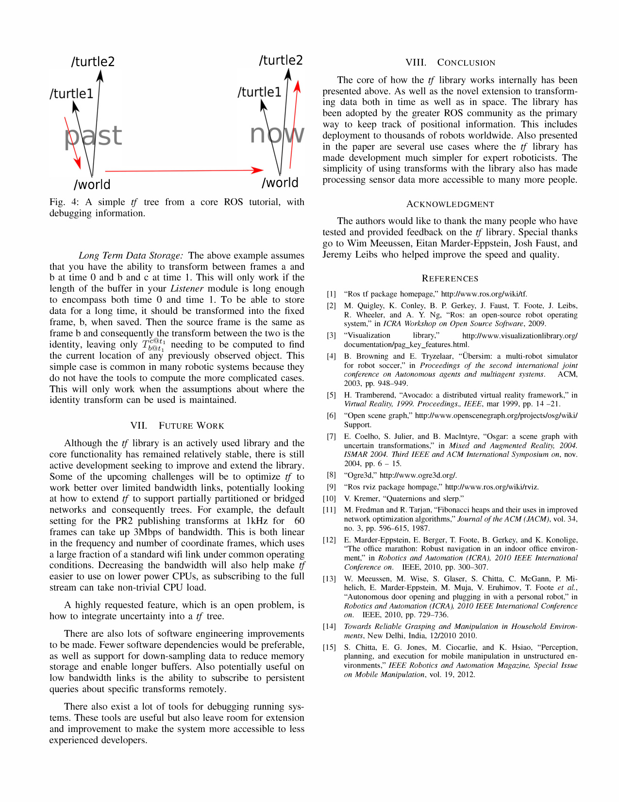

Fig. 4: A simple if tree from a core ROS tutorial, with
debugging information.

Long Term Data Storage: The above example assumes
that you have the ability to transform between frames a and
b at time 0 and b and c at time 1. This will only work if the
length of the buffer in your Listener module is long enough
to encompass both time 0 and time 1. To be able to store
data for a long time, it should be transformed into the fixed
frame, b, when saved. Then the source frame is the same as
frame b and consequently the transform between the two is the
identity, leaving only T�:t [t] " [" ] needing to be computed to find
the current location of any previously observed object. This
simple case is common in many robotic systems because they
do not have the tools to compute the more complicated cases.
This will only work when the assumptions about where the
identity transform can be used is maintained.

VII. FUTURE WORK

Although the if library is an actively used library and the
core functionality has remained relatively stable, there is still
active development seeking to improve and extend the library.
Some of the upcoming challenges will be to optimize if to
work better over limited bandwidth links, potentially looking
at how to extend if to support partially partitioned or bridged
networks and consequently trees. For example, the default
setting for the PR2 publishing transforms at 1kHz for 60
frames can take up 3Mbps of bandwidth. This is both linear
in the frequency and number of coordinate frames, which uses
a large fraction of a standard wifi link under common operating
conditions. Decreasing the bandwidth will also help make if
easier to use on lower power CPUs, as subscribing to the full
stream can take non-trivial CPU load.

A highly requested feature, which is an open problem, is
how to integrate uncertainty into a if tree.

There are also lots of software engineering improvements
to be made. Fewer software dependencies would be preferable,
as well as support for down-sampling data to reduce memory
storage and enable longer buffers. Also potentially useful on
low bandwidth links is the ability to subscribe to persistent
queries about specific transforms remotely.

There also exist a lot of tools for debugging running sys­
tems. These tools are useful but also leave room for extension
and improvement to make the system more accessible to less
experienced developers.

VIII. CONCLUSION

The core of how the if library works internally has been
presented above. As well as the novel extension to transform­
ing data both in time as well as in space. The library has
been adopted by the greater ROS community as the primary
way to keep track of positional information. This includes
deployment to thousands of robots worldwide. Also presented
in the paper are several use cases where the if library has
made development much simpler for expert roboticists. The
simplicity of using transforms with the library also has made
processing sensor data more accessible to many more people.

ACKNOWLEDGMENT

The authors would like to thank the many people who have
tested and provided feedback on the if library. Special thanks
go to Wim Meeussen, Eitan Marder-Eppstein, Josh Faust, and
Jeremy Leibs who helped improve the speed and quality.

REFERENCES

[1] "Ros tf package homepage," http://www.ros.org/wiki/tf.

[2] M. Quigley, K. Conley, B. P. Gerkey, J. Faust, T. Foote, J. Leibs,
R. Wheeler, and A. Y. Ng, "Ros: an open-source robot operating
system," in ICRA Workshop on Open Source Software, 2009.

[3] "Visualization library," http://www.visualizationlibrary.org/
documentation/pag_key _features.htm!.

[4] B. Browning and E. Tryzelaar, "Ubersim: a multi-robot simulator
for robot soccer," in Proceedings of the second international joint
conference on Autonomous agents and multiagent systems. ACM,
2003, pp. 948-949.

[5] H. Tramberend, "Avocado: a distributed virtual reality framework," in
Virtual Reality, 1999. Proceedings., IEEE, mar 1999, pp. 14 -2l.

[6] "Open scene graph," http://www.openscenegraph.org/projects/osg/wiki/
Support.

[7] E. Coelho, S. Julier, and B. Maclntyre, "Osgar: a scene graph with
uncertain transformations." in Mixed and Augmented Reality, 2004.
ISMAR 2004. Third IEEE and ACM International Symposium on, nov.
2004, pp. 6 - 15.

[8] "Ogre3d," http://www.ogre3d.org/.

[9] "Ros rviz package hompage," http://www.ros.orglwiki/rviz.

[10] Y. Kremer, "Quaternions and slerp."

[II] M. Fredman and R. Tarjan, "Fibonacci heaps and their uses in improved
network optimization algorithms," Journal of the ACM (JACM), vol. 34,
no. 3, pp. 596-615, 1987.

[12] E. Marder-Eppstein, E. Berger, T. Foote, B. Gerkey, and K. Konolige,
"The office marathon: Robust navigation in an indoor office environ­
ment," in Robotics and Automation (ICRA). 2010 IEEE International
Conference on. IEEE, 2010, pp. 300-307.

[13] W. Meeussen, M. Wise, S. Glaser, S. Chitta, C. McGann, P. Mi­
helich, E. Marder-Eppstein, M. Muja, Y. Eruhimov, T. Foote et al.,
"Autonomous door opening and plugging in with a personal robot," in
Robotics and Automation (ICRA), 2010 IEEE International Conference
on. IEEE, 2010, pp. 729-736.

[14] Towards Reliable Grasping and Manipulation in Household Environ­
ments, New Delhi, India, 12/2010 2010.

[15] S. Chitta, E. G. Jones, M. Ciocarlie, and K. Hsiao, "Perception,
planning, and execution for mobile manipulation in unstructured en­
vironments," IEEE Robotics and Automation Magazine, Special Issue
on Mobile Manipulation, vol. 19, 2012.

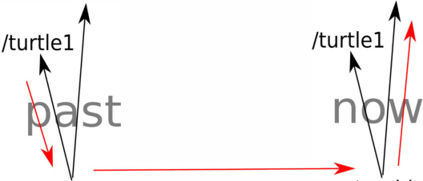
