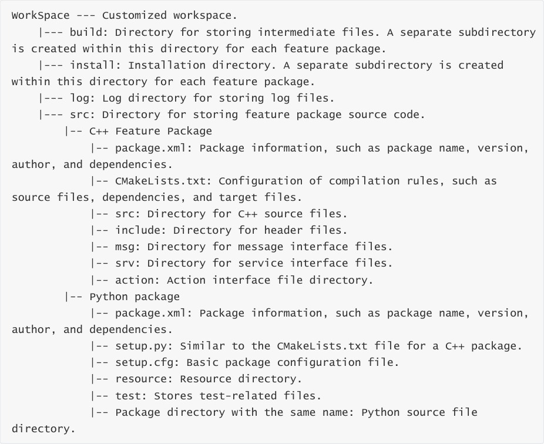
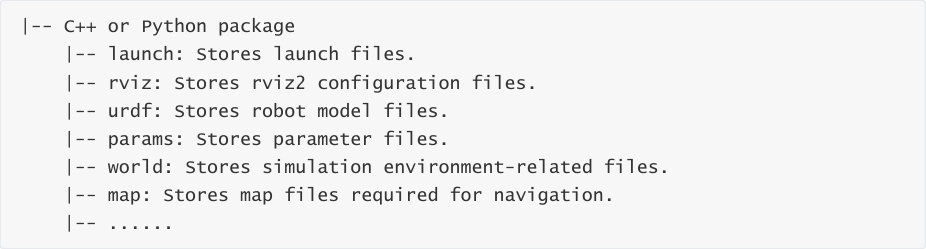

# 5. ROS2 Function Packages
## 1. Introduction to Function Packages
Each robot may have many functions, such as motion control, visual perception, and autonomous

navigation. While it's possible to lump the source code for all of these functions together, when

we want to share some of these functions with others, we often find the code all mixed together,

making it difficult to separate them.

Function packages work in this way. We separate the code for different functions into separate

packages, minimizing the coupling between them. When sharing with others in the ROS

community, we only need to explain how to use the package, and others can quickly start using it.

Thus, the function package mechanism is one of the key methods for increasing software reuse in

ROS.
## 2. Creating Function Packages
How do I create a function package in ROS2? We can use this command:

In the ros2 command:

**pkg** : Indicates the functions associated with the package;

**create** : Creates the package;

**package_name** : Required: The name of the new package;

**build-type** : Required: Indicates whether the newly created package is C++ or Python. If using

C++ or C, use ament_cmake; if using Python, use ament_python;

**dependencies** : Optional: Indicates the package's dependencies. A C++ package must include

rclcpp; a Python package must include rclpy, as well as other required dependencies;

**node-name** : Optional: The name of the executable program. The corresponding source files

and configuration files will be automatically generated.

For example, to create C++ and Python versions of the package in the terminal:

Switch to the src directory of the workspace.

Replace "workspace" with your actual folder path.

Create a C++ package example

Create a Python package example

## 3. Compile the package
In the created package, we can continue writing code. We will then need to compile and configure

environment variables for proper operation:

Switch to the workspace directory

Compile all packages

Compile a specific package

## 4. Complete Workspace Structure with Feature
**Packages**

The directory structure of a ROS2 workspace is as follows:

In addition, both Python and C++ packages can customize directories related to configuration

files.

These directories can also be defined with other names, or additional directories can be created

as needed.
