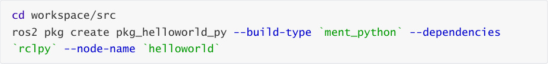
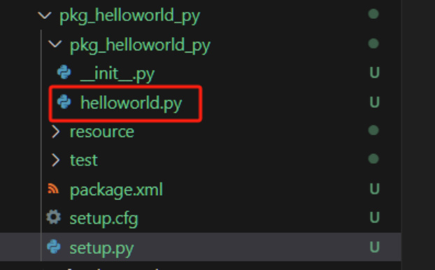
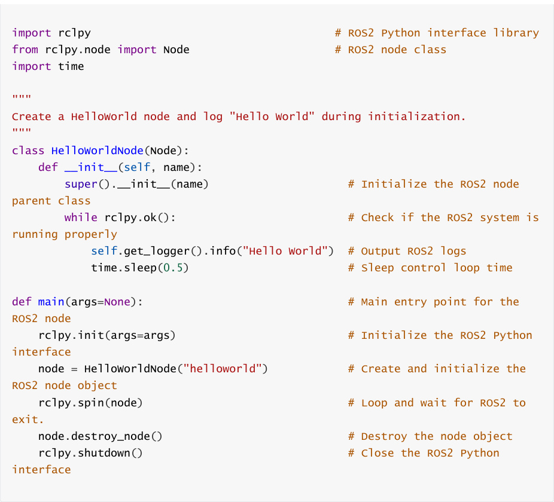
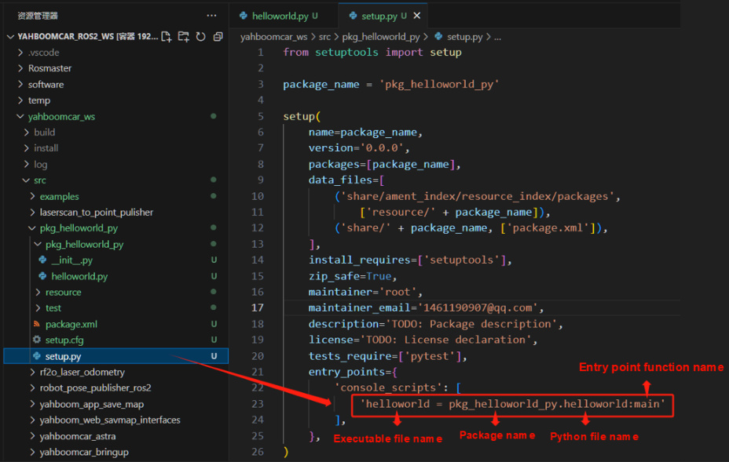
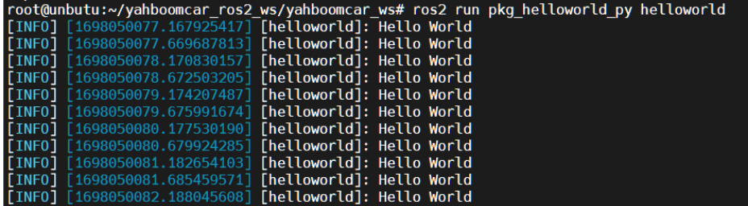

# 6. ROS2 Nodes
## 1. Node Introduction
Regardless of the communication method used, the construction of communication objects relies

on nodes. In ROS2, each node generally corresponds to a single functional module (for example, a

radar driver node might be responsible for publishing radar messages, while a camera driver

node might be responsible for publishing image messages). A complete robotic system may

consist of many nodes working together. In ROS2, a single executable file (C++ program or Python

program) can contain one or more nodes.
## 2. Node Creation Process
1. Create a Program File

2. Import Related ROS Libraries

3. Write Node Functions

4. Write the Configuration File

5. Compile and Run
## 3. Hello World Node Example
This section uses the Python package as an example.

### 3.1. Creating the Python Package

### 3.2. Writing Code
writing the node:

After writing the code, you need to set the package's compilation options to let the system know

the entry point for the Python program. Open the package's setup.py file and add the following

entry point configuration:

### 3.3. Compiling the Package
Compiling the Package

Refresh the environment variables in the workspace

### 3.4. Running the Node
After running successfully, you can see the "Hello World" string being printed in a loop in the

terminal:

