# 7. ROS2 Topic Communication
## 1. Introduction to Topic Communication

Topic communication is the most frequently used communication method in ROS2. A publisher

publishes data on a specified topic, and subscribers who subscribe to that topic receive the data.

Topic communication is based on the publish/subscribe model, as shown in the figure:

Topic data transmission is a process where the data is transmitted from one node to another. The

object sending data is called a publisher, and the object receiving data is called a subscriber. Each

topic must have a name, and the data transmitted must have a fixed data type.

Next, we will explain how to implement topic communication between nodes using Python.
## 2. Create a New Package

Switch to the src directory of the workspace

Create a new pkg_topic package

After executing the above command, the pkg_topic package will be created, along with a

publisher_demo node and the relevant configuration files.

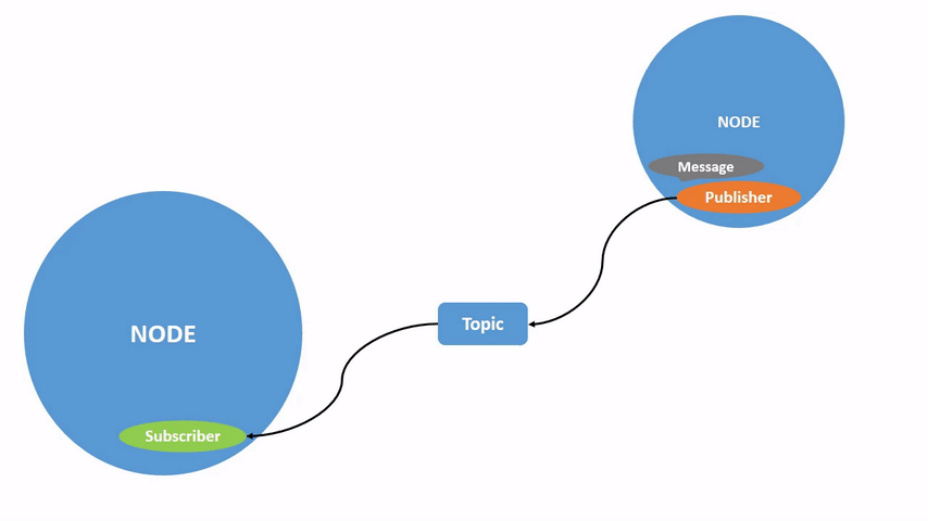
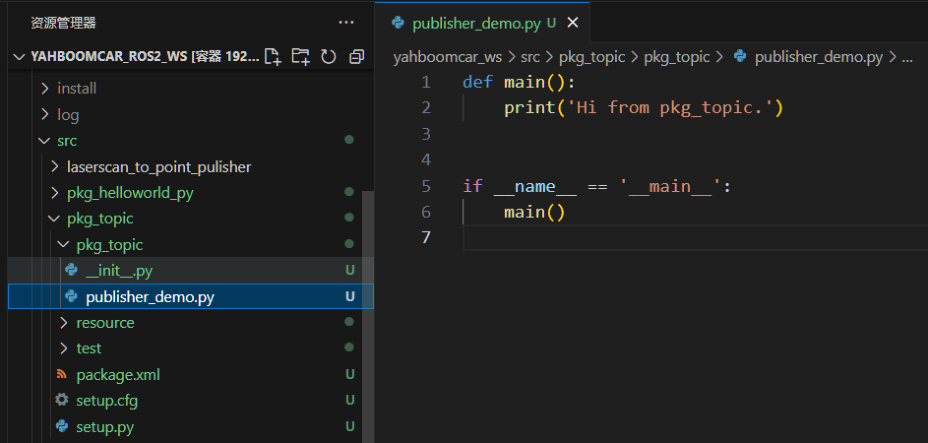
## 3. Publisher Implementation
### 3.1 Create a Publisher

Next, edit [publisher_demo.py] to implement the publisher functionality and add the following

code:

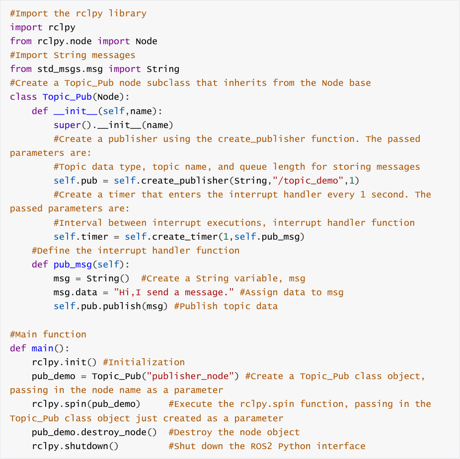

### 3.2 Editing the Configuration File
### 3.3 Compiling the Package

Compiling the Package

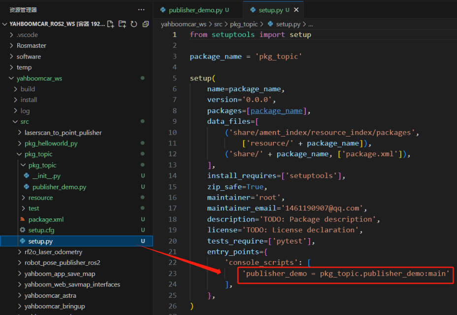

Refresh the environment variables in the workspace

### 3.4 Running the Program

After refreshing the environment variables, run the command

After the program successfully runs, nothing is printed. We can use the ros2 topic tool to view the

data. First, check if there are any topics being published. Open another terminal and enter:

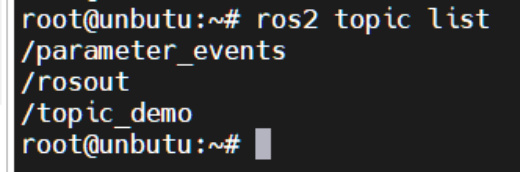

This topic_demo is the topic data defined in the program. Next, we'll use ros2 topic echo to print

this data. In the terminal, enter:

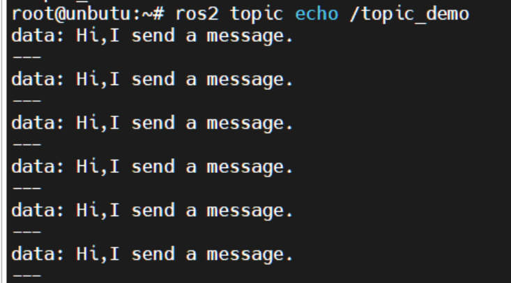

As you can see, the output "Hi, I send a message." from the terminal matches the line msg.data =

"Hi, I send a message." in our code.
## 4. Subscriber Implementation
### 4.1 Creating a Subscriber

Create a new file, [subscriber_demo.py], in the same directory as [publisher_demo.py].

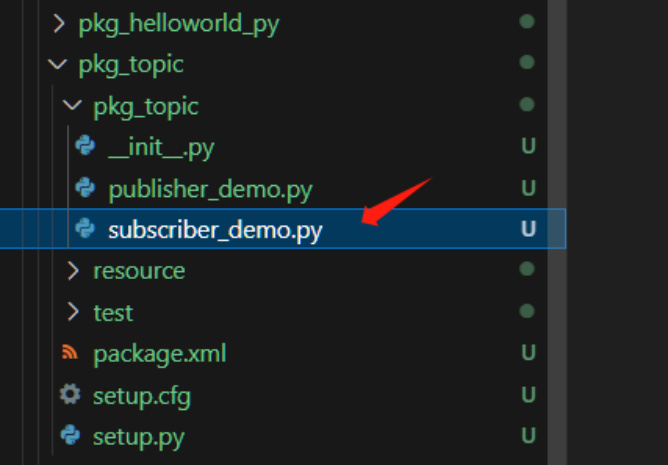
Next, edit [subscriber_demo.py] to implement the subscriber functionality and add the following

code:

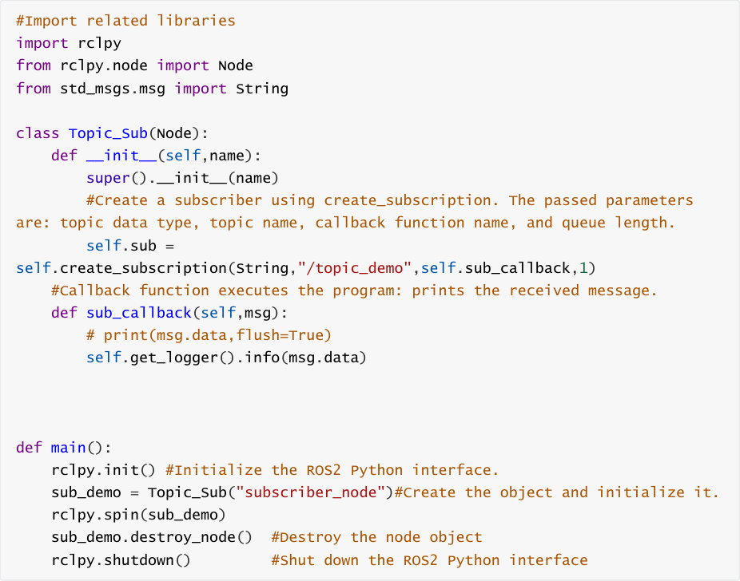

### 4.2 Editing the Configuration File

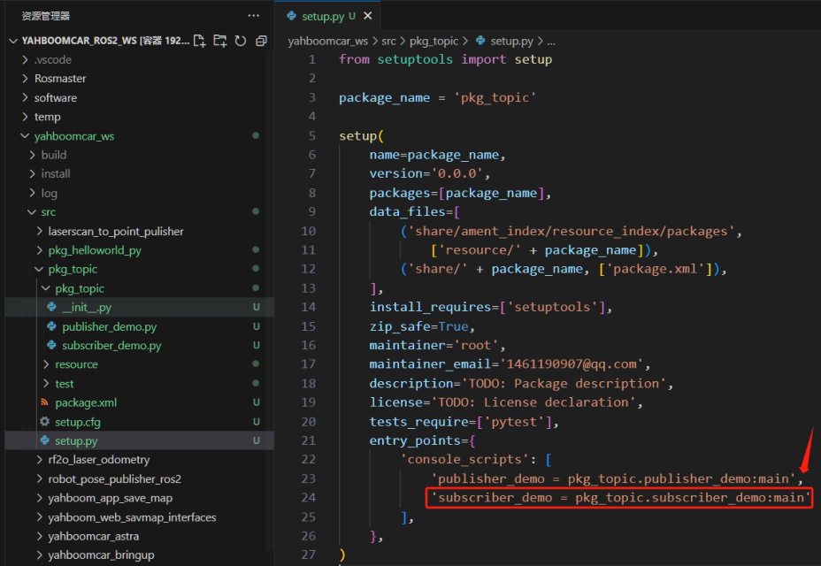
### 4.3 Compile the Workspace

Compile the package

Refresh the environment variables in the workspace

### 4.4 Run the Program

Execute the following command in a separate terminal:

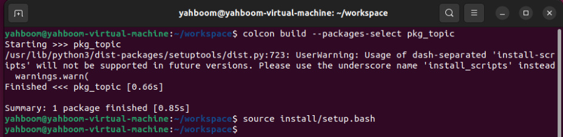

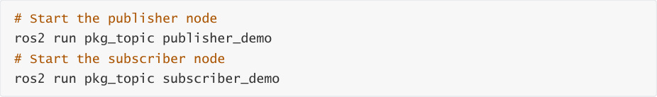

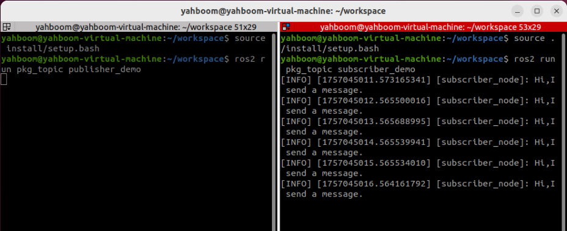

As shown in the figure above, the terminal running the subscriber node will print the information

published by the publisher, /topic_demo.
