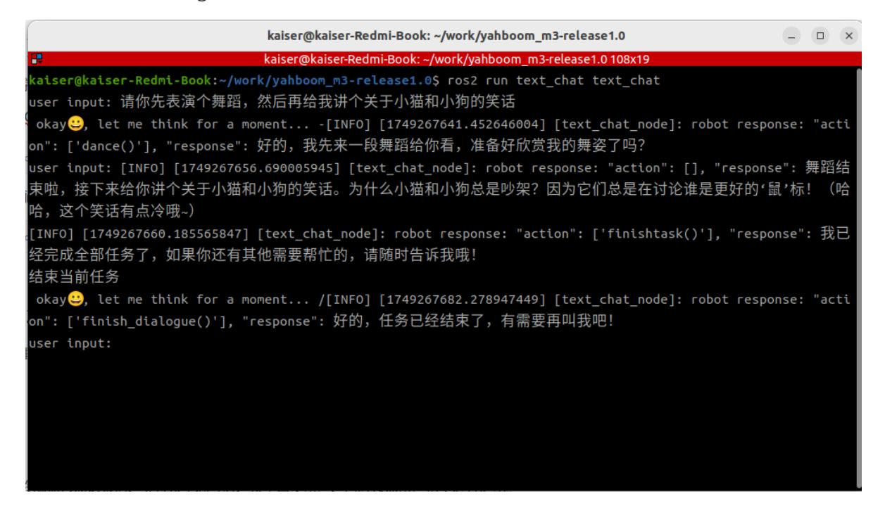

# **Semantic Understanding and Command Following**

#### **Semantic [Understanding](#page-0-0) and Command Following**

- <span id="page-0-0"></span>[1. Course](#page-0-1) Content
- [2. Preparation](#page-0-2)
  - 2.1 Content [Description](#page-0-3)
  - 2.2 [Starting](#page-0-4) the Agent
- <span id="page-0-1"></span>[3. Running](#page-1-0) Examples
  - 3.1 Starting the [Program](#page-1-1)
  - 3.2 Test [Cases](#page-1-2)
    - [3.2.1](#page-1-3) Case 1
    - [3.2.2](#page-2-0) Case 2

# **1. Course Content**

Run the example program and interact with the robot only through text in the terminal, without voice input or voice response.

# <span id="page-0-2"></span>**2. Preparation**

#### <span id="page-0-3"></span>**2.1 Content Description**

This section of the course uses the Jetson Orin NX as an example. For Raspberry Pi and Jetson Nano boards, you need to open a terminal on the host machine and then enter the command to enter the Docker container. After entering the Docker container, enter the commands mentioned in this section of the course in the terminal. For instructions on entering the Docker container from the host machine, please refer to the "Entering the Robot's Docker (For Jetson Nano and Raspberry Pi 5 Users)" section in the product tutorial [0. Instructions and Installation Steps]. For Orin and NX boards, simply open the terminal and enter the commands mentioned in this section of the course.

### **2.2 Starting the Agent**

**Note: If the agent is already running, you do not need to start it again.**

Enter the following command in the vehicle's terminal:

```
sh start_agent.sh
```

The terminal will print the following information, indicating a successful connection:

# **3. Running Examples**

#### **3.1 Starting the Program**

<span id="page-1-1"></span><span id="page-1-0"></span>Open a terminal on the vehicle's system and enter the following command:

```
ros2 launch multi_brains llm_agent_control.launch.py text_chat_mode:=True
```

Start the text interaction terminal. This can be started on either the vehicle's system or the virtual machine; **choose only one** method, do not start it on both the virtual machine and the vehicle's system:

```
ros2 run text_chat text_chat
```

#### **3.2 Test Cases**

Here are some example test cases. Users can create their own dialogue commands.

- Please move forward 1 meter quickly, then slowly move backward 0.5 meters like a turtle, then turn left 30 degrees, turn right 90 degrees, then translate left 0.5 meters, and then translate right 10 centimeters.
- <span id="page-1-3"></span>Please perform a dance, and then tell me a joke about cats and dogs.

#### **3.2.1 Case 1**

Open a terminal in the virtual machine, enter the test case in the terminal, and after the model thinks, the AI agent will reply to the user and perform the actions according to the user's instructions.


#### <span id="page-2-0"></span>**3.2.2 Case 2**

Using the same method as Case 1, enter Case 2 in the terminal. The model will reply and perform the actions according to the instructions.

