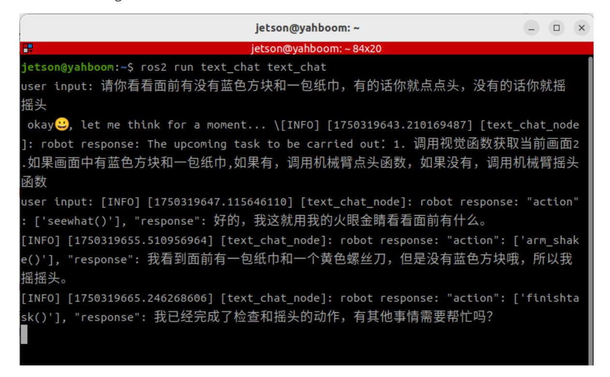

# **Multimodal Visual Understanding**

#### **[Multimodal Visual Understanding](#page-0-0)**

- <span id="page-0-0"></span>[1. Course](#page-0-1) Content
- [2. Preparation](#page-0-2)
  - 2.1 [Starting](#page-0-3) the Agent
- [3. Running](#page-1-0) the Examples
  - 3.1 Starting the [Program](#page-1-1)
  - 3.2 Test [Cases](#page-1-2)
    - [3.2.1](#page-1-3) Case 1
    - [3.2.2](#page-2-0) Case 2
- <span id="page-0-1"></span>[4. Source](#page-3-0) Code Analysis

## **1. Course Content**

Run the example program, allowing the robot to observe the environment through text interaction in the terminal and perform tasks based on instructions.

#### [!NOTE]

<span id="page-0-3"></span><span id="page-0-2"></span>The only difference between the text version and the voice version is the method of instruction input; the text version does not include speech recognition and speech synthesis playback.

# **2. Preparation**

### **2.1 Starting the Agent**

**Note: The Docker agent must be started before testing all cases. If it is already running, there is no need to start it again.**

Enter the following command in the vehicle terminal:

```
sh start_agent.sh
```

The terminal will print the following information, indicating a successful connection:

### **3. Running the Examples**

### **3.1 Starting the Program**

<span id="page-1-1"></span><span id="page-1-0"></span>Open the terminal on the vehicle and enter the command:

```
ros2 launch multi_brains llm_agent_control.launch.py text_chat_mode:=True
```

Start the text interaction node on the vehicle:

```
ros2 run text_chat text_chat
```

#### **3.2 Test Cases**

Here are two example test cases; users can create their own test instructions.

- <span id="page-1-2"></span>Tell me what objects are in front of you, and describe their functions.
- <span id="page-1-3"></span>Please look to see if there is a blue block and a pack of tissues in front of you. If there is, nod your head; if not, shake your head.

#### **3.2.1 Case 1**

Enter the test case in the text interaction terminal. After the model thinks, the model will reply to the user and perform the actions according to the user's instructions.

After the robot completes a task, it enters a waiting state. At this point, you can continue the conversation. The instructions will be directly passed to the execution layer's large language model, and all conversation history will be retained. You can enter the "end current task" command again to have the robot end the current task cycle and start a new one.

#### <span id="page-2-0"></span>**3.2.2 Case 2**

Similar to Case 1, entering Case 2 in the terminal will cause the model to respond and perform actions according to the instructions.



# **4. Source Code Analysis**

<span id="page-3-0"></span>Robot action source code path:

```
~/M3Pro_ws/src/multi_brains/multi_brains/action_service.py
```

Model service source code:

```
~/M3Pro_ws/src/multi_brains/multi_brains/model_service.py
```

- The main program that implements the robot's visual observation function is the seewhat method in the action\_service.py program:
- The function implementation is: save and display an image from the latest viewpoint.
- Then, it sends a request to the model\_service node, requesting to provide image feedback to the multi\_brains agent in Dify.

```
def seewhat(self):
        """
        Save the current view image and send it as feedback to the Dify agent.
        """
        self.save_single_image()
        msg=LlmRequest()
        msg.llm_request=self.actionlog.get_text("image_feedback")
        msg.robot_feedback=True
        self.llm_request_pub.publish(msg)
        return None
    def save_single_image(self):
        """保存一张图片 / Save a single image"""
        cv_image = self.bridge.imgmsg_to_cv2(self.image_msg, "bgr8")
        cv2.imwrite(self.image_cache_path, cv_image)
        time.sleep(0.05)
        display_thread = threading.Thread(target=self.__display_saved_image)
        display_thread.start()
    def __display_saved_image(self):
        """
        显示已保存的图片4秒后关闭窗口 / Display the saved image for 4 seconds before
closing the window
        """
        try:
            img = cv2.imread(self.image_cache_path)
            if img is not None:
                cv2.imshow("Saved Image", img)
                cv2.waitKey(4000) # 等待4秒 / Wait for 4 seconds
                cv2.destroyAllWindows()
            else:
                self.get_logger().error(
                    "Failed to load saved image for display."
                ) # Failed to load the saved image for display...
        except Exception as e:
            self.get_logger().error(f"Error displaying image: {e}") # An error
occurred while displaying the image...
```

- In addition, the llm\_request\_callback function in model\_service.py is used to receive requests to access the multi\_brains agent.
- If the llm\_request field in the request message indicates an image request, a list [msg.llm\_request, 'image\_request', True] is constructed and added to the model request processing queue.

```
def llm_request_callback(self, msg:LlmRequest):
        '''话题回调函数,接收调用模型请求并放入队列中 / Topic callback function, receive
model request and put into queue
        '''if self.debug_mode: self.get_logger().info(f"robot_feedback:
{msg.robot_feedback},llm_request:{msg.llm_request}")
        if msg.robot_feedback:
            # Robot Feedback Request
            if msg.llm_request ==self.syslog.get_text("image_feedback"):
 self.llm_handler_queue.put([msg.llm_request,'image_request',True])
            elif msg.llm_request =="finish":
                # Upon receiving the `finish` command from dify-agent, the
current task cycle ends. This clears the historical context and starts a new task
cycle.
                self.clear_request_queue() # Clear the request queue.
                self.dify_llmclient.reset_conversation() # Reset session
            else:
                #Conventional robot feedback results
                if self.debug_mode:
self.get_logger().info(self.syslog.get_text("system_log_4"))
 self.llm_handler_queue.put([msg.llm_request,'text_request',True])
        else:# Model requests from other sources
            self.llm_handler_queue.put([msg.llm_request,'text_request',None])
```

In the handle\_llm\_thread method of model\_service.py , the response mode is determined by the self.text\_chat\_mode variable. If it's only text-based interaction mode, only text responses will be provided.

```
def handle_llm_thread(self)->None:
        '''处理模型请求/ Handle model request
        '''while True:
            if not self.llm_handler_queue.empty():#The queue is not empty,
processing model requests.
                request_query = self.llm_handler_queue.get()
                if self.debug_mode: self.get_logger().info(f"Processing LLM
request: {request_query}")
                if request_query[1]=='text_request':
                    '''text request'''
```

```
result=self.dify_llmclient.chat(request_query[0],robot_feedback=request_query[2
])
                elif request_query[1]=='image_request':
                    '''vision + text request'''
 result=self.dify_llmclient.chat(request_query[0],image_path=self.image_cache_pa
th,robot_feedback=request_query[2])
                if result[0]:
                    if not self.text_chat_mode and self.asr_detect.record_flag
: continue
                    split_result=self.extract_actions(result[1])
                    if split_result is None: continue
 action_list,llm_response,decision_plan=self.extract_actions(result[1])
                    if decision_plan is not None:
 self.get_logger().info(Fore.YELLOW+self.syslog.get_text("system_log_3",decision
_plan=decision_plan)+Fore.RESET)
                    self.get_logger().info(Fore.YELLOW+f'"action":
{action_list},"response": {llm_response}'+Fore.RESET)
                    if not self.text_chat_mode:#Voice Reply
                        if
self.tts_engine.synthesize(llm_response,self.tts_out_path) :
                            self.play_audio(self.tts_out_path)
                        else:
                            self.get_logger().error(Fore.RED+"Speech synthesis
failed. Check whether the TTS model is available"+Fore.RESET)
                    else:#Text Reply
                        if decision_plan is not None:
 self.text_pub.publish(String(data=self.syslog.get_text("system_log_3",decision_
plan=decision_plan)))
                        self.text_pub.publish(String(data=f'"action":
{action_list}, "response": {llm_response}'))
                    if action_list!=[]: self.send_action_service(action_list,
llm_response)
                else:
                    self.get_logger().error(Fore.RED+f"The model request failed.
Check whether the dify or AI model is normal.\
                                            Error Log:{result[1]}"+Fore.RESET)
            else:
                time.sleep(1.0)#Sleep for 1 second when there are no requests.
```

When initializing the model engine, the speech recognition and speech synthesis models are loaded only in speech interaction mode.

```
def init_largemodel(self):
      # Initialize Dify
 self.dify_llmclient=Dify_LLM_Client(api_key=self.dify_api_key,base_url=self.dif
y_base_url)
```

```
result=self.dify_llmclient.test_connection()
        if result[0]:
            self.get_logger().info("Dify LLM connection successful")
        else:
            self.get_logger().error(Fore.RED+f"Dify LLM connection failed,\
                                    Please check whether DIY dify has been
started, API and BASE_URL settings\
                                    Error log:{result[1]}"+Fore.RESET)
        llm_handler_thread = threading.Thread(target=self.handle_llm_thread)#
Start the Dify thread to handle business logic related to large language model
requests.
        llm_handler_thread.daemon = True
        llm_handler_thread.start()
        if not self.text_chat_mode: # Voice Chat Mode
           #Initialize ASR
            self.asr_detect=ASR_Detect(self.llm_handler_queue,self.config_file,
pygame_lock=self.pygame_lock)
            if not self.asr_detect.init_ASR_Detect() :
                self.get_logger().error(Fore.RED+"Failed to initialize
ASR_Engine"+Fore.RESET)
            asr_thread =
threading.Thread(target=self.asr_detect.asr_detect_run)#Start the ASR thread to
handle wake-up and speech recognition related tasks.
            asr_thread.daemon = True
            asr_thread.start()
            #Initialize TTS
 self.tts_out_path=os.path.join(os.path.expanduser('~'),'M3Pro_ws','multi_brains
_file','tts_output.wav') # 语音合成输出路径 / TTS output path
            if self.config_param.get("USE_OLINE_TTS", False):
                tts_supplier=self.config_param.get("TTS_SUPPLIER")
                if tts_supplier=="aliyun":
                    self.tts_engine=TongyiTTS(self.config_file)
                    if self.tts_engine.init_tts_engine() :
                        self.get_logger().info(Fore.BLUE+"Tongyi TTS_Engine
initialized successfully"+Fore.RESET)
                    else:
                        self.get_logger().error(Fore.RED+"Tongyi TTS_Engine
initialized failed"+Fore.RESET)
                elif tts_supplier=="baidu":
                    self.tts_engine=BaiduTTS(self.config_file)
                    if self.tts_engine.init_tts_engine() :
                        self.get_logger().info(Fore.BLUE+"Baidu TTS_Engine
initialized successfully"+Fore.RESET)
                    else:
                        self.get_logger().error(Fore.RED+"Baidu TTS_Engine
initialized failed "+Fore.RESET)
                elif tts_supplier=="xunfei":
 self.tts_out_path=os.path.join(os.path.expanduser('~'),'M3Pro_ws','multi_brains
_file','xunfei_tts_output.mp3')
```

```
key_path=os.path.join(os.path.expanduser('~'),self.config_param.get("XUNFEI_KEY
",""))
 xunfei_encrypted_key=os.path.join(os.path.expanduser('~'),self.config_param.get
("XUNFEI_ENCRYPTED",""))
 self.tts_engine=XunfeiTTS(key_path,xunfei_encrypted_key,self.config_file)
                    if self.tts_engine.init_tts_engine():
                        self.get_logger().info(Fore.BLUE+"Xunfei TTS_Engine
initialized successfully"+Fore.RESET)
                    else:
                        self.get_logger().error(Fore.RED+"Xunfei TTS_Engine
initialized failed"+Fore.RESET)
            else:
                self.tts_engine=PiperTTS(self.language)
                if self.tts_engine.init_tts_engine() is not False:
                    self.get_logger().info(Fore.BLUE+"Piper TTS_Engine
initialized successfully"+Fore.RESET)
                else:
                    self.get_logger().error(Fore.RED+"Piper TTS_Engine
initialized failed"+Fore.RESET)
```