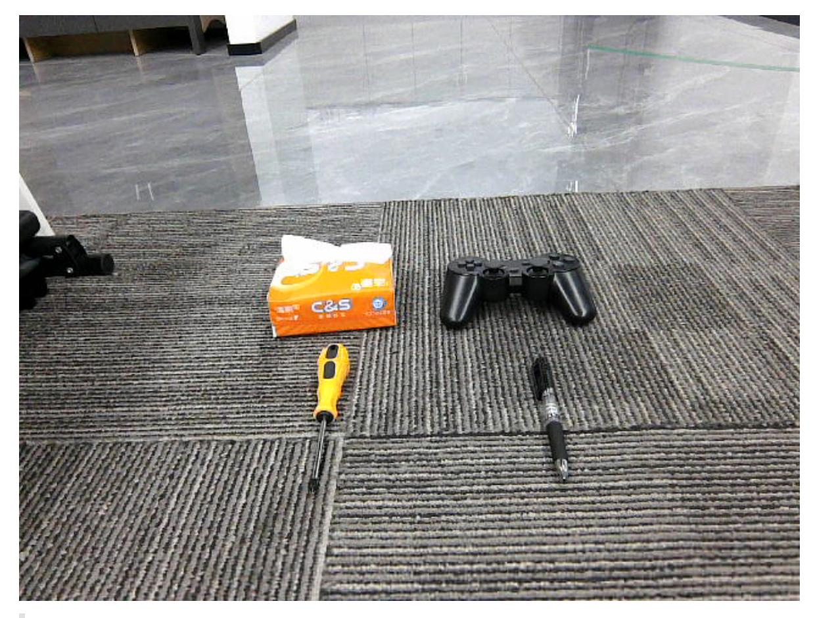
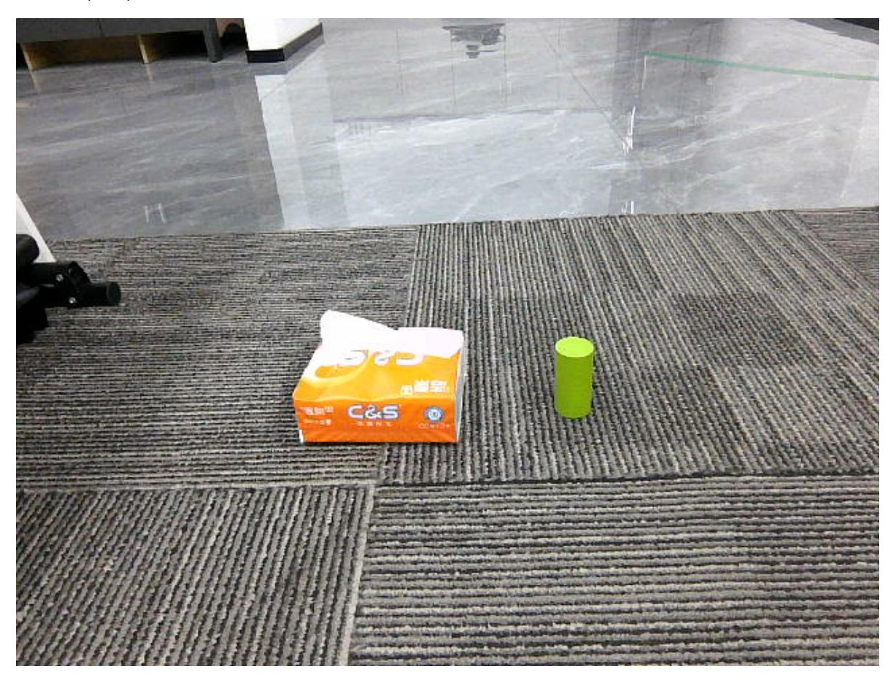

# **Multimodal Visual Understanding**

#### **[Multimodal Visual Understanding](#page-0-0)**

- <span id="page-0-0"></span>[1. Course](#page-0-1) Content
- [2. Preparation](#page-0-2)
  - 2.1 Content [Description](#page-0-3)
  - 2.2 [Starting](#page-0-4) the Agent
- [3. Running](#page-1-0) Examples
  - 3.1 Starting the [Program](#page-1-1)
  - 3.2 Test [Cases](#page-2-0)
    - [3.2.1](#page-2-1) Case 1
    - [3.2.2](#page-3-0) Case 2
- <span id="page-0-1"></span>[4. Source](#page-4-0) Code Analysis

## **1. Course Content**

Basic: Run the example program, allowing the robot to observe the environment and execute tasks based on instructions.

Advanced: Understand the key source code introduced in this section.

# <span id="page-0-2"></span>**2. Preparation**

### <span id="page-0-3"></span>**2.1 Content Description**

This course uses the Jetson Orin NX as an example. For Raspberry Pi and Jetson Nano boards, you need to open a terminal on the host machine and then enter the command to access the Docker container. After entering the Docker container, enter the commands mentioned in this section in the terminal. For instructions on accessing the Docker container from the host machine, please refer to the "Accessing the Robot's Docker (For Jetson Nano and Raspberry Pi 5 users)" section in the product tutorial [0. Instructions and Installation Steps]. For Orin and NX boards, simply open a terminal and enter the commands mentioned in this section.

### **2.2 Starting the Agent**

**Note: If the agent is already running, you do not need to start it again.**

Enter the following command in the vehicle terminal:

```
sh start_agent.sh
```

The terminal will print the following information, indicating a successful connection:

# <span id="page-1-0"></span>**3. Running Examples**

### <span id="page-1-1"></span>**3.1 Starting the Program**

Open the terminal on the vehicle and enter the following command:

```
ros2 launch multi_brains llm_agent_control.launch.py
```

Alternatively, you can use the shortcut command:

```
multi_brains
```

Wait for the initialization program to complete, as shown in the image below:

#### **3.2 Test Cases**

These test cases are for demonstration purposes only; users can create their own dialogue commands.

- <span id="page-2-0"></span>Tell me what objects are in front of you and what their functions are.
- Please check if there is a blue cube and a pack of tissues in front of you. If there is, nod your head; if not, shake your head.

#### **3.2.1 Case 1**

<span id="page-2-1"></span>First, use "Hello yahboom" to wake up the robot. The robot will respond. After the recording prompt, the user can speak. The robot will perform dynamic sound detection. If there is sound activity, it will print "1-1-1-1"; if there is no sound activity, it will print "---------". After speaking, it will perform end-of-speech detection. If there is silence for more than 1.5 seconds, the recording will stop. - The robot will first respond to the user, then perform the actions according to the instructions, while simultaneously printing the following information on the terminal:

Robot's perspective screen:



#### [!IMPORTANT]

It is important to note that:

<span id="page-3-0"></span>The robot has short-term memory. After being activated, all interactions will be stored in the AI large language model's historical context memory. The robot will only clear its previous memory when the user explicitly requests to end the current task or gives similar commands such as asking the robot to stop or rest.

#### **3.2.2 Case 2**

Wake up the robot and speak the test command. The terminal prints the following information:

Robot's perspective view:



# **4. Source Code Analysis**

<span id="page-4-0"></span>Robot action source code path:

```
~/M3Pro_ws/src/multi_brains/multi_brains/action_service.py
```

Model service source code:

```
~/M3Pro_ws/src/multi_brains/multi_brains/model_service.py
```

- The main program that implements the robot's visual observation function is the seewhat method in the action\_service.py program:
- The function saves and displays an image from the latest perspective.
- Then, it sends a request to the model\_service node, requesting to provide the image feedback to the multi\_brains agent in Dify.

```
def seewhat(self):
    """
  Save the current view image and send it as feedback to the Dify agent.
    """
    self.save_single_image()
    msg=LlmRequest()
    msg.llm_request=self.actionlog.get_text("image_feedback")
    msg.robot_feedback=True
    self.llm_request_pub.publish(msg)
    return None
def save_single_image(self):
```

```
"""保存一张图片 / Save a single image"""
       cv_image = self.bridge.imgmsg_to_cv2(self.image_msg, "bgr8")
       cv2.imwrite(self.image_cache_path, cv_image)
       time.sleep(0.05)
       display_thread = threading.Thread(target=self.__display_saved_image)
       display_thread.start()
   def __display_saved_image(self):
       """
       显示已保存的图片4秒后关闭窗口 / Display the saved image for 4 seconds before
closing the window
       """
       try:
           img = cv2.imread(self.image_cache_path)
           if img is not None:
               cv2.imshow("Saved Image", img)
               cv2.waitKey(4000) # 等待4秒 / Wait for 4 seconds
               cv2.destroyAllWindows()
           else:
               self.get_logger().error(
                   "Failed to load saved image for display."
               ) # Failed to load the saved image for display...
       except Exception as e:
           self.get_logger().error(f"Error displaying image: {e}") # An error
occurred while displaying the image...
```

- In addition, the llm\_request\_callback function in model\_service.py is used to receive requests to access the multi\_brains agent.
- If the llm\_request field in the request message indicates an image request, a list [msg.llm\_request, 'image\_request', True] is constructed and added to the model request processing queue.

```
def llm_request_callback(self, msg:LlmRequest):
        '''话题回调函数,接收调用模型请求并放入队列中 / Topic callback function, receive
model request and put into queue
        '''if self.debug_mode: self.get_logger().info(f"robot_feedback:
{msg.robot_feedback},llm_request:{msg.llm_request}")
       if msg.robot_feedback:
           # Robot Feedback Request
           if msg.llm_request ==self.syslog.get_text("image_feedback"):
self.llm_handler_queue.put([msg.llm_request,'image_request',True])
           elif msg.llm_request =="finish":
               # Upon receiving the finish command from dify-agent, the current
task cycle ends. This clears the historical context and starts a new task cycle.
               self.clear_request_queue() # Clear the request queue
               self.dify_llmclient.reset_conversation() # Reset session
           else:
               #Regular robot feedback results
               if self.debug_mode:
self.get_logger().info(self.syslog.get_text("system_log_4"))
self.llm_handler_queue.put([msg.llm_request,'text_request',True])
```

else:# Model requests from other sources
 self.llm\_handler\_queue.put([msg.llm\_request,'text\_request',None])