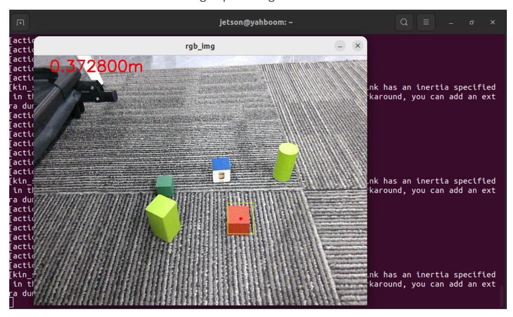
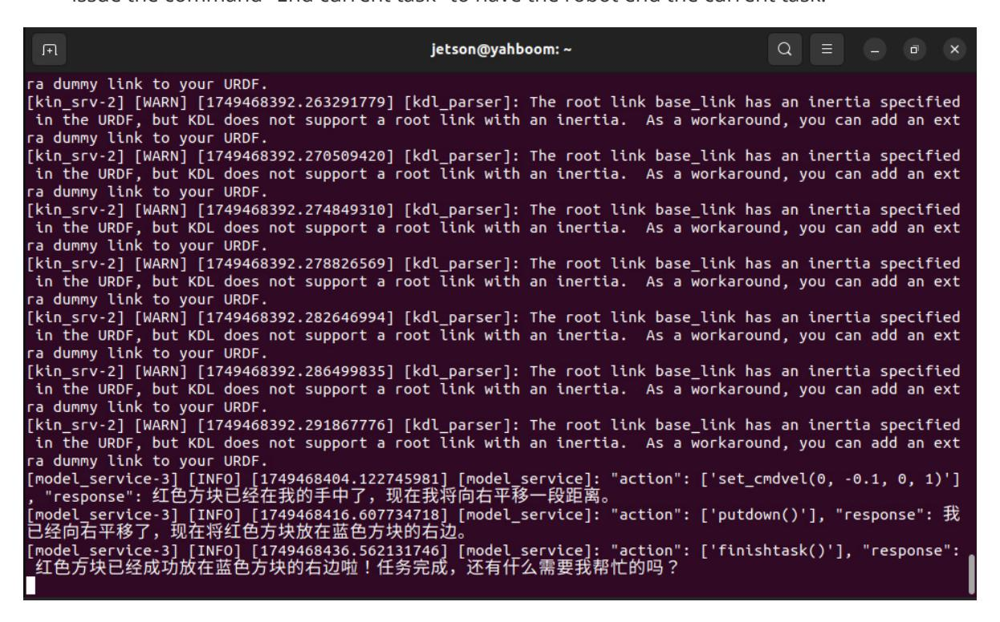
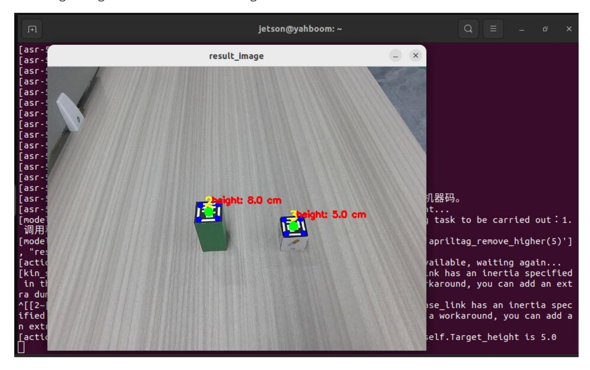
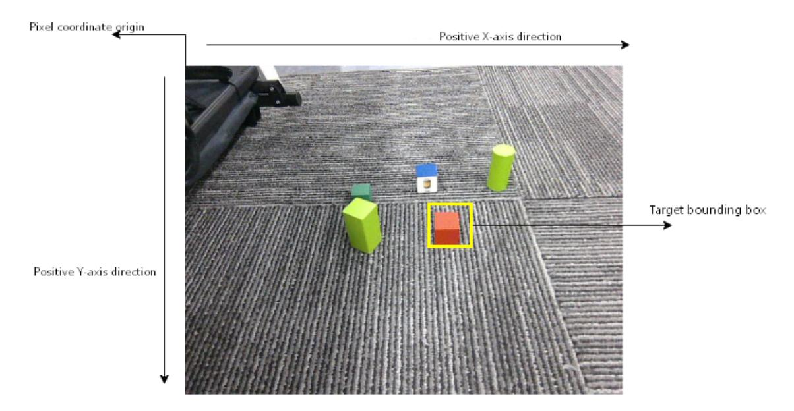

# **Multimodal Visual Understanding + Robotic Arm Grasping**

#### **[Multimodal Visual Understanding](#page-0-0) + Robotic Arm Grasping**

- <span id="page-0-0"></span>[1. Course](#page-0-1) Content
- [2. Preparation](#page-0-2)
  - 2.1 Content [Description](#page-0-3)
  - 2.2 [Starting](#page-1-0) the Agent
- [3. Running](#page-1-1) the Cases
  - 3.1 Starting the [Program](#page-1-2)
  - 3.2 [Testing](#page-2-0) Cases
    - 3.2.1 Case [1: "Find the](#page-2-1) red square in front of you and pick it up"
    - 3.2.2 Case 2: "Put the [red cube](#page-3-0) in front of you to the right of the blue cube"
    - 3.2.3 Case 3: "Please remove the machine code in front of you that is taller than 5 [centimeters"](#page-4-0)
- <span id="page-0-1"></span>[4. Source](#page-5-0) Code Analysis
  - 4.1 [Case](#page-6-0) 1
  - 4.2 Case [Study](#page-8-0) 2
  - 4.3 Case [Study](#page-8-1) 3

# **1. Course Content**

- Basic: Run the example program and perform integrated tasks using the robot's visual understanding combined with robotic arm grasping.
- Advanced: Master the key source code introduced in this section.

[!NOTE]

#### **Note**

<span id="page-0-3"></span><span id="page-0-2"></span>The AI large language model's responses to the same test commands will not be exactly the same each time, and may differ slightly from the screenshots in the tutorial.

# **2. Preparation**

## **2.1 Content Description**

This section of the course uses the Jetson Orin NX as an example. For Raspberry Pi and Jetson Nano boards, you need to open a terminal on the host machine, then enter the command to enter the Docker container. After entering the Docker container, enter the commands mentioned in this section of the course in the terminal. For instructions on entering the Docker container from the host machine, please refer to the "Entering the Robot's Docker (For Jetson Nano and Raspberry Pi 5 Users)" section in the product tutorial [0. Instructions and Installation Steps]. For Orin and NX boards, simply open the terminal and enter the commands mentioned in this section.

### <span id="page-1-0"></span>**2.2 Starting the Agent**

**Note: The Docker agent must be started before testing all cases. If it is already running, there is no need to start it again.**

Enter the following command in the vehicle terminal:

```
sh start_agent.sh
```

The terminal will print the following information, indicating a successful connection:

# <span id="page-1-1"></span>**3. Running the Cases**

#### **3.1 Starting the Program**

Open the terminal on the vehicle and enter the command to start the AI agent function:

```
ros2 launch multi_brains llm_agent_control.launch.py
```

Alternatively, you can use the shortcut command:

```
multi_brains
```

Wait for the initialization program to complete, as shown in the image below:

### <span id="page-2-0"></span>**3.2 Testing Cases**

These cases are for reference only; users can create their own test commands.

Wooden blocks used: 30x30x30 mm blocks.

#### **3.2.1 Case 1: "Find the red square in front of you and pick it up"**

<span id="page-2-1"></span>First, use "Hello yahboom" to wake up the robot. The robot will respond. After the recording prompt, the user can speak. The robot will perform dynamic sound detection. If there is sound activity, it will print "1-1-1-1", and if there is no sound activity, it will print "---------". After speaking, it will perform end-of-speech detection. If there is silence for more than 1.5 seconds, the recording will stop. - The robot will first respond to the user, then perform the actions according to the instructions, and simultaneously print the following information on the terminal:

After the grasp\_obj() function is called, a window titled **rgb\_img** will open in the VNC screen, displaying the image from the robot's perspective. The robot will automatically adjust the distance between itself and the target object. Once the distance adjustment is complete, the robot will use its robotic arm to grasp the target item.



#### [!IMPORTANT]

Note: After the robot picks up an object, the robotic arm will remain in its current position. If you need the robotic arm to return to its initial state, you can use the following methods:

- Method 1: Wake up the robot again and have it put down the red cube it just picked up.
- <span id="page-3-0"></span>Method 2: Wake up the robot again and issue the command "End current task" to have the robot end the current task. After the task cycle ends, the robotic arm will reset to its initial posture.

#### **3.2.2 Case 2: "Put the red cube in front of you to the right of the blue cube"**

- Wooden blocks used: 30x30x30 mm blocks.
- After waking up the robot, say the command "Put the red cube in front of you to the right of the blue cube". The terminal output is as follows. From the output of the decision layer, it can be seen that the robot's strategy for completing the task is: 1. Identify the scene - 2. Locate the red cube - 3. Pick up the red cube - 4. Move to the right - 5. Put down the cube.

When the robot completes the task and enters a waiting state, wake up the robot again and issue the command "End current task" to have the robot end the current task.



#### **3.2.3 Case 3: "Please remove the machine code in front of you that is taller than 5 centimeters"**

- <span id="page-4-0"></span>Wooden blocks used: 30x30x30mm and 30x30x60mm machine-coded blocks.
- After waking up the robot, say the command "Please remove the machine code in front of you that is taller than 5 centimeters". The terminal output is as follows:

The terminal will open a window titled **result\_image**, showing the height of each machine code. After the distance measurement stabilizes, the robot will automatically adjust its distance from the target, and then use the robotic arm to grasp the machine code at the target height and transfer it to the right side of the robot.



# **4. Source Code Analysis**

<span id="page-5-0"></span>The path to the robot's action source code:

```
~/M3Pro_ws/src/multi_brains/multi_brains/action_service.py
```

#### <span id="page-6-0"></span>**4.1 Case 1**

action\_service.py program:

Case 1 uses the **seewhat** and **grasp\_obj** methods in the **ActionController** class. The **seewhat** function mainly obtains the color image from the depth camera, which has been explained in the **Multimodal Visual Understanding** section. Here, we will explain the **grasp\_obj** function.

The object coordinate rules in the robotic arm's grasping view are shown in the following figure:



The **grasp\_obj(x1, y1, x2, y2)** function is used to call the robotic arm to grasp the target object. The parameters are the coordinates of the top-left and bottom-right vertices of the bounding box of the object to be grasped (the top-left corner of the image is the pixel coordinate origin). For example, in Case 1, the bounding box coordinates of the red square to be grasped can be obtained from the large model's response: the top-left corner coordinates are (365, 200), and the bottom-right corner coordinates are (408, 261). - grasp\_obj launched the subprocesses **grasp\_desktop**, **KCF\_follow**, and **ALM\_KCF\_Tracker\_Node3**, and passed the parameters provided by the large AI model to the **ALM\_KCF\_Tracker\_Node** node via a topic.

```
def grasp_obj(self, x1, y1, x2, y2) -> None:
        """grasp_obj: Grasping object x1, y1, x2, y2: Coordinates of the
object's bounding box """
        def __reset_grasp_obj():
            kill_process_tree(self.grasp_obj_process_1.pid)
            kill_process_tree(self.grasp_obj_process_2.pid)
            kill_process_tree(self.grasp_obj_process_3.pid)
            self.grasp_obj_future = Future()
        cmd_1=['ros2', 'run', 'largemodel_arm', 'grasp_desktop']
        cmd_2=['ros2', 'run', 'largemodel_arm', 'KCF_follow']
        cmd_3=['ros2', 'run', 'M3Pro_KCF', 'ALM_KCF_Tracker_Node']
        self.grasp_obj_process_1=subprocess.Popen(cmd_1)
        time.sleep(5.0) #Waiting for grasp_desktop to finish starting up
        self.grasp_obj_process_2=subprocess.Popen(cmd_2)
        self.grasp_obj_process_3=subprocess.Popen(cmd_3)
        time.sleep(1.0)
        x1 = int(x1)
        y1 = int(y1)
```

```
x2 = int(x2)
y2 = int(y2)
self.object_position_pub.publish(Int16MultiArray(data=[x1, y1, x2, y2]))
while not self.grasp_obj_future.done():
    if self.interrupt_event.is_set():
        __reset_grasp_obj()
        self.pubSix_Arm(self.init_joints)
        return None
    time.sleep(0.1)
result = self.grasp_obj_future.result()
if not self.interrupt_event.is_set():
    if result.data == "grasp_obj_done":
        res = True
    else:
        res = False
__reset_grasp_obj()
if self.interrupt_event.is_set():
    time.sleep(0.5)
    self.pubSix_Arm(self.init_joints) # Robotic arm retracted
return res
```

After the grasping is complete, the **KCF\_follow** node will publish a signal on the **largemodel\_arm\_done** topic with the content "**grasp\_obj\_done**", which sets the **grasp\_obj\_future** object in the **largemodel\_arm\_done\_callback** callback function.

```
def action_feedback_callback(self, msg:String):
        ''' 外部动作反馈回调函数 / External action feedback callback function '''
        if msg.data =="follow_line_finish":
            if not self.follow_line_clear_future.done():
                self.follow_line_clear_future.set_result(msg)
        elif msg.data =="road_net_nav_succeeded":
            if not self.road_net_nav_future.done():
                self.road_net_nav_future.set_result(msg)
        elif msg.data =="road_net_nav_failed":
            if not self.road_net_nav_future.done():
                self.road_net_nav_future.set_result(msg)
        if msg.data in ["apriltag_sort_done", "apriltag_sort_failed"]:
            if not self.apriltag_sort_future.done():
                self.apriltag_sort_future.set_result(msg)
        elif msg.data in
["apriltag_remove_higher_done","apriltag_remove_higher_failed"]:
            if not self.apriltag_remove_higher_future.done():
                self.apriltag_remove_higher_future.set_result(msg)
        elif msg.data == "grasp_obj_done":
            if not self.grasp_obj_future.done():
                self.grasp_obj_future.set_result(msg)
        elif msg.data == "color_remove_higher_done":
            if not self.color_remove_higher_future.done():
                self.color_remove_higher_future.set_result(msg)
        elif msg.data == "follow_line_clear_future_done":
            if not self.follow_line_clear_future.done():
                self.follow_line_clear_future.set_result(msg)
```

### **4.2 Case Study 2**

<span id="page-8-0"></span>The set\_cmdvel function controls the robot's base movement by publishing the cmd\_vel velocity topic.

```
def set_cmdvel(self, linear_x:str, linear_y:str, angular_z:str,
duration:str)->None:
        ''' 发布cmd_vel速度指令 / Publish cmd_vel velocity command '''
        linear_x = float(linear_x)
        linear_y = float(linear_y)
        angular_z = float(angular_z)
        duration = float(duration)
        twist = Twist()
        twist.linear.x = linear_x
        twist.linear.y = linear_y
        twist.angular.z = angular_z
        self._execute_action(twist, durationtime=duration)
        self.stop()
        return True
```

The putdown method is used to make the robotic arm put down the object it is holding.

```
def putdown(self):
        self.pubSix_Arm(self.putsown_joints) # Deployment of robotic arm
        time.sleep(4)
        self.pubSingle_Arm(6, 30, 1000) #The robotic arm opens its gripper and
releases the object.
        time.sleep(3)
        self.pubSix_Arm(self.init_joints) # Robotic arm retracted
        return True
```

### **4.3 Case Study 3**

<span id="page-8-1"></span>The apriltag\_remove\_higher method starts the external grasp\_desktop\_remove and apriltag\_remove\_higher nodes via a subprocess. This is an example from the robotic arm chapter demonstrating the removal of machine code at a specified height.

```
def apriltag_remove_higher(self, target_high):
        '''移除指定高度的机器码/Remove machine code at the specified height.'''
        def __reset_apriltag_remove_higher():
            kill_process_tree(self.apriltag_remove_higher_process_1.pid)
            kill_process_tree(self.apriltag_remove_higher_process_2.pid)
            self.apriltag_remove_higher_future = Future()
        target_highf = float(target_high) / 100
        cmd_1=['ros2', 'run', 'largemodel_arm', 'grasp_desktop_remove']
        cmd_2=['ros2', 'run', 'largemodel_arm', 'apriltag_remove_higher','--ros-
args','-p',f'target_high:={target_highf:.2f}']
        self.apriltag_remove_higher_process_1=subprocess.Popen(cmd_1)
        self.apriltag_remove_higher_process_2=subprocess.Popen(cmd_2)
        while not self.apriltag_remove_higher_future.done():
```

```
if self.interrupt_event.is_set():
        __reset_apriltag_remove_higher()
        self.stop()
        self.pubSix_Arm(self.init_joints)
        return None
    time.sleep(0.1)
result = self.apriltag_remove_higher_future.result()
if not self.interrupt_event.is_set():
    if result.data == "apriltag_remove_higher_done":
        res=True
    elif result.data == "apriltag_remove_higher_failed":
        res= False
__reset_apriltag_remove_higher()
self.pubSix_Arm(self.init_joints)
return res
```