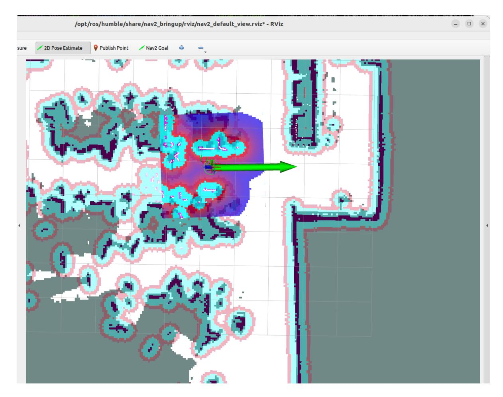

# **Intent Understanding**

#### **Intent [Understanding](#page-0-0)**

- [1. Course](#page-0-1) Content
- [2. Preparation](#page-0-2)
  - 2.1 Content [Description](#page-0-3)
  - 2.2 [Starting](#page-0-4) the Agent
  - 2.2 [Configuring](#page-1-0) the Intent Mapping File
  - 2.3 [Configuring](#page-1-1) the Knowledge Base
  - 4.1 Starting the [Program](#page-2-0)
  - 4.2 Test [Cases](#page-3-0)
- 5. Effect [Debugging](#page-4-0)
  - 5.1 [Visualized Workflow](#page-5-0)

# **1. Course Content**

Basic: Master customizing unique user intent understanding functions through the RAG knowledge base.

Advanced: Master debugging the intent understanding effect on the DIfy platform.

[!IMPORTANT]

Intent understanding is designed to increase the rapport between the robot and the user, allowing the robot to understand the user more uniquely. This function should not be used to perform "strange" and "unconventional" tasks.

# **2. Preparation**

### **2.1 Content Description**

This section of the course uses the Jetson Orin NX as an example. For Raspberry Pi and Jetson-Nano boards, you need to open a terminal on the host machine, then enter the command to enter the Docker container. After entering the Docker container, enter the commands mentioned in this section of the course in the terminal. For instructions on entering the Docker container from the host machine, please refer to the content in [0. Instructions and Installation Steps] -> [Entering the Car's Docker (For Jetson-Nano and Raspberry Pi 5 users)] in this product tutorial. For Orin and NX boards, simply open the terminal and enter the commands mentioned in this section of the course.

#### **2.2 Starting the Agent**

**Note: If it has already been started, there is no need to start it again.**

Enter the following command in the vehicle terminal:

sh start\_agent.sh

The terminal will print the following information, indicating a successful connection:

#### **2.2 Configuring the Intent Mapping File**

This file is used to store personal fuzzy intents and the corresponding tasks that the robot should perform. - Open the example file in the tutorial folder for this section. You can add multiple custom intents according to the reference format. Below is a simple example:

| query                      | answer                                                                                                                                                                           |
|----------------------------|----------------------------------------------------------------------------------------------------------------------------------------------------------------------------------|
| I'm a little thirsty | 1. Navigate to the kitchen, 2. Check if there is bottled water or drinks, 3. If there is, use the robotic arm to pick up the drink, 4. Navigate back to the starting position |

#### **2.3 Configuring the Knowledge Base**

Next, we need to upload the edited intent mapping file to Dify's RAG knowledge base.

#### [!TIP]

- For detailed instructions on using the RAG knowledge base, please refer to the tutorial in [2. AI Model Development - 06 - Deploy the RAG knowledge base] .
- Dify comes pre-configured with a reference knowledge base for Intent mapping to demonstrate how to use the intent understanding function.

You can modify the Intent mapping.xlsx template, or you can delete it and add your own file.

[!TIP]

Note that:

To ensure the best intent understanding results, it is recommended to set the Intent mapping knowledge base to high-quality mode, as intent understanding often requires retrieving relevant snippets between similar semantic cues. ## 4. Running Examples

#### **4.1 Starting the Program**

On the vehicle's onboard computer, open a terminal and enter the command to start the AI agent function:

ros2 launch multi\_brains llm\_agent\_control.launch.py

Alternatively, you can use the shortcut command:

multi\_brains

On the vehicle's onboard computer, open two more terminals and enter the commands to start the navigation function:

ros2 launch M3Pro\_navigation base\_bringup.launch.py

ros2 launch M3Pro\_navigation navigation2.launch.py

On the robot, start rviz:

ros2 launch M3Pro\_navigation nav\_rviz.launch.py

Then, follow the procedure for starting the navigation function to initialize the positioning. This will open the rviz2 visualization interface. Click on **2D Pose Estimate** in the toolbar at the top to enter the selection state. Roughly mark the robot's location and orientation on the map. After initializing the positioning, the preparation is complete.

#### **4.2 Test Cases**

These test cases are for reference only; users can create their own dialogue commands.

I'm in the master bedroom now, and I feel a little thirsty.

The task steps for the decision-making layer model planning are as follows:

The tasks are executed sequentially according to the task steps planned by the decision-making layer's large model:

When the robotic arm is grasping, a visualization window will be displayed, as shown below:

After arriving at the "master bedroom," the robot will use its robotic arm to put down the red block and prompt the user that the task is complete.

## **5. Effect Debugging**

### **5.1 Visualized Workflow**

Open the corresponding language version of the multi\_brains application, then click preview to input test content and view the data flow.

You can also open the workflow to view the time taken for each step and the input and output content of each process.

If the task routing module is inaccurate in certain contexts and does not categorize the input into Category 3: Personal Intent , you can add constraints or supplementary contextual descriptions for personal intent here.

In addition, the recall performance of input sentences in the knowledge base can also be tested separately within the intent mapping knowledge base.

