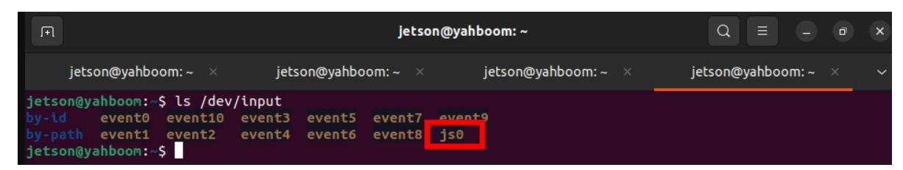
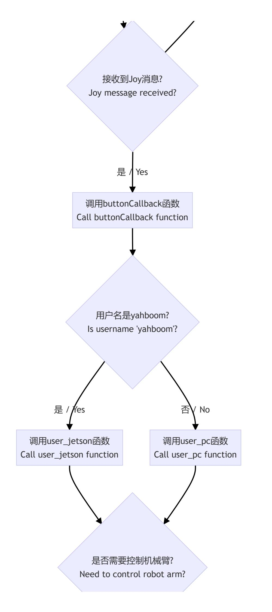
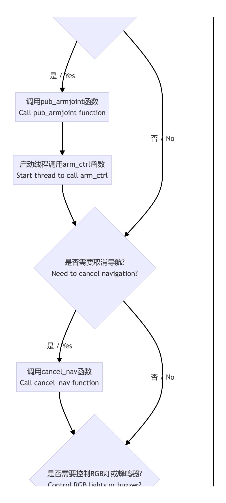
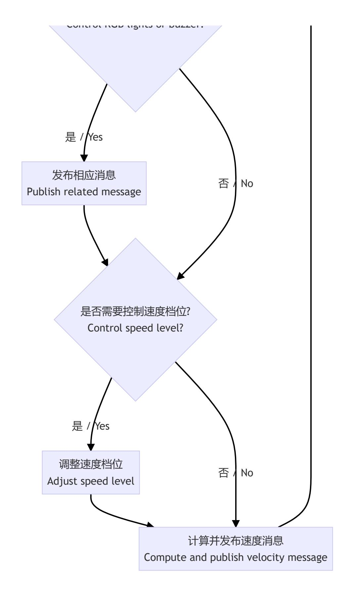

# **Controller Control**

#### **[Controller Control](#page-0-0)**

- <span id="page-0-0"></span>[1. Course](#page-0-1) Content
- [2. Preparation](#page-0-2)
  - 2.1 Content [Description](#page-0-3)
  - 2.2 Start the [agent](#page-0-4)
  - 2.3 [Check the](#page-1-0) device
  - 2.4 Testing the [Controller](#page-1-1) Input
- 3. Run the [Example](#page-2-0)
  - 3.1 Start the PS2 [Controller](#page-2-1) Control Node
  - 3.2 Button Control [Instructions](#page-3-0)
- [4. Source](#page-4-0) Code Analysis
  - 4.1 View the Node [Relationship Graph](#page-4-1)
  - 4.2 Viewing [Topic Messages](#page-4-2) and Message Types
  - 4.3 [Program Flowchart](#page-5-0)
  - 4.4 Source Code [Analysis](#page-8-0)
    - 4.4.1 [Topic Communication](#page-9-0)
    - 4.4.2 [Robotic Arm Control](#page-9-1)
    - 4.4.3 Chassis [Movement](#page-9-2) Control

## <span id="page-0-1"></span>**1. Course Content**

Learn to control robot movement using a PS2 controller.

After running the program, use the PS2 controller to control the robot chassis and the robotic arm.

# <span id="page-0-2"></span>**2. Preparation**

### <span id="page-0-3"></span>**2.1 Content Description**

This course uses the Jetson Orin NX as an example. For Raspberry Pi and Jetson Nano boards, you need to open a terminal and enter the command to enter the Docker container. Once inside the Docker container, enter the commands mentioned in this course in the terminal. For instructions on entering the Docker container, refer to the product tutorial **[Configuration and Operation Guide] - [Entering the Docker (Jetson Nano and Raspberry Pi 5 users see here)]**. For Orin and NX boards, simply open a terminal and enter the commands mentioned in this course.

### <span id="page-0-4"></span>**2.2 Start the agent**

**Note: All test cases must start the docker agent first. If it has already started, there is no need to restart it**

Enter the command in the car terminal:

```
sh start_agent.sh
```

The terminal prints the following information, indicating that the connection is successful:

### <span id="page-1-0"></span>**2.3 Check the device**

First, insert the wireless handle USB receiver into the main control (jetson, Raspberry Pi, PC), open the terminal, and enter the following command. If [js0] is displayed, it is the wireless handle. In special cases, you can also check the changes in the device list by connecting and disconnecting the wireless handle USB port. If there is a change, the changed device is the device; otherwise, the connection is unsuccessful or cannot be recognized.



### <span id="page-1-1"></span>**2.4 Testing the Controller Input**

Open Terminal and enter the following command. As shown in the image, this wireless controller has 8 axis inputs and 15 button inputs. You can test the corresponding numbers by pressing each button individually.

sudo jstest /dev/input/js0


If jstest is not installed, run the following command:

```
sudo apt-get install joystick
```

# **3. Run the Example**

### **3.1 Start the PS2 Controller Control Node**

#### **Note:**

<span id="page-2-1"></span>The Jetson Nano and Raspberry Pi series controllers must first enter the Docker container (see the [Docker Course Chapter - Entering the Robot's Docker Container] for steps).

Open two terminals on the car computer and run the following two nodes respectively.

Run the controller receiving node:

```
ros2 launch yahboomcar_ctrl yahboomcar_joy_launch.py
```

Run the robot controller control node:

```
ros2 run yahboomcar_ctrl yahboom_joy_M3Pro
```

### <span id="page-3-0"></span>**3.2 Button Control Instructions**

| Controller Actions        | Functions                                     |
|---------------------------|-----------------------------------------------|
| Left Joystick Up/Down     | Car Moves Forward/Backward                    |
| Left Joystick Left/Right  | Car Moves Straight Left/Right                 |
| Right Joystick Left/Right | Car Rotates Left/Right                        |
| "START" Button            | End Sleep                                     |
| Left Joystick Pressed     | Adjust X/Y Axis Speed                         |
| Right Joystick Pressed    | Adjusting Angular Velocity                    |
| Up Button                 | Servo 4 Up                                    |
| Down Button               | Servo 4 Down                                  |
| Left Button               | Servo 3 Down                                  |
| Right Button              | Servo 3 Up                                    |
| X Button                  | Servo 1 Left                                  |
| B Button                  | Servo 1 Right                                 |
| Y Button                  | Servo 2 Up                                    |
| A Button                  | Servo 2 Down                                  |
| Left "1" Button           | Servo 6 Clamp (Tighten) / Servo 5 Turn Right  |
| Left "2" Button           | Servo 6 Clamp (Loose) / Servo 5 Turn Left     |
| SELECT Button             | Switching Control Between Servo 6 and Servo 5 |

# <span id="page-4-0"></span>**4. Source Code Analysis**

Source Code Path:

Jetson Orin Nano, Jetson Orin NX:

/home/jetson/yahboomcar\_ws/src/yahboomcar\_ctrl/yahboomcar\_ctrl/yahboom\_joy\_M3Pro .py

Jetson Orin Nano, Raspberry Pi:

You need to enter Docker first.

<span id="page-4-1"></span>root/yahboomcar\_ws/src/yahboomcar\_ctrl/yahboomcar\_ctrl/yahboom\_joy\_M3Pro.py

### **4.1 View the Node Relationship Graph**

Open a terminal and enter the command:

ros2 run rqt\_graph rqt\_graph


In the above node relationship graph:

**joy\_node**: Receives data from the controller receiver and publishes it to the **/joy** topic.

**joy\_ctrl**: Subscribes to data from the **/joy** topic and parses keystrokes and corresponding operations. Publishes to the **/cmd\_vel** and /arm\_joint\*\* topics to control the robot chassis and robotic arms.

### **4.2 Viewing Topic Messages and Message Types**

Open a terminal on the vehicle or virtual machine and enter the following command:

<span id="page-4-2"></span>ros2 interface show sensor\_msgs/msg/Joy

The data in the /joy topic is a float32 array containing timestamps.

- float32[] axes: Input data for 8 axes
- int32[] buttons: Input data for 15 buttons

### **4.3 Program Flowchart**

Image size is too large. The original image can be viewed in this lesson's folder.

<span id="page-5-0"></span>







### **4.4 Source Code Analysis**

Jetson Orin Nano and Jetson Orin NX series motherboards, source code is located here:

<span id="page-8-0"></span>/home/jetson/yahboomcar\_ws/src/yahboomcar\_ctrl/yahboomcar\_ctrl/yahboom\_joy\_M3Pro .py

jetson Nano, Raspberry Pi series controller:

You need to first enter the Docker container. The source code is located here:

```
/root/yahboomcar_ws/src/yahboomcar_ctrl/yahboomcar_ctrl/yahboom_joy_M3Pro.py
```

#### **4.4.1 Topic Communication**

```
self.pub_cmdVel = self.create_publisher(Twist,'cmd_vel', 1)
self.pub_SingleTargetAngle = self.create_publisher(ArmJoint, "arm_joint", 1)
self.sub_Joy = self.create_subscription(Joy,'joy', self.buttonCallback,10)
```

The chassis and robotic arm movements are controlled by publishing topics **/cmd\_vel** and /arm\_joint**, and the** /joy\*\* topic is subscribed to obtain the button status of the PS2 controller.

The essential principle of controlling the robot with a controller is to first parse the controller data, convert it into corresponding control state variables, and send it to the chassis control board via topic communication. The chassis control board subscribes to the topic data and converts it into values for directly controlling the hardware.

#### <span id="page-9-1"></span>**4.4.2 Robotic Arm Control**

The function of controlling the robotic arm with a PS2 controller is implemented through the arm\_ctrl method in the JoyTeleop class:

```
def arm_ctrl(self, id, direction):
    while 1:
        if self.loop_active:
            self.arm_joints[id - 1] += direction
            if id == 5:
                if self.arm_joints[id - 1] > 270: self.arm_joints[id - 1] = 270
                elif self.arm_joints[id - 1] < 0: self.arm_joints[id - 1] = 0
            elif id == 6:
                if self.arm_joints[id - 1] >= 180: self.arm_joints[id - 1] = 180
                elif self.arm_joints[id - 1] <= 30: self.arm_joints[id - 1] = 30
            else:
                if self.arm_joints[id - 1] > 180: self.arm_joints[id - 1] = 180
                elif self.arm_joints[id - 1] < 0: self.arm_joints[id - 1] = 0
            self.arm_joint.id = id
            self.arm_joint.joint = int(self.arm_joints[id - 1])
            self.arm_joint.time = 500
            self.pub_SingleTargetAngle.publish(self.arm_joint)
        else: break
        sleep(0.03)
```

#### <span id="page-9-2"></span>**4.4.3 Chassis Movement Control**

Chassis movement control with the PS2 controller is implemented using the user\_jetson method in the JoyTeleop class:

```
def user_jetson(self, joy_data):
    #arm_ctrl_start
    if joy_data.buttons[10] == 1: self.gripper_active = not self.gripper_active
    if joy_data.buttons[0] == joy_data.buttons[1] == joy_data.buttons[
```

```
6] == joy_data.buttons[3] == joy_data.buttons[4] == 0 and joy_data.axes[
        7] == joy_data.axes[6] == 0 and joy_data.axes[5] != -1: self.loop_active
= False
    else:
        if joy_data.buttons[3] == 1:
            print("1,-")
            self.pub_armjoint(1, -1) # X
        if joy_data.buttons[1] == 1:
            self.pub_armjoint(1, 1) # B
            print("1,+")
        if joy_data.buttons[0] == 1:
            self.pub_armjoint(2, -1) # A
            print("2,-")
        if joy_data.buttons[4] == 1:
            self.pub_armjoint(2, 1) # Y
            print("2,+")
        if joy_data.axes[6] != 0:
            self.pub_armjoint(3, -joy_data.axes[6]) # 左按键左正右负 Left button
left positive right negative
            print("3,-/+")
        if joy_data.axes[7] != 0:
            self.pub_armjoint(4, joy_data.axes[7]) # 左按键上正下负 Left button up
positive down negative
            print("4,-/+")
        if self.gripper_active:
            if joy_data.axes[5] == -1:
                self.pub_armjoint(6, -1) # L2
                print("6,-")
            if joy_data.buttons[6] == 1:
                self.pub_armjoint(6, 1) # L1
                print("6,+")
        else:
            if joy_data.axes[5] == -1:
                self.pub_armjoint(5, -1) # L2
                print("5,-")
            if joy_data.buttons[6] == 1:
                self.pub_armjoint(5, 1) # L1
                print("5,+")
    #arm_ctrl_end
    #cancel nav
    if joy_data.buttons[9] == 1:
        #print("-------------------")
        self.cancel_nav()
    #RGBLight
    if joy_data.buttons[7] == 1:
        return
    #Buzzer
    if joy_data.buttons[11] == 1:
        Buzzer_ctrl = UInt16()
        if self.Buzzer_active == 0:
            self.Buzzer_active = self.Buzzer_active + 1
        else:
            self.Buzzer_active = self.Buzzer_active - 1
        Buzzer_ctrl.data =self.Buzzer_active
        for i in range(3): self.pub_Buzzer.publish(Buzzer_ctrl)
    #linear Gear control
    if joy_data.buttons[13] == 1:
```

```
if self.linear_Gear == 1.0: self.linear_Gear = 1.0 / 3
        elif self.linear_Gear == 1.0 / 3: self.linear_Gear = 2.0 / 3
        elif self.linear_Gear == 2.0 / 3: self.linear_Gear = 1
    # angular Gear control
    if joy_data.buttons[14] == 1:
        if self.angular_Gear == 1.0: self.angular_Gear = 1.0 / 4
        elif self.angular_Gear == 1.0 / 4: self.angular_Gear = 1.0 / 2
        elif self.angular_Gear == 1.0 / 2: self.angular_Gear = 3.0 / 4
        elif self.angular_Gear == 3.0 / 4: self.angular_Gear = 1.0
    xlinear_speed = self.filter_data(joy_data.axes[1]) * self.xspeed_limit *
self.linear_Gear
    #ylinear_speed = self.filter_data(joy_data.axes[2]) * self.yspeed_limit *
self.linear_Gear
    ylinear_speed = self.filter_data(joy_data.axes[0]) * self.yspeed_limit *
self.linear_Gear
    angular_speed = self.filter_data(joy_data.axes[2]) *
self.angular_speed_limit * self.angular_Gear
    if xlinear_speed > self.xspeed_limit: xlinear_speed = self.xspeed_limit
    elif xlinear_speed < -self.xspeed_limit: xlinear_speed = -self.xspeed_limit
    if ylinear_speed > self.yspeed_limit: ylinear_speed = self.yspeed_limit
    elif ylinear_speed < -self.yspeed_limit: ylinear_speed = -self.yspeed_limit
    if angular_speed > self.angular_speed_limit: angular_speed =
self.angular_speed_limit
    elif angular_speed < -self.angular_speed_limit: angular_speed = -
self.angular_speed_limit
    twist = Twist()
    twist.linear.x = xlinear_speed
    twist.linear.y = ylinear_speed
    twist.angular.z = angular_speed
    if self.Joy_active == True:
        print("joy control now")
        for i in range(3): self.pub_cmdVel.publish(twist)
```